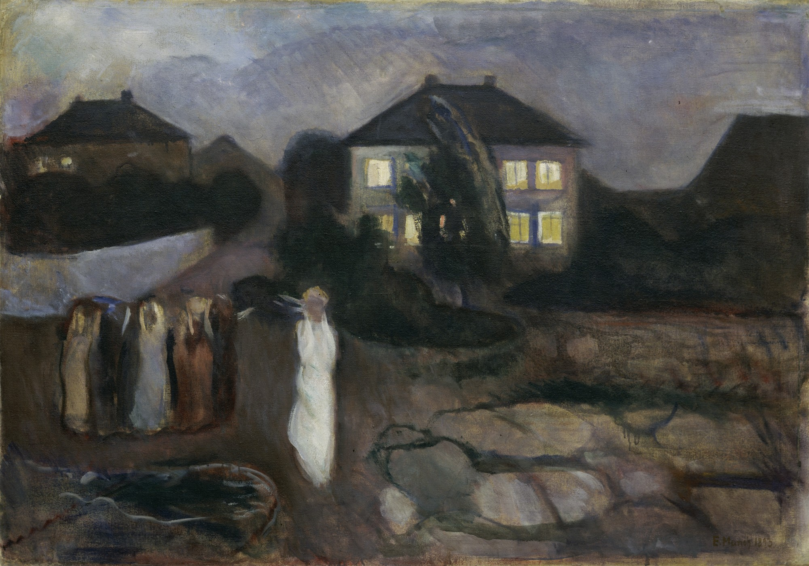

## 基本信息

- 作者：[[爱德华·蒙克 Edvard Munch]]
- 创作年代：1893
- 材质：布面油画 (*not from wiki*)
- 尺寸：未注明
- 现存地：纽约现代艺术博物馆 MoMA (*not from wiki*)

## 画面与技法

蒙克 1893 年作品——与 [[呐喊 The Scream]] 同年——表现挪威海岸小镇风暴之夜，一群女子双手捂耳、面孔模糊、彼此疏离——蒙克"用集体姿态外化情绪"的早期程式（顾衡 070 把本作并入象征主义同质组）。

## 历史背景 (*not from wiki*)

地点为奥斯陆峡湾沿岸 Åsgårdstrand——蒙克 1890s 夏季常住此处，他笔下许多"夏夜母题"作品取景同一海岸线。

## 图片清单

| 编号 | 出自 | 描述 |
|---|---|---|
| 01 | [[070｜蒙克1：表现主义的先行者经历了什么？]] | 风暴夜女子群像 |

## 出现在

- [[070｜蒙克1：表现主义的先行者经历了什么？]]
