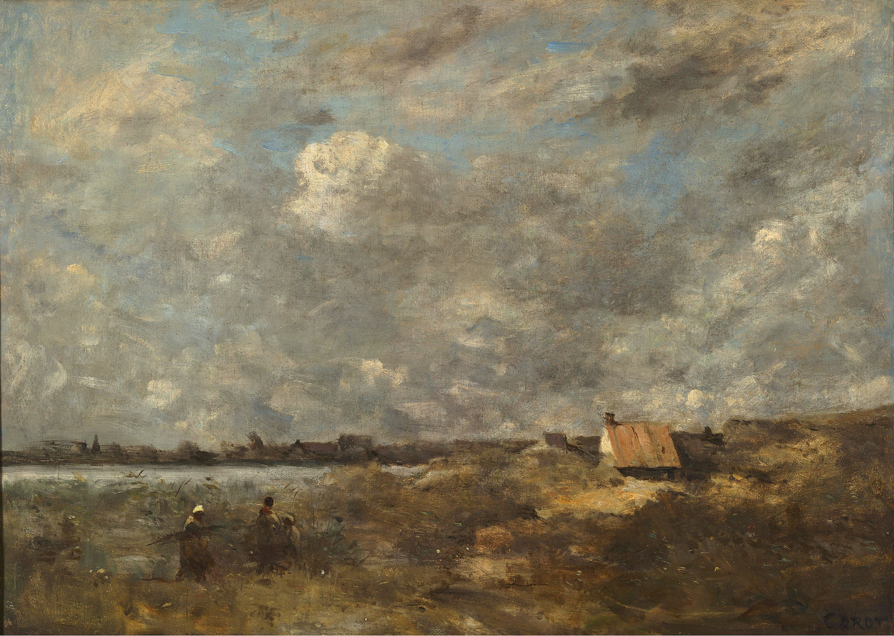

## 基本信息

- 作者：[[柯罗 Camille Corot]]
- 创作年代：1870（041 caption）
- 材质：(*not from wiki*) 布面油画
- 尺寸：(*not from wiki*)
- 现存地：(*not from wiki*)

## 画面与技法

041 出现的柯罗风景画。典型柯罗式"朦胧效果"——041 顾衡明示：莫奈早期作品"这种朦朦胧胧的效果，极力模仿柯罗的痕迹也还是很明显"。柯罗派"有意把笔触掩藏起来"的细腻处理，是莫奈早期模仿的对象——动机部分在于"急于获得沙龙承认"，因为 1863 起 [[柯罗 Camille Corot]] 当选了沙龙评委。

## 历史背景

(*not from wiki*) 柯罗晚年延续其惯常的银灰色调风景。1870 是普法战争之年；柯罗在 041 中是 [[巴比松画派 Barbizon School]] 圈中莫奈他们四个年轻人到舍依（Chailly-en-Bière）村写生时结识的人之一。

041 顾衡定位：柯罗代表"细腻、藏笔触"路线，与 [[杜比尼 Charles-François Daubigny]] "粗犷、留笔触"路线在巴比松内部形成对照。莫奈虽然模仿过柯罗、但**真正受影响最大的是杜比尼**。

## 图片清单

| 编号 | 出自 | 描述 |
|---|---|---|
| 01 | [[041｜莫奈1：颠覆式的创新从何而来？]] | 风暴天气下的乡村风景 |

## 出现在

- [[041｜莫奈1：颠覆式的创新从何而来？]]
