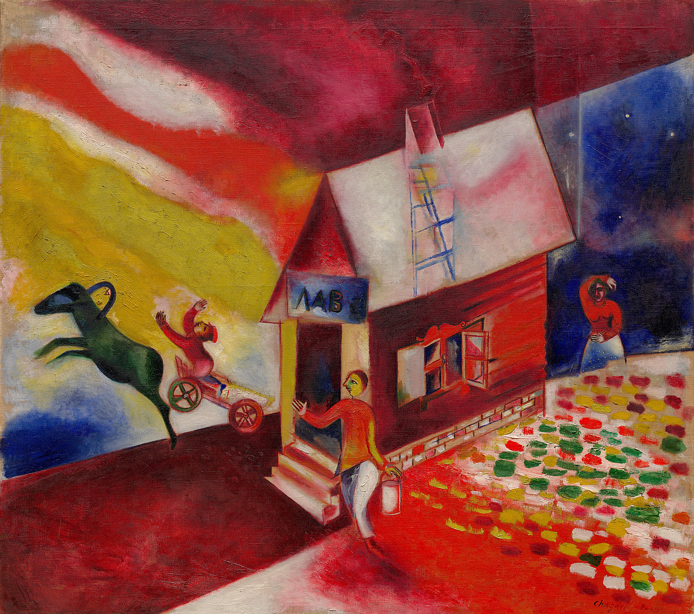

## 基本信息

- 作者：[[夏加尔 Marc Chagall]]
- 创作年代：约 1925
- 材质：布面油画 (*not from wiki*)
- 尺寸：约 65 × 80 cm (*not from wiki*)
- 现存地：纽约古根海姆博物馆 (Guggenheim) (*not from wiki*)

## 画面与技法

顾衡 077 用此画演示**夏加尔把立体主义 / 野兽派当作工具、用来表达乡愁和幻想**的母题：

- **丈夫驾着一辆马车腾空而起**
- **妻子拎着一罐牛奶**，对这个场景**仿佛早已司空见惯，若无其事地挥手告别**

这是典型的夏加尔"梦境即日常"图式——飞翔被当作家务的一部分；妻子的反应是**告别**而不是**惊奇**。

顾衡总评："**立体主义也好，野兽派也好，这些艺术语言对夏加尔来说只是工具，用来表达他的乡愁，表达他的幻想。**"

## 历史背景 (*not from wiki*)

1922 年夏加尔一家离开苏联、1923 年起重返巴黎定居。本作正属于第二次巴黎期的开端——顾衡评："**到巴黎后，夏加尔的创作更加自闭，更加富于幻想，作品中梦境的意味越来越明显。**"

## 图片清单

| 编号 | 出自 | 描述 |
|---|---|---|
| 01 | [[077｜夏加尔：俄国人在巴黎]] | 丈夫驾飞翔马车、妻子拎牛奶罐挥手告别 |

## 出现在

- [[077｜夏加尔：俄国人在巴黎]] —— "梦境即日常"母题的代表案例
