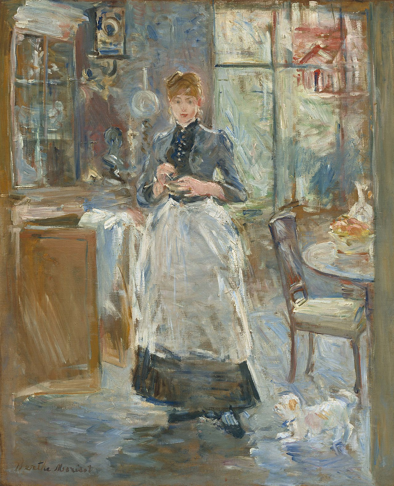

## 基本信息

- 作者：[[莫利索 Berthe Morisot]]
- 创作年代：1886
- 材质：布面油画 (*not from wiki*)
- 尺寸：61.3 × 50 cm (*not from wiki*)
- 现存地：华盛顿国家美术馆 National Gallery of Art (*not from wiki*)

## 画面与技法

[[莫利索 Berthe Morisot]] 晚期室内场景——女佣（或女主人）站在餐厅的家具旁，光线从窗户洒入。**细碎短笔触**几乎遍布整个画面——衣裙、墙面、家具表面全部以马赛克式色块拼出，**完全不平涂**——是顾衡 044 用以演示莫利索不妥协态度的典型样本。

## 在课程中的角色

顾衡 044 把它列入莫利索"**贯彻印象派理念的样本组**"——和《[[穿衣镜 The Psyche Mirror]]》《[[摇篮 The Cradle]]》《[[舟上女孩与鹅 Girl in a Boat with Geese]]》共同展示莫利索作为"印象派教科书"的实践。

## 图片清单

| 编号 | 出自 | 描述 |
|---|---|---|
| 01 | [[044｜莫利索和毕沙罗：最纯正的印象派什么样？]] | 全画 |

## 出现在

- [[044｜莫利索和毕沙罗：最纯正的印象派什么样？]] —— 莫利索"印象派教科书"样本之一
- [[莫利索 Berthe Morisot]] —— 代表作之一
