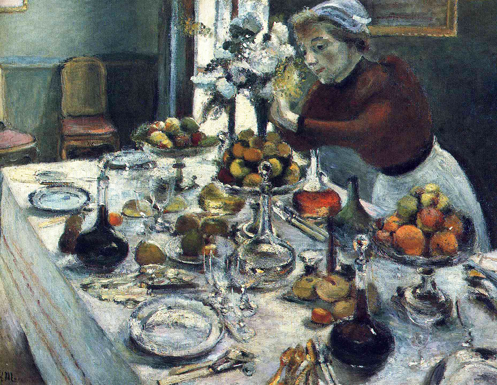

## 基本信息

- 作者：[[马蒂斯 Henri Matisse]]
- 创作年代：1896–1897
- 材质：油彩，画布 (*not from wiki*)
- 尺寸：100 × 131 cm (*not from wiki*)
- 现存地：私人藏 / Niarchos 收藏 (*not from wiki*)

## 画面与技法

[[马蒂斯 Henri Matisse]] **学院派沙龙翻车之作**（060 明示）—— [[莫罗 Gustave Moreau]] 1897 年对马蒂斯说"你现在已经是个人物了，应该画一幅大作品去参加学院派沙龙"，**马蒂斯不知深浅，以浓浓的塞尚风画了《餐桌》送展，结果当然是翻车了**。

技法上：
- **强烈的塞尚式色彩塑形**——抛弃明暗法
- **桌面前景出现笔触粗大的块面感**
- **整体色调向后印象派偏移**——已与马蒂斯 1894《[[读书的女人 (马蒂斯) Woman Reading (Matisse)]]》的学院派工整作品风格断裂

## 历史背景 (*not from wiki*)

本作展出后**学界大佬不敢替他说话**，马蒂斯与学院派的好日子到头——他从此**坚定走出学院派、进入后印象派/新印象主义之间的七年游移期**（1897–1905），最终通向 [[野兽派 Fauvism]]。

> 060 顾衡："大家都认为马蒂斯堕落了，以前欣赏他的学界大佬也不敢替他说话了。这么着，马蒂斯与学院派之间的好日子，也就到头了。但是马蒂斯一点儿都不后悔，他坚持认为塞尚是对的。"

## 图片清单

| 编号 | 出自 | 描述 |
|---|---|---|
| 01 | [[060｜马蒂斯1：野兽派从何而来？]] | 全图——学院派沙龙翻车之作 |

## 出现在

- [[060｜马蒂斯1：野兽派从何而来？]]
