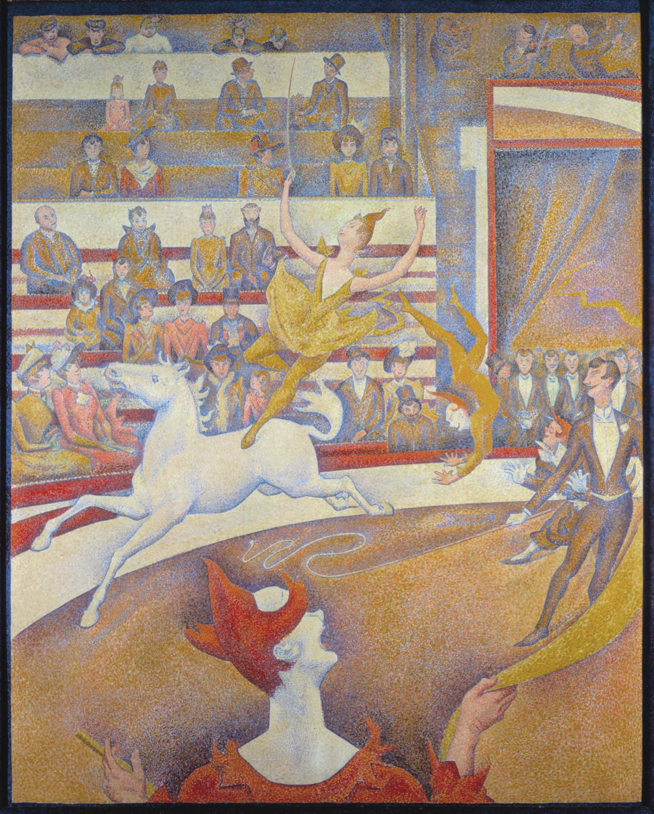

## 基本信息

- **作者**：[[修拉 Georges Seurat]]
- **创作年代**：1890–1891
- **材质**：(*not from wiki*) 布面油画
- **尺寸**：(*not from wiki*) 185 × 152 cm
- **现存地**：(*not from wiki*) 巴黎奥赛博物馆 (Musée d'Orsay)
- **状态**：**修拉遗作**（未完成；1891 年修拉死于白喉时只完成大部分）

## 画面与技法

修拉**"科学反噬"的标志性作品**（顾衡 047 核心样本）——

修拉在《[[康康舞 The Can-can]]》上已经开始用更小的点子；在《马戏》里更进一步："**他拿出了比《大碗岛》更大的耐心，和更严谨的科学精神，用了更小更小的点子来作画。**"

但反噬来了——参 [[更细笔触致画面变暗 Smaller Dot Darkening]]：

> "**更细的小点子导致了更多的混色效果，就像把红黄蓝三种颜色混在一起会得到黑色一样，更小的点子反而使整个画面变得黯淡了。**"

修拉**被迫让步**：

> "**没办法，到这儿科学也得让步了。修拉只好把《马戏》这幅画中的那匹马和前景的小丑改成平涂。**"

—— 这是 [[新印象主义 Neo-Impressionism]] / [[分色主义 Divisionism]] **走进死胡同**的第一手物证：科学方法的发明者**亲手**在画面最关键的形象上**改回了传统平涂**。

同时画面继续应用 [[昂里 Charles Henry]] 的"线条情绪科学"——舞马 / 小丑 / 观众的线条仍保持严格的方向性安排。

## 历史背景 *(not from wiki)*

- 1890 年起作；1891 年春修拉于 *Salon des Indépendants* 展出**未完成**版后不久即病死（白喉，3 月 29 日）
- 顾衡 047 明示：1901 年妻子贱卖此画**仅 500 法郎**（《[[大碗岛的星期天下午 A Sunday Afternoon on the Island of La Grande Jatte]]》卖 800 法郎）
- 1924 年由收藏家 John Quinn 遗嘱捐入卢浮宫，1986 转奥赛

## 死胡同的标本（顾衡 047 命题）

| 修拉创作阶段 | 代表作 | 特点 |
|---|---|---|
| 色彩科学化 | 《大碗岛》 | 22 色色轮 + 标准小圆点 |
| + 线条情绪科学化 | 《康康舞》 | 更小点 + 严格平行 |
| **反噬让步** | **《马戏》** | **马 / 小丑改平涂；遗作** |

修拉**32 岁死于白喉**之后留下的这幅未完成画作，被顾衡读作**新印象主义自身宣告局限的物证**。

## 图片清单

| 编号 | 出自 | 描述 |
|---|---|---|
| 01 | [[047｜修拉：新印象主义为什么走进了死胡同？]] | 整幅画作 |

## 出现在

- [[047｜修拉：新印象主义为什么走进了死胡同？]] —— 修拉遗作；"科学也得让步"的样本
