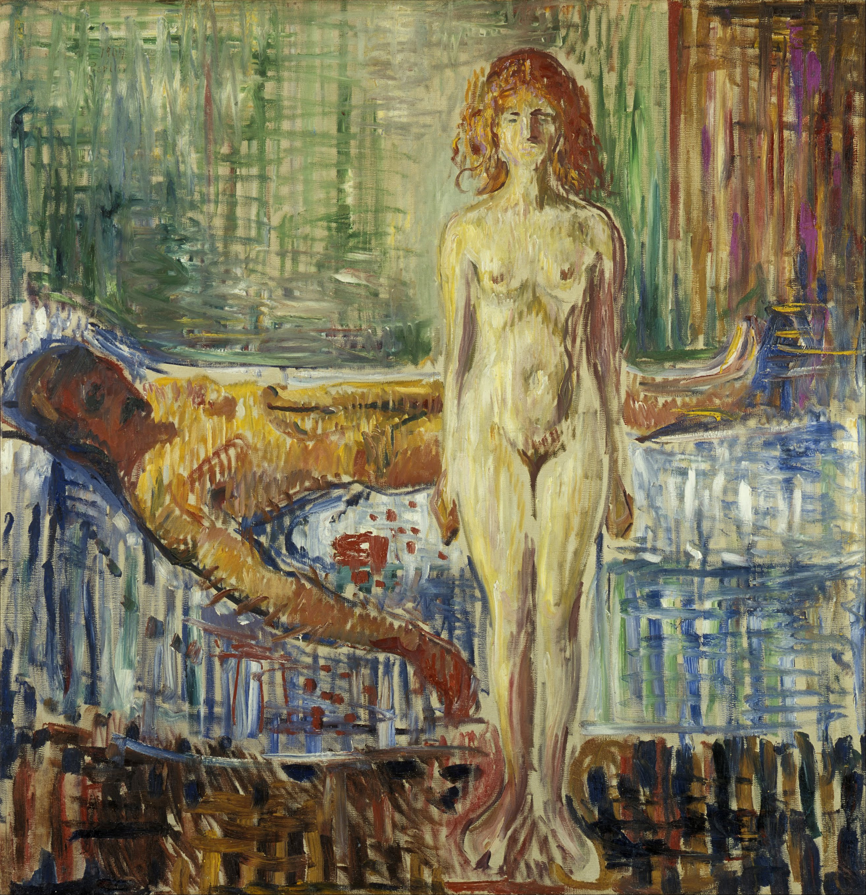

## 基本信息

- 作者：[[爱德华·蒙克 Edvard Munch]]
- 创作年代：1907
- 材质：布面油画 (*not from wiki*)
- 尺寸：约 153 × 149 cm (*not from wiki*)
- 现存地：奥斯陆 蒙克博物馆 Munch Museum, Oslo (*not from wiki*)

> ⚠️ 与 [[马拉之死 The Death of Marat]]（大卫 1793）同名——本作为蒙克 1907 年的**完全独立**作品。两件不可混用。

## 画面与技法

顾衡 [[071｜蒙克2：为什么他是表现主义之父？]] 解读：

- "**在蒙克的笔下，马拉不是死于匕首，而是精尽人亡。**"
- "**女人站在男人的尸体旁，脸上露出心满意足的笑容。**" —— 顾衡评价：**"这是有多恨女人呀！"**
- 形象的**女人 = 母蜘蛛 / 凶手**——把法国大革命象征性事件**完全 re-cast** 为蒙克自己 [[图拉·拉尔森 Tulla Larsen]] 创伤的视觉化。

属蒙克 [[表现主义 Expressionism]] 时期、与 [[女凶手 The Killer (Munch)]]、[[绿色背景的自画像和图拉肖像 Self-Portrait against a Green Background]] 同一情感谱系。

## 历史背景 (*not from wiki*)

蒙克至少绘有两版（1907 油画版与同期素描 / 版画）；与 [[大卫 Jacques-Louis David]] 1793 年新古典主义同题作 [[马拉之死 The Death of Marat]] 在主题、画面、含义上**全面对立**——大卫将马拉**英雄化、圣化**，蒙克则将整个事件**重写为性别战争**。

## 图片清单

| 编号 | 出自 | 描述 |
|---|---|---|
| 01 | [[071｜蒙克2：为什么他是表现主义之父？]] | 站立裸女与床上裸体男尸 |

## 出现在

- [[071｜蒙克2：为什么他是表现主义之父？]]
