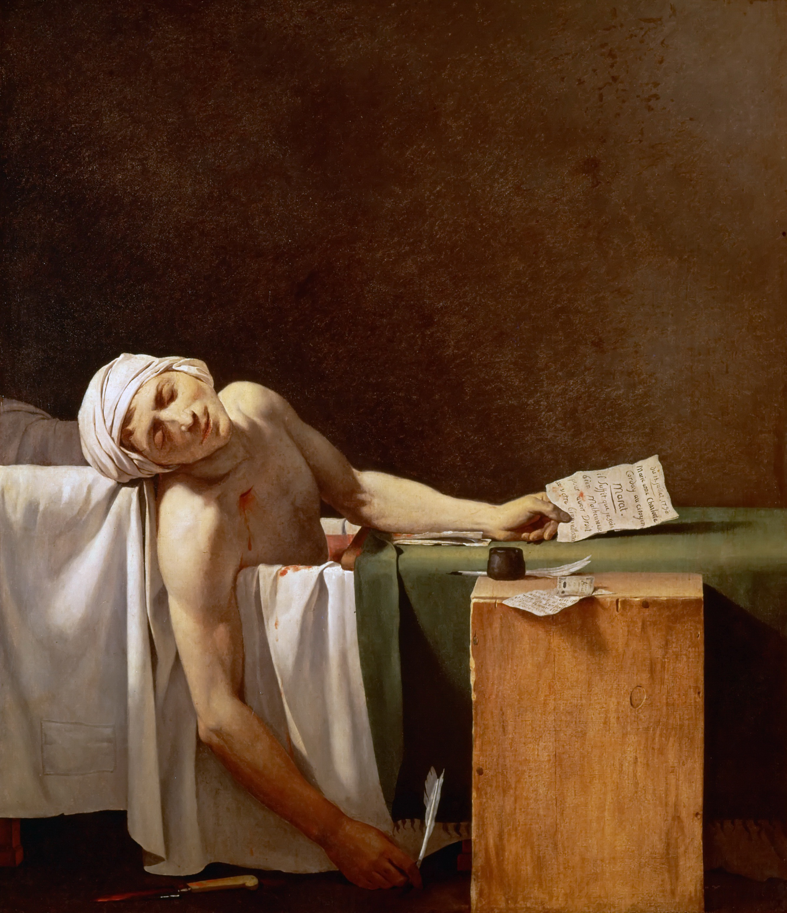

## 基本信息

- 作者：[[大卫 Jacques-Louis David]]
- 创作年代：1793
- 材质：布面油画 (*not from wiki*)
- 尺寸：165 × 128 cm (*not from wiki*)
- 现存地：布鲁塞尔比利时皇家美术博物馆 Royal Museums of Fine Arts of Belgium (*not from wiki*)

## 画面与技法

雅各宾派领袖 让-保罗·马拉 (Jean-Paul Marat) 被夏洛特·科黛 (Charlotte Corday) 刺杀于浴缸中（1793 年 7 月 13 日）。画面：

- 马拉死在浴缸里，身披白布，手中握笔与一张纸条
- 木箱（作为案几）上摆着墨水瓶 + 鹅毛笔
- 浴缸侧倚着行凶的尖刀
- 画面下半段大片留白——光线照亮马拉躯体、上半段沉浸于黑色背景——**借用 [[卡拉瓦乔 Caravaggio]] 的明暗对比 + 圣殇 (Pietà) 的姿态**

## 顾衡解读（030）—— 篡改的真相

> 马拉被刺时，手上拿的明明是**明天要亲手送上断头台的 18 个人的名单**，但是在《马拉之死》中，大卫却把纸条的内容**篡改成一个寡妇写给马拉的求助信**。对于这样的篡改，大卫丝毫不觉得有什么不妥。

这是顾衡 030 用以指控**大卫"太过热衷于政治，却毫无政治操守"**的核心证据。大卫公开宣言：

> 艺术不是目的而是手段，是为了援助某一政治概念的胜利。

顾衡随即追问："**但他援助的政治概念又是什么呢？**"——路易十六把他当作宫廷画师；大革命期间他投票赞成处死路易十六；拿破仑上台后他又强烈支持拿破仑称帝。

> 正是因为这些原因，**我对大卫本人的人品和作品，评价甚低**。

## 历史背景

(*not from wiki*) 大卫作为雅各宾派议员、马拉的友人，本画为雅各宾的政治宣传画。画面构图明显借用基督教 Pietà（圣母怀抱基督遗体）传统——把马拉塑造为"为革命殉道的圣徒"。被视为新古典主义最具政治宣传力的杰作之一。

## 图片清单

| 编号 | 出自 | 描述 |
|---|---|---|
| 01 | [[030｜新古典主义：为什么绘画再次转向宏大叙事？]] | 整体图 |

## 出现在

- [[030｜新古典主义：为什么绘画再次转向宏大叙事？]]
