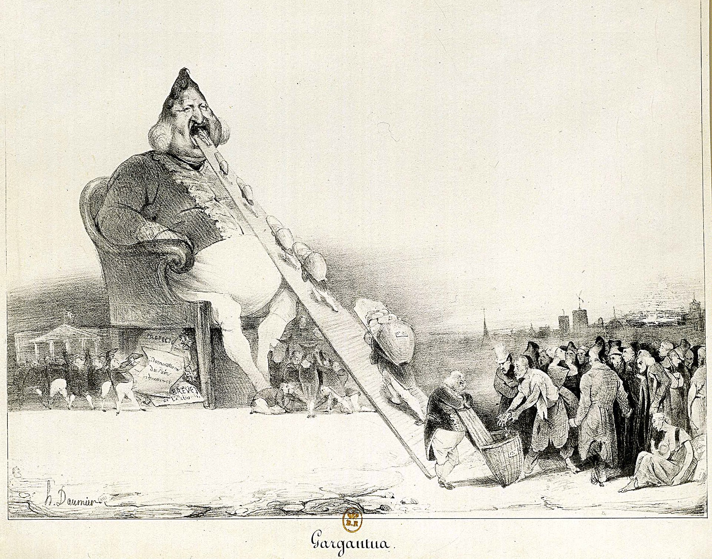

## 基本信息

- **作者**：[[杜米埃 Honoré Daumier]]
- **创作年代**：1831（出版 1832）
- **材质**：[[版画 Printmaking]] · [[石版印刷术 Lithography]]（石版讽刺画）(*not from wiki*)
- **尺寸**：约 21.4 × 30.5 cm (*not from wiki*)
- **现存地**：美国波士顿美术馆、纽约大都会博物馆等多处收藏 (*not from wiki*)

## 画面与技法

(*not from wiki*) 杜米埃把法国国王**路易·菲利普**画成一个**梨形头、巨人体魄**的怪物——坐在马桶式宝座上，**张大嘴巴吞食**从一条长长的传送板上递来的金币和供品；他的随从从下方接住排泄物（化作各种好处分给同党）。**梨形头**（*la poire*）是杜米埃发明的国王 caricature 母题——后成法国新闻讽刺漫画的固定符号。**画名借自拉伯雷小说《巨人传》主人公**，暗讽国王搜刮民脂民膏的贪婪暴食。

## 历史背景 (*not from wiki*)

七月王朝（1830—1848）建立后，杜米埃和讽刺杂志《漫画》（*La Caricature*）频繁攻击路易·菲利普。本画发表后**杜米埃被判 6 个月监禁 + 500 法郎罚款**。本画也是**石版印刷术作为政治武器**的标志性早期案例——铜版太贵、木版不经用、石版可反复使用且传播力极强，杜米埃改良了石版技术让讽刺漫画进入大众媒介。

## 在课程中的角色

顾衡 036 引为**杜米埃 vs 米勒**对比的反面案例——**杜米埃的批判现实主义**让七月王朝政府"特别不喜欢"，杜米埃为此坐牢。课中还引出**石版印刷术作为重要发明**的史实（铜版贵、木版易损、石版便宜耐用、传播力强）——这一论点在 020 丢勒讲版画时有过铺垫。

## 图片清单

| 编号 | 出自 | 描述 |
|---|---|---|
| 01 | [[036｜米勒：什么是"伟大的现实主义"？]] | 石版讽刺画全幅 |

## 出现在

- [[036｜米勒：什么是"伟大的现实主义"？]] —— 杜米埃"犯忌"案例；石版印刷术政治应用
- [[杜米埃 Honoré Daumier]] —— 代表作；招致牢狱的讽刺画
- [[路易·菲利普 King Louis Philippe]] —— 被讽刺对象
- [[版画 Printmaking]] · [[石版印刷术 Lithography]] —— 媒介
