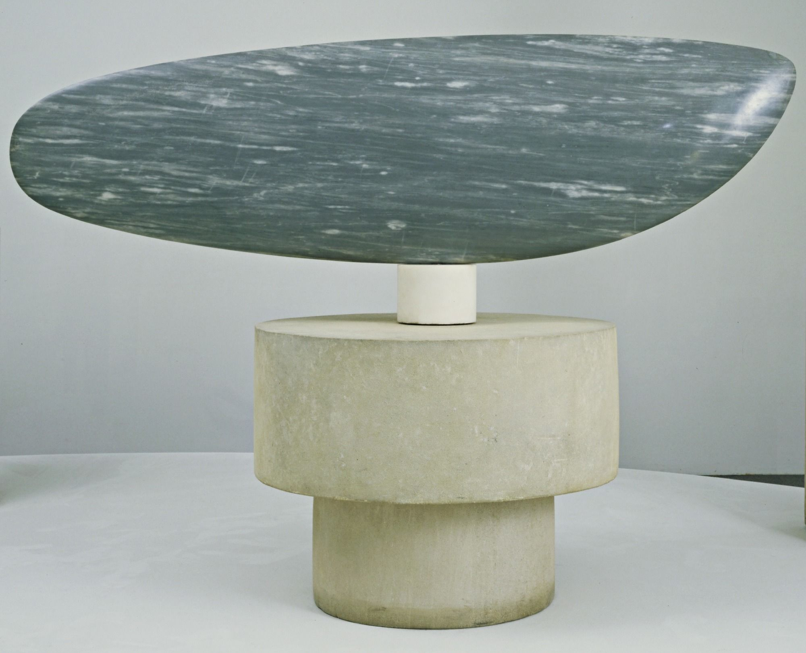

## 基本信息

- 作者：[[布朗库西 Constantin Brâncuși]]
- 创作年代：1926
- 材质：大理石 / 后有抛光青铜版本 (*not from wiki*)
- 尺寸：(*未知*)
- 现存地：(*未知；纽约现代艺术博物馆 MoMA 藏一件 1930 抛光铜版*) (*not from wiki*)

## 画面与技法

[[布朗库西 Constantin Brâncuși]] "**透过现象看本质**"系列的核心作品（顾衡 078）。把鱼简化为一片光滑的弓形薄片——抹去鳞、鳍、眼、嘴所有细节。一片"非具象鱼"——观者仍认得出"鱼"，但它不是任何一条特定的鱼。

布朗库西的核心命题：**对原型的追求 = 对细节的抛弃和简化**。本作与 [[海豹 (布朗库西) The Miracle (Seal I)]] 是这一原则的双联范本。

## 历史背景 (*not from wiki*)

《Fish》布朗库西多次重做，材质包括大理石、青铜，1926 至 1930 年代多个版本。

## 图片清单

| 编号 | 出自 | 描述 |
|---|---|---|
| 01 | [[078｜莫迪里阿尼：画中女子为什么让人一眼难忘？]] | 抛光鱼形薄片 |

## 出现在

- [[078｜莫迪里阿尼：画中女子为什么让人一眼难忘？]]
