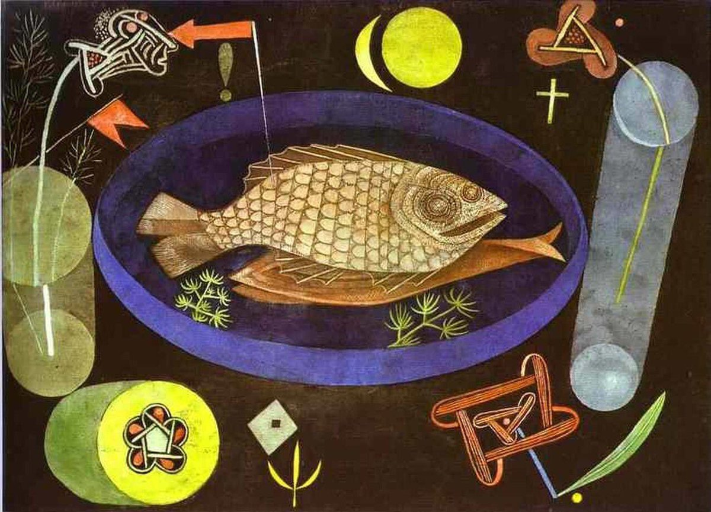

## 基本信息

- 作者：[[克利 Paul Klee]]
- 创作年代：1926
- 材质：油画与蛋彩，画布裱于纸板 (*not from wiki*)
- 尺寸：46.7 × 63.8 cm (*not from wiki*)
- 现存地：纽约·现代艺术博物馆 (MoMA) (*not from wiki*)

## 画面与技法

[[克利 Paul Klee]] 1926 年作，悼念一战阵亡的好友 [[马克 August Macke]] 和 [[马尔克 Franz Marc]]：

- **童稚画风格** + 黑色背景 → 悲伤气息
- **鱼**：代表克利自己，躺在盘子里，回忆他与马克同游那不勒斯水族馆的经历
- **盘子里的水草**：代表马克
- **盘子外的十字架与几何图案**：代表基督，纪念马尔克

本讲断言："如果克利的目标就是揣摩出儿童的心理，那么这幅《鱼的周围》可以说是他最成功的作品了。"

## 历史背景

(*not from wiki*) 创作于德绍 [[包豪斯 Bauhaus]] 阶段；MoMA 早年收藏的克利代表作之一。

## 图片清单

| 编号 | 出自 | 描述 |
|---|---|---|
| 01 | [[085｜克利：他为什么模仿小孩子画画？]] | 黑底盘中鱼，悼念友人母题 |

## 出现在

- [[085｜克利：他为什么模仿小孩子画画？]]
