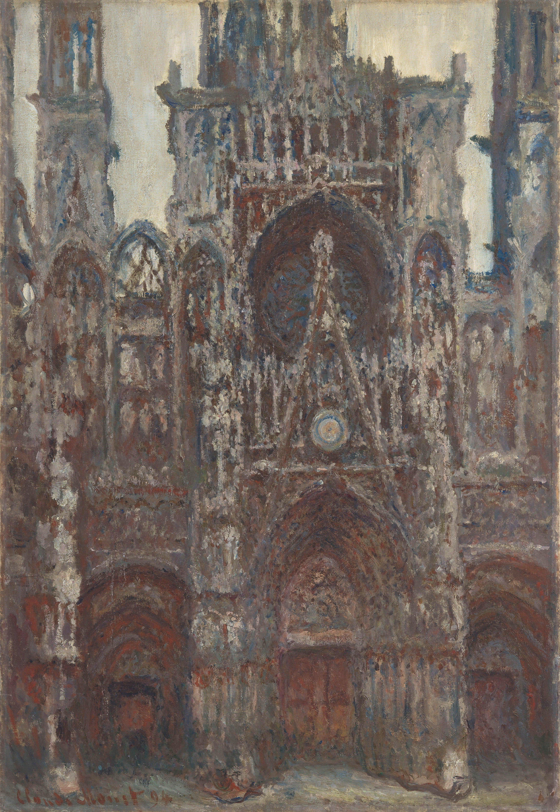

## 基本信息

- 作者：[[莫奈 Claude Monet]]
- 创作年代：1892–1894 （主要 1894 年完成）(*not from wiki*)
- 材质：布面油画 (*not from wiki*)
- 尺寸：约 100 × 65 cm（不一）(*not from wiki*)
- 现存地：分散于奥赛美术馆、华盛顿国家美术馆、贝桑松美术馆等 30 余处 (*not from wiki*)

## 画面与技法

诺曼底鲁昂大教堂的西立面，**正面、垂直构图**——莫奈在租住对面公寓房间，从同一窗口、不同时刻、不同光照下反复画教堂哥特立面。

这是 [[组画 Series Paintings|组画]] 模式的第二代表作。042 顾衡明示与《[[干草垛系列 Haystacks]]》《[[睡莲系列 Water Lilies|睡莲]]》并列为莫奈三大组画。

技法特征：

- **石材表面光线 -色彩耦合**——同一立面在晨曦 / 正午 / 夕阳 / 阴天下呈现完全不同的色温
- **厚涂堆叠**——把石材肌理 / 雕饰边缘抽象化为色彩振动
- **构图近乎完全相同** → 强化光线作为唯一变量

## 历史背景 (*not from wiki*)

1895 年 [[丢朗-吕厄 Paul Durand-Ruel]] 在巴黎办 20 幅鲁昂大教堂专题展，被普遍视为印象派"光线 = 主题"的终极宣言；售价较干草垛系列又翻倍。

## 图片清单

| 编号 | 出自 | 描述 |
|---|---|---|
| 01 | [[042｜莫奈2：《日出·印象》是不是印象派作品？]] | 系列选作 1 |
| 02 | [[042｜莫奈2：《日出·印象》是不是印象派作品？]] | 系列选作 2 |

## 出现在

- [[042｜莫奈2：《日出·印象》是不是印象派作品？]]
