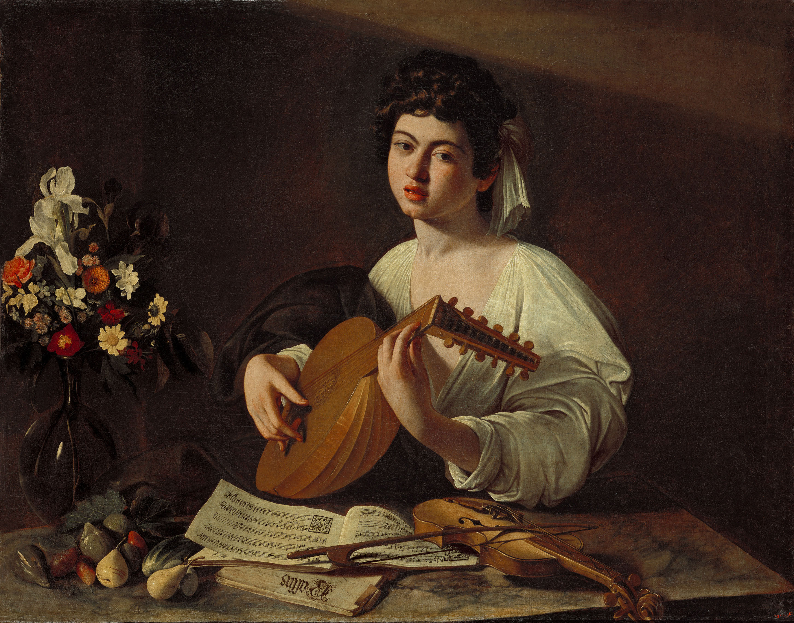
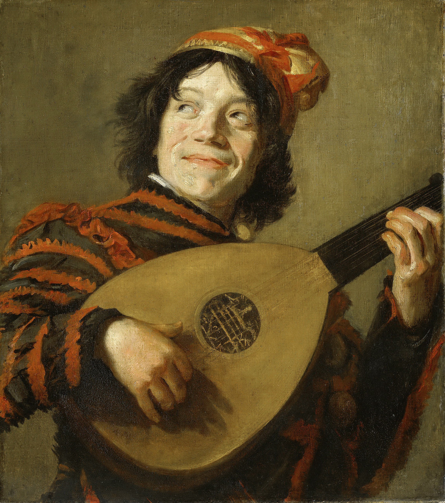

## 基本信息

- 作者：[[卡拉瓦乔 Caravaggio]]
- 创作年代：约 1596（顾衡引；另存若干稍早 / 稍晚版本）
- 材质：布面油彩 (*not from wiki*)
- 尺寸：约 94 × 119 cm (*not from wiki*)
- 现存地：圣彼得堡冬宫博物馆 (Hermitage Museum, St. Petersburg)；另存两个版本于纽约大都会艺术博物馆与英国一私人收藏 (*not from wiki*)

## 画面与技法

一位 **中性气质的年轻男孩**（或被理解为女性）半身像，弹奏一把鲁特琴，桌面上摆着乐谱、小提琴、水果——目光直视观者。

**乐谱**上可辨识 Jacques Arcadelt 的牧歌 *Voi sapete ch'io vi amo*（"你知道我爱你"）（*not from wiki*）——为画面注入了 **爱情寓言** 的层面，呼应 [[音乐会 Musicians]] 中的丘比特。

**为 [[德尔蒙特 Cardinal Francesco Maria del Monte]] 圈层定制的少年题材**——同属顾衡 023 中提到的 "色情画" 系列。

**水果 + 鲁特琴 + 乐谱** 的静物组合显示卡拉瓦乔早期对物体写实的极致追求；色调中的 **强光从单一方向打来** 已经接近 [[酒窖光 Tenebrism]] 的雏形。

## 历史背景

(*not from wiki*) [[德尔蒙特 Cardinal Francesco Maria del Monte]] 委托或购藏；与 [[抱水果篮的男孩 Boy with a Basket of Fruit]]、[[音乐会 Musicians]] 共同构成卡拉瓦乔 1593–1596 在德尔蒙特圈层的少年 / 音乐题材系列。

## 图片清单

| 编号 | 出自 | 描述 |
|---|---|---|
| 01 | [[023｜卡拉瓦乔：巴洛克的戏剧性从何而来？]] | 整体图 |

## 出现在

- [[023｜卡拉瓦乔：巴洛克的戏剧性从何而来？]]
