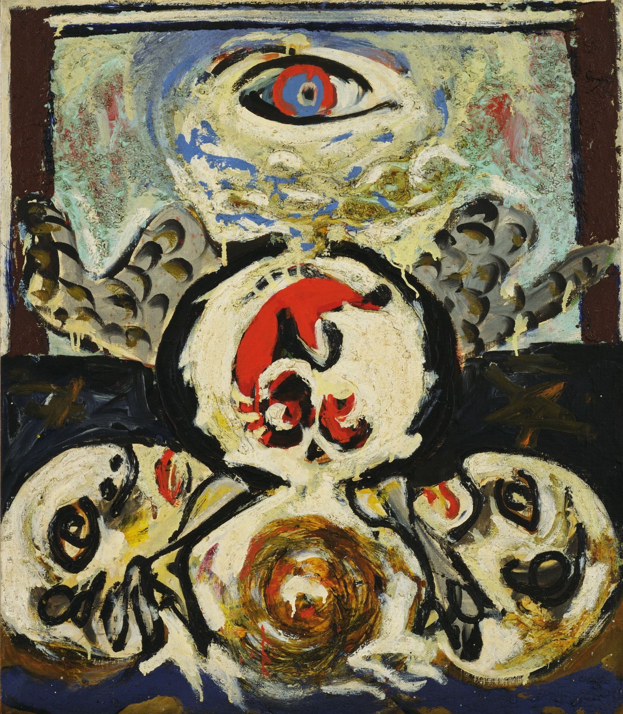

## 基本信息

- 作者：[[波洛克 Jackson Pollock]]
- 创作年代：1938–1941
- 材质：(*not from wiki*)
- 尺寸：(*not from wiki*)
- 现存地：纽约现代艺术博物馆 MoMA (*not from wiki*)

## 画面与技法

[[荣格 Carl Jung]] 派精神病医生建议波洛克"在纸上自动画画"之后的**梦境绘画**期代表作之一。已明显追求 [[超现实主义 Surrealism]] 美学。

## 历史背景 (*not from wiki*)

1938 年波洛克因酗酒被误诊为精神分裂入院，主治医生是荣格派——医生让他自动画画，由此把波洛克带上超现实主义路径。这幅画跨度 3 年，正是这段心理治疗-绘画转化期的产物。

## 图片清单

| 编号 | 出自 | 描述 |
|---|---|---|
| 01 | [[096｜波洛克：什么是当代艺术的第一个流派？]] | 鸟 Bird (1938–1941) |

## 出现在

- [[096｜波洛克：什么是当代艺术的第一个流派？]]
