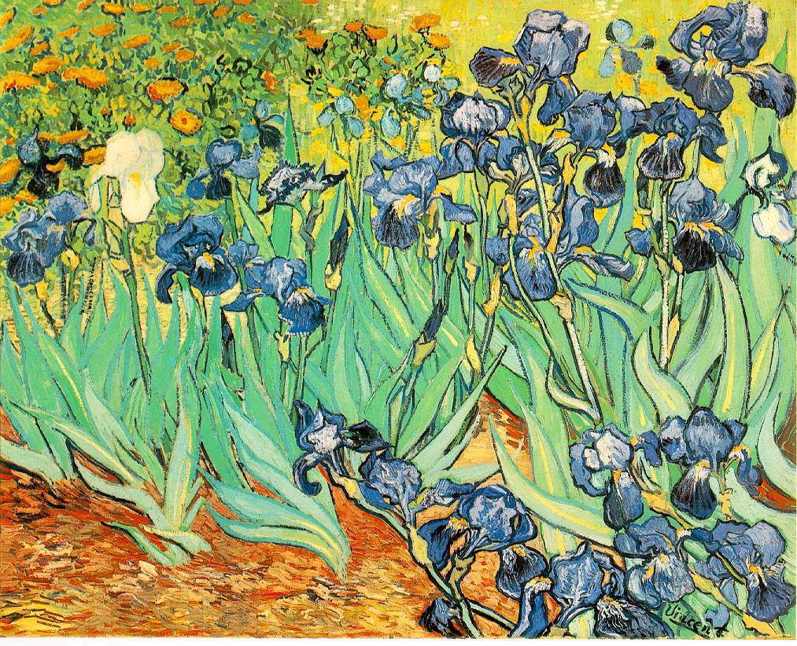

## 基本信息

- 作者：[[凡·高 Vincent van Gogh]]
- 创作年代：1889
- 材质：布面油画 (*not from wiki*)
- 尺寸：(*not from wiki*) 71 × 93 cm
- 现存地：(*not from wiki*) 洛杉矶盖蒂博物馆 (J. Paul Getty Museum)

## 画面与技法

058 用以举证凡·高的**"以我为主"对各流派的肆意解读**：

- **该用线条就用线条**——叶子的轮廓直接勾出，公然违反"印象派不画线条"的纪律
- **该用小笔触就用小笔触**——花瓣与花瓣之间的色彩振动来自印象派
- **紫与黄**——画面整体的补色策略
- **平涂大色块**——浮世绘式简化

这种"该 X 就 X"的自由是 058 与 [[睡莲系列 Water Lilies]]（莫奈必须遵守"印象派不画线条"）对照的关键样本——也是顾衡 058 论点"理论形不成约束反而拥有了更大创作自由"的代表证据。

## 历史背景 (*not from wiki*)

1889 年 5 月凡·高自愿住入 [[圣雷米精神病院 Saint-Paul-de-Mausole]] (Saint-Rémy-de-Provence)，《鸢尾花》是入院第一周完成的作品——画面之鲜活与画家精神状态的恶劣形成强烈反差。他自评："这幅画让我没有发疯。"

## 图片清单

| 编号 | 出自 | 描述 |
|---|---|---|
| 01 | [[058｜凡·高2：为什么他的风格难以界定？]] | 整幅画作，"该线条就线条、该小笔触就小笔触"的自由 |

## 出现在

- [[058｜凡·高2：为什么他的风格难以界定？]]
