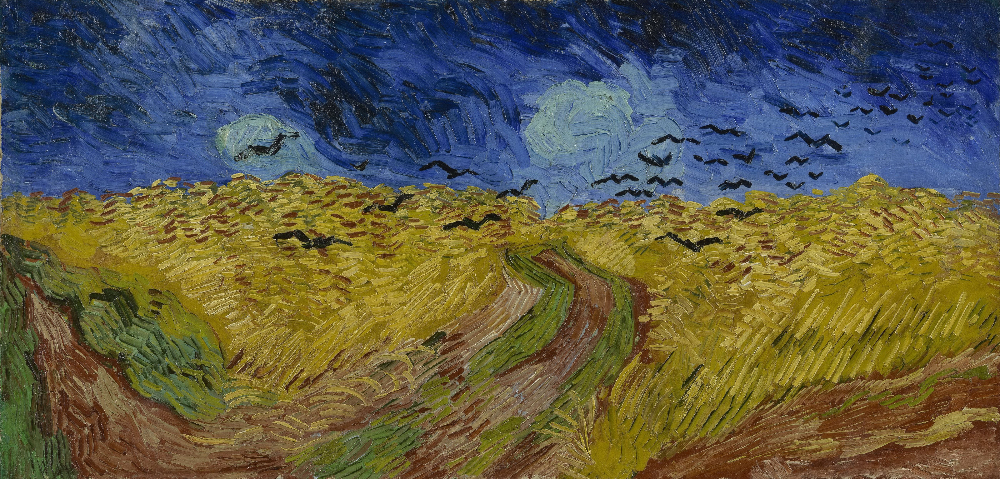

## 基本信息

- 作者：[[凡·高 Vincent van Gogh]]
- 创作年代：1890
- 材质：布面油画 (*not from wiki*)
- 尺寸：50.5 × 103 cm (*not from wiki*)
- 现存地：阿姆斯特丹凡·高博物馆 (*not from wiki*)

## 画面与技法

凡·高临终前最后几幅作品之一。横长画幅、压抑的乌云密布、三条分岔小路均不通向地平线、一群黑色乌鸦从地平线扑面飞来。顾衡 059 解读："乌云密布，画中的三条小路没有一条到达地平线，表达了无路可走的绝望。"

凡·高画此作时正接到提奥的信——1890 年提奥生意出问题、只寄来 50 法郎并附条说剩下 100 法郎尽快想办法。这是十年来从未发生的事情。凡·高回信道："我的生活，从根基上被破坏，我的脚只能颠簸着走……我担心我已经成了你们沉重的负担，画上的线条很生硬，失去了秩序，天地鸣动，所有的凄切、悲哀和绝望，都从地平线的那一端扑过来。"

## 历史背景 (*not from wiki*)

长期被误认为凡·高"绝笔"，但据 Van Gogh Museum 最新研究本作约作于 1890 年 7 月初，临终前两三周；最后完成的画作另有 *Tree Roots* 或 *Daubigny's Garden* 等候选。1890 年 7 月 29 日凡·高在奥维尔麦田朝胸口开枪自伤，两天后死于提奥怀中。

## 图片清单

| 编号 | 出自 | 描述 |
|---|---|---|
| 01 | [[059｜凡·高3：他为什么走向毁灭？]] | 乌云压顶、群鸦盘旋、三路分岔 |

## 出现在

- [[059｜凡·高3：他为什么走向毁灭？]]
