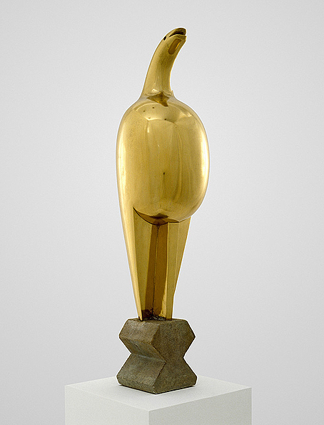

## 基本信息

- 作者：[[布朗库西 Constantin Brâncuși]]
- 创作年代：1910–1912
- 材质：抛光青铜 / 大理石（多版本） (*not from wiki*)
- 尺寸：约 55–60 cm 高 (*not from wiki*)
- 现存地：多版本 — 巴黎蓬皮杜、伦敦泰特、纽约 MoMA 等 (*not from wiki*)

## 画面与技法

题名取自[[布朗库西 Constantin Brâncuși]] 故乡**罗马尼亚的民间传说**——一只能预言爱情、化解黑暗的"神鸟"。本作是布朗库西"鸟"母题的**第一阶段**：仍然**具象**——可辨认鸟的轮廓、头、喙、突出的胸脯、长尾。

顾衡 078 解读："**很快，他就认为作为鸟的原型而言，《麦雅斯特拉》过于具象了**"——于是迅速进化成 [[空间的鸟 (布朗库西) Bird in Space]] 系列。

**柏拉图框架**：本作 = **摹仿**（仍在描述一只具体的神鸟）；[[空间的鸟 (布朗库西) Bird in Space]] = **原型**（提炼为"飞翔"本身的几何垂直）。两件雕塑构成"摹仿 vs 原型"的最直观对子。

## 历史背景 (*not from wiki*)

《Maiastra》布朗库西从 1910 起做了至少七个版本——青铜、大理石、不同高度。早期版本在巴黎独立沙龙展出后即引起关注，成为他从写实雕塑向抽象雕塑过渡的关键标志。

## 图片清单

| 编号 | 出自 | 描述 |
|---|---|---|
| 01 | [[078｜莫迪里阿尼：画中女子为什么让人一眼难忘？]] | 仍具象的"神鸟"造型 |

## 出现在

- [[078｜莫迪里阿尼：画中女子为什么让人一眼难忘？]]
