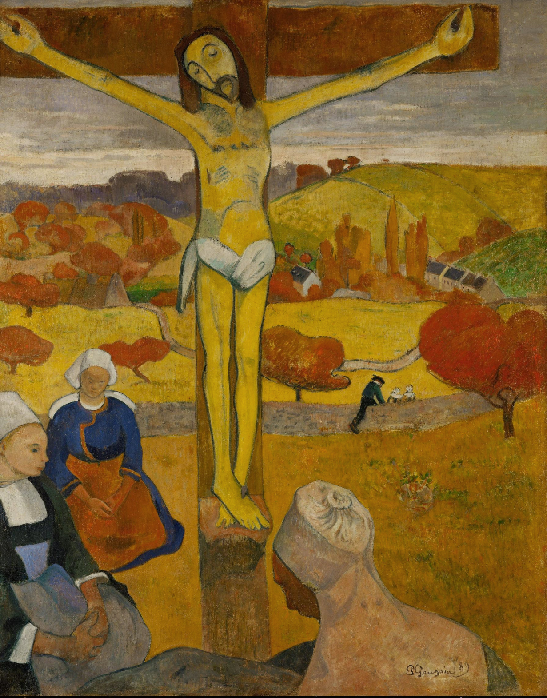

## 基本信息

- 作者: [[高更 Paul Gauguin]] (*not from wiki*)
- 创作年代: 1889
- 材质: 布面油画
- 尺寸: 92 × 73 cm (*not from wiki*)
- 现存地: 奥尔布赖特-诺克斯美术馆，水牛城 (*not from wiki*)

## 画面与技法

> Stub。046 仅引为"印象派之后看不懂"的样本，未做画面分析。
> 详细分析待后续高更专题 lecture（约 050 之后）展开。

## 历史背景 (*not from wiki*)

高更在布列塔尼阿凡桥 (Pont-Aven) 时期的代表作，与塞尚、修拉同时探索印象派之后的方向；
本画以宗教主题 + 装饰性平涂 + 黄色基督像著称，被视为综合主义 (Synthetism) 与象征主义在绘画端的合流样本。

## 图片清单

| 编号 | 出自 lecture | 描述 |
|---|---|---|
| 01 | [[046｜如何运用"时代之眼"来看画？]] | 全图 — 引为"印象派之后看不懂"的样本 |

## 出现在

- [[046｜如何运用"时代之眼"来看画？]]
