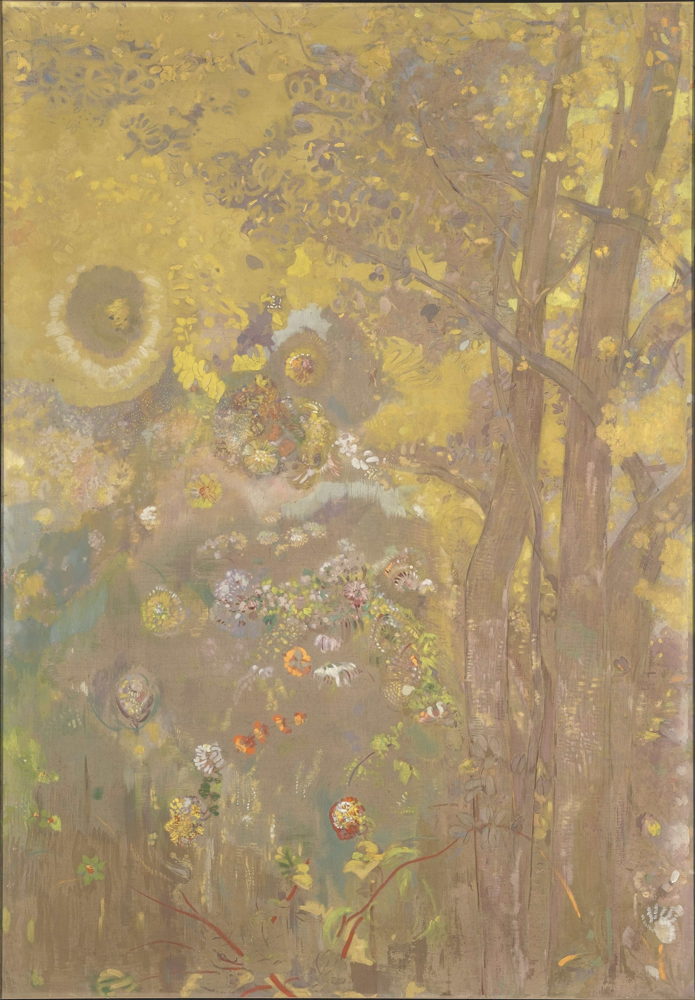

## 基本信息

- 作者：[[雷东 Odilon Redon]]
- 创作年代：1901
- 材质：年代不详
- 尺寸：年代不详
- 现存地：未注明

## 画面与技法

雷东中后期色彩转向阶段的作品——**整片饱和黄色背景上的几株简化树形**。色彩 / 形状抽象化的尝试，被顾衡 051 用作雷东 "**形的放弃** = 马拉美的'词语放弃'变奏" 的范例。

## 历史背景 (*not from wiki*)

雷东这类色域背景 + 简化形的画面，预示了纳比派、野兽派与早期抽象绘画的色彩观（*not from wiki*）。

## 图片清单

| 编号 | 出自 | 描述 |
|---|---|---|
| 01 | [[051｜雷东：怪诞是不是象征主义的方向？]] | 黄色平面上简化的树 |

## 出现在

- [[051｜雷东：怪诞是不是象征主义的方向？]]
