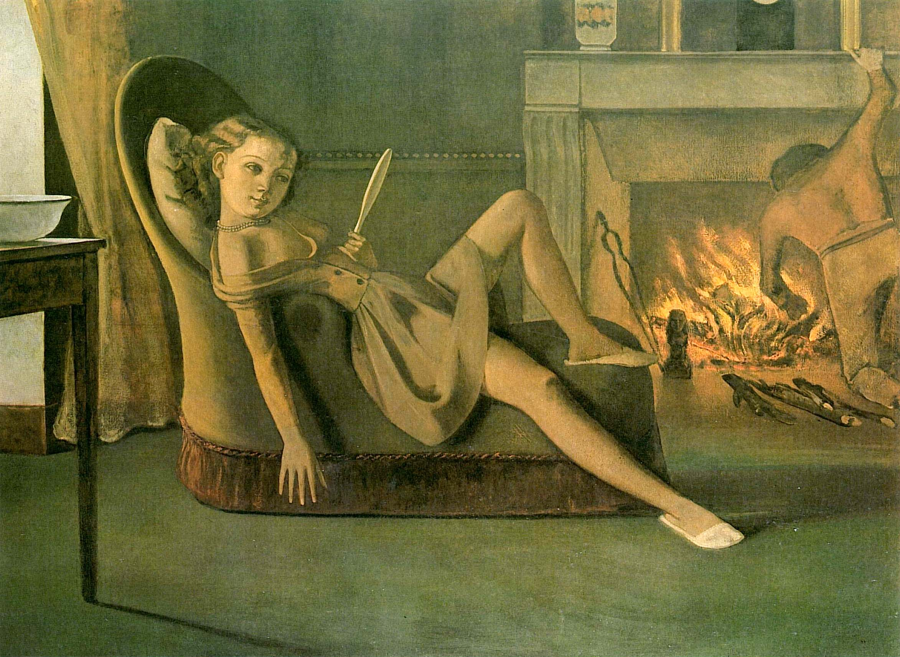

## 基本信息

- **作者**：[[巴尔蒂斯 Balthus]]
- **创作年代**：1945 (*顾衡 075*)
- **材质**：油彩 / 画布 (*not from wiki*)
- **现存地**：华盛顿赫希洪博物馆 Hirshhorn Museum (*not from wiki*)

## 画面与技法

少女半躺照镜的场景。顾衡在 075 把此作作为**"色情"的对照样本**引入：

> 对于受过良好教育的人来说，巴尔蒂斯是色情的，候麦是色情的，**而席勒却并不色情**。

顾衡的判据：色情与否**不在于露多少**，而在于**是否以挑起观者性欲为目的**。本作即被划入"色情"那一边。

## 历史背景 (*not from wiki*)

巴尔蒂斯长期以未成年少女为模特、在私密室内空间表现少女的暧昧姿态——这令他在 20 世纪艺术史上颇具争议。

## 图片清单

| 编号 | 出自 | 描述 |
|---|---|---|
| 01 | [[075｜席勒2：为什么他是"最表现主义"的画家？]] | 室内半躺少女 |

## 出现在

- [[075｜席勒2：为什么他是"最表现主义"的画家？]]
