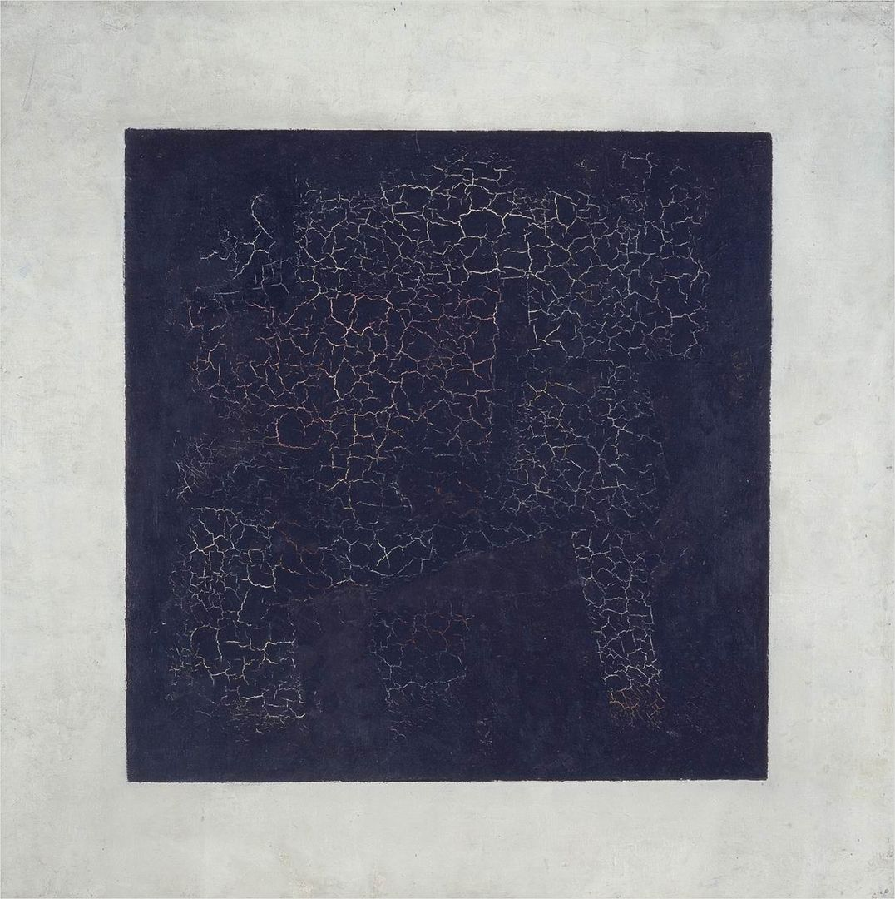

## 基本信息

- 作者：[[马列维奇 Kazimir Malevich]]
- 创作年代：1915（首版为 1913 年音乐剧《[[征服太阳 Victory over the Sun]]》幕布设计，1915 年第二轮公演时被马列维奇正式定义为绘画作品）
- 材质：布面油画 (*not from wiki*)
- 尺寸：79.5 × 79.5 cm (*not from wiki*)
- 现存地：俄罗斯莫斯科特列季亚科夫画廊 (*not from wiki*)

## 画面与技法

[[至上主义 Suprematism]] 的开山之作，也是西方艺术史上**最纯粹的几何抽象**样本之一：白色画布中央，一个黑色正方形。仅此而已。

[[马列维奇 Kazimir Malevich]] 自释：

- **为什么黑色**："这是人类感情所能做的最精简的表演。"
- **为什么正方形**："因为它充满了所有物质的缺失，孕育着许多意义。"

顾衡 083 评点：马列维奇说不清自己作品的意义，他的"理性正是套在艺术家身上的枷锁"宣言，本身就是反逻辑反理性的——和 [[康定斯基 Wassily Kandinsky]] **理论先行、创作不彻底**的路径恰恰相反，他是**创作彻底抽象、但理论说不清**。

## 历史背景

1913 年，马列维奇为他和文人朋友们的音乐剧《征服太阳》设计幕布——一个 35 世纪人类把太阳关进盒子的荒诞科幻剧，"和后面出现的达达主义挺像"。马列维奇本是出于荒诞效果画了白布上一个黑方块。

1915 年第二轮公演时，他"回过味儿来了"，写信给导演："这幅无意中完成的创作，可能蕴含着非凡的成果。"随即发表《[[至上主义绘画宣言 Suprematist Manifesto|至上主义绘画宣言]]》：

> 对于至上主义者来说，客观世界的视觉现象本身是没有意义的，重要的是感觉。这种感觉与客观世界也没有关系。我们不研究也不接触客观世界，我们只靠感觉……模仿性的艺术必须被摧毁，就如同消灭帝国主义军队一样。

[[康定斯基 Wassily Kandinsky]] 和 [[蒙德里安 Piet Mondrian]] 看到本作后深以为然——康定斯基从 1923 年开始画几何块块即是被马列维奇影响。

## 图片清单

| 编号 | 出自 | 描述 |
|---|---|---|
| 01 | [[083｜马列维奇：什么是至上主义？]] | 全画 |

## 出现在

- [[083｜马列维奇：什么是至上主义？]]
