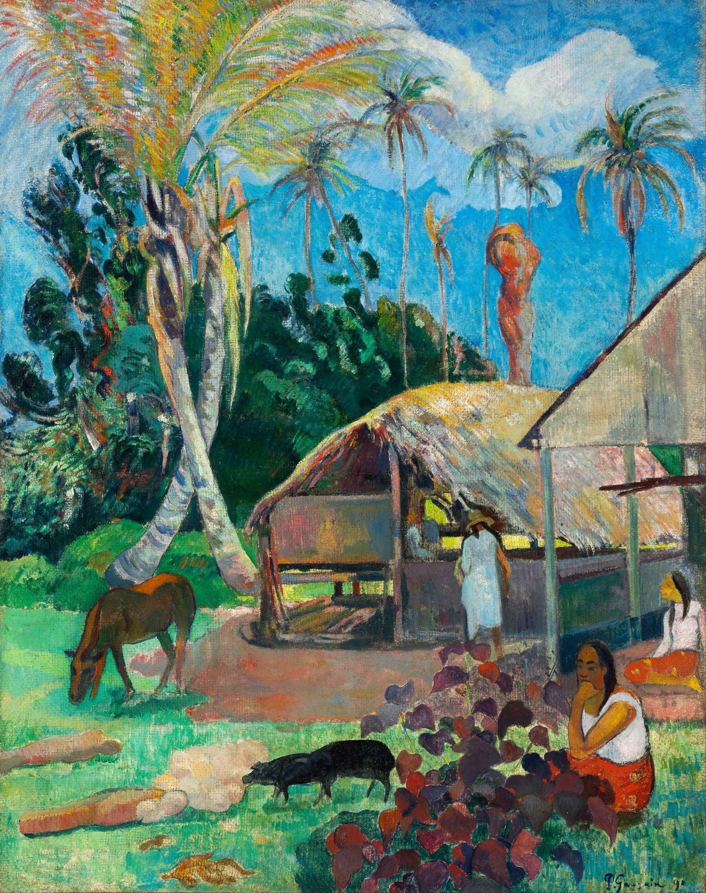

## 基本信息

- 作者: [[高更 Paul Gauguin]]
- 创作年代: 1891
- 材质: 布面油画 (*not from wiki*)
- 尺寸: 信息不全 (*not from wiki*)
- 现存地: 布达佩斯美术博物馆 (Szépművészeti Múzeum, Budapest) (*not from wiki*)

## 画面与技法

- 高更 1891 年首次抵达塔希提后的早期作品之一。
- 顾衡："**因为这次拍卖的成功，到了塔希提岛之后，高更的创作实际上就更加偏向象征主义了。形状越来越简化，颜色也越来越主观、越来越鲜艳。**"——黑猪作为这一阶段的样本。
- 装饰性突出（[[奥里耶 Albert Aurier]] 总结的"五个性"中的装饰性）。

## 历史背景 (*not from wiki*)

1891 年 6 月高更抵塔希提，9350 法郎拍卖收入资助了他的远行。

## 图片清单

| 编号 | 出自 | 描述 |
|---|---|---|
| 01 | [[056｜高更2：象征主义还能走多远？]] | 全图 — 塔希提早期 |

## 出现在

- [[056｜高更2：象征主义还能走多远？]]
