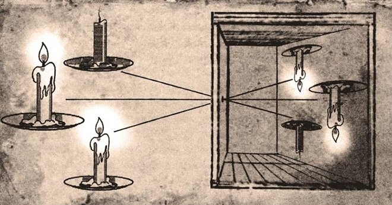

## 一句话总结

总导论给出本课的方法论坐标：艺术鉴赏需要的是**阐释**而非**主观感受**；阐释只能交给艺术史这门"对艺术观念谱系的梳理"学问；艺术史历史上有四种主要方法，本课选其中"绘画与社会环境互动"一支，工具是 [[巴克森德尔 Michael Baxandall]] 的 [[时代之眼 Period Eye]]。

## 核心论点

1. **绘画讨论里"感受"与"阐释"是两种东西**——后者才有公共价值。专业人士不应该对画"啊啊啊好棒"，应该讲清楚里面的道道。
2. **画家解释不了自己**（"会画不会说"），**知识分子又容易胡说**（劳什伯格夸错归属的《[[戴金盔的男子 Man with the Golden Helmet]]》六万字、多热莱斯用驴尾巴画《[[阿德里阿蒂克的日落 Sunset over the Adriatic]]》骗倒整个评论圈）。**这两类失败逼出了艺术史这门学问**。
3. **艺术史 ≠ 关于艺术的历史**——不是"画家生平 + 作品"，而是**对艺术观念谱系的梳理**。要回答的是"为什么"，不是"是什么"。
4. **艺术史有四种解读路径**（详见 [[艺术史四种方法 Four Approaches to Art History]]）：质料与技术 / 图像志 ([[潘诺夫斯基 Erwin Panofsky]]) / 风格内在演进 ([[沃尔夫林 Heinrich Wölfflin]]) / 绘画与社会的互动 ([[丹纳 Hippolyte Taine]] → [[巴克森德尔 Michael Baxandall]])。
5. **顾衡的选择是第 4 条**——以 [[时代之眼 Period Eye]] 为工具，每讲一个画家先还原他的社会气氛、新技术、当时流行的文学与哲学。

## 涉及实体

### 时代

- 隐含：现代绘画（19 世纪后）—— 阐释引领创作的张力激化之时段。

### 流派

- 提及但不展开：浪漫主义绘画（lecture 033–034 将专题）

### 人物

- [[巴克森德尔 Michael Baxandall]] —— 本课方法论奠基者，再次点名
- [[潘诺夫斯基 Erwin Panofsky]] —— 图像志学派代表
- [[沃尔夫林 Heinrich Wölfflin]] —— 风格内在演进派代表
- [[丹纳 Hippolyte Taine]] —— "种族·时代·环境"三参数派代表
- 路人式引述（未建页）：
  - 雅各布·劳什伯格 Jakob Rosenberg（艺术史家，错夸《戴金盔的男子》）
  - 波德莱尔 Charles Baudelaire（诗人，把德拉克罗瓦树为浪漫主义旗手）
  - 罗兰·多热莱斯 Roland Dorgelès（记者，驴尾巴绘画的策划者）
- 课程后续将专题讲解（本篇仅举例提及，未建页）：
  - 毕加索 Pablo Picasso（lecture 064–067）
  - 伦勃朗 Rembrandt（lecture 025–026；本篇围绕《戴金盔的男子》归属翻案展开）
  - 德拉克罗瓦 Eugène Delacroix（lecture 034；本篇以"被波德莱尔硬树为浪漫主义旗手"为例）
  - 莫奈 Claude Monet（lecture 041–042；本篇以生平 vs. 作品阐释的反例提及）
  - 达·芬奇 Leonardo da Vinci（lecture 010；本篇为《最后的晚餐》技术案例）
  - 凡·艾克 Jan van Eyck（lecture 019；本篇为《阿尔诺菲尼夫妻像》图像志案例）
  - 雷诺阿 Pierre-Auguste Renoir（lecture 043；本篇以"艺术家是小溪里的软木塞"引语提及）

### 技法

- [[小孔成像法 Camera Obscura]] —— 文艺复兴画家用以辅助透视，是"为何画中左撇子激增"的可能解释，本篇作为"质料与技术"路径的案例

### 作品

- [[藤椅上的静物 Still Life with Chair Caning]] —— 毕加索 1912，西方艺术第一件 collage，本篇开场例子
- [[戴金盔的男子 Man with the Golden Helmet]] —— 1985 年归属翻案；本篇用以批判"主观感受式"解读
- [[阿德里阿蒂克的日落 Sunset over the Adriatic]] —— 1910 年驴尾巴绘画骗局；本篇用以批判知识分子的主观滥用
- [[最后的晚餐 The Last Supper]] —— 达·芬奇违反 fresco 规范造成的剥落；本篇"质料与技术"路径案例
- [[阿尔诺菲尼夫妻像 The Arnolfini Portrait]] —— 潘诺夫斯基图像志读法的范本；本篇"图像志"路径案例

### 概念

- [[艺术史四种方法 Four Approaches to Art History]] —— 本篇结构骨架
- [[图像志 Iconography]] —— 第二种方法的具名版本
- [[时代之眼 Period Eye]] —— 本课主轴方法论，本篇再次点名

## 与其他课程的连接

- 上承：[[发刊词｜我们都有搞懂艺术的权利]] —— 发刊词已说"用时代之眼+三阶段框架来讲全课"，001 把这个"为什么这样讲"补全为完整的方法论坐标。
- 下接：[[002｜古希腊雕塑：为什么做得这么逼真？]] —— 002 是顾衡的方法论的首个落点：用[时代之眼]还原前 7 世纪希腊的社会与技术条件。
- 各种"将来回看 001 的彩蛋"：
  - lecture 010 达·芬奇 → 接续《最后的晚餐》
  - lecture 019 凡·艾克 → 接续《阿尔诺菲尼夫妻像》
  - lecture 025–026 伦勃朗 → 重新评估真伪问题
  - lecture 034 德拉克罗瓦 → "被知识分子树成旗手"的代价
  - lecture 041–046 印象派 → 莫奈的生平 vs. 作品阐释如何不同
  - lecture 064–067 毕加索 → 重新看《藤椅上的静物》在立体主义里的位置

## 我的反应

<!-- 留空给用户 -->

## 原文

> 来源：https://www.dedao.cn/course/article?id=wgpMLla6Py4qK25MPlXYmvNzjd2Zx1
> 出处：[[顾衡·西方美术100讲]] · 11分48秒　顾衡 亲述

你好，我是顾衡。

你很可能不是一个研究艺术、从事艺术相关工作的专业人士。我自己也不是。

所以在这门课正式开始之前，我想先跟你讨论一个重要的问题：

作为非专业人士，我们想要了解艺术，应该通过什么方法呢？

那第一个反应，当然就是摆个小板凳，听专业人士给我们说说呗，但是听谁的、怎么听，也值得想一想。

举个例子，翠花周末去美术馆，看了一幅毕加索的《藤椅上的静物》，回家说给大柱子听。

<!-- src: https://piccdn3.umiwi.com/img/202103/08/202103081815426686226322.png -->
<!-- artwork: [[藤椅上的静物 Still Life with Chair Caning]] -->

毕加索《藤椅上的静物》

她会说些什么呢？从内容的性质上，可以分为 **主观** 和 **客观** 这么两种：

1. 主观的感受：我特别喜欢这幅画，那个藤椅跟锅盔似的，直接把我看饿了。老公咱晚上出去吃锅盔吧？
2. 客观的阐述：你说别人的画都是画上去的，这个毕加索咋是直接贴上去的呢？卖那么老贵，老公你说买他画的人脑子是不是进水了？

现在很多专业人士，对一幅画的解读都是采取了第一种方式。就是先扯几句艺术家的生辰八字，然后就大谈特谈他的感受。

比如有个叫雅各布·劳什伯格的专业人士，写了整整一本书，说你瞧瞧伦勃朗的这幅《戴金盔的男子》，多么光彩夺目，精神内涵支配了整个画面，伦勃朗彻底将梦幻与真实融合在一起，这种效果更像音乐而不是造型艺术，blabla，夸了六万多字高高的。

可是后来发现，这幅画根本就不是伦勃朗画的。情何以堪呢？

<!-- src: https://piccdn3.umiwi.com/img/202103/08/202103081818014681795791.jpg -->
<!-- artwork: [[戴金盔的男子 Man with the Golden Helmet]] -->

《戴金盔的男子》

这种对着一幅画啊啊啊谈主观感受的解读方式，不仅不靠谱，更不是我们想要的。

专业人士的任务不是对大众表达自己的好恶，而是讲清楚里面的道道。就好比一个医生，天天对着病人哭，啊呀你好可怜呀！但是不跟病人聊病怎么治。这成何体统呢？

我们需要专业人士为我们提供的，是解释， 你说看见这幅画你的脑海里想起了妈妈小时候做的红烧肉，那你回家跟你妈妈说去。和别人说不着啊！

那如果知识分子不靠谱，咱们请个画家来给咱解释解释，这样行不行呢？那就更不行了。

因为创作和阐释完全是两码事。画家会画不会说，知识分子会说不会画。艺术的实践和对艺术的阐释就成了分裂的东西。

在19世纪以前，这个矛盾并不严重，但是到了现代绘画之后，知识分子对艺术的阐释不再是回顾性的，而是要引领画家创作了。这下矛盾就激化了。

**一方面，报纸杂志这些渠道都掌握在知识分子手上，而且论起耍嘴来，画家也确实不是对手。**

知识分子对艺术的阐释往往很粗暴很蛮横。腰一掐，我说你是啥你就是啥，你画家自己说了不算。

一个最著名的例子就是法国画家德拉克罗瓦。

波德莱尔几个诗人、作家，硬是把德拉克罗瓦树成了浪漫主义绘画的旗手。造成了什么结果呢？德拉克罗瓦在理念层面与学院派的对抗，弄得他评法兰西美术学院院士，评了六次都没评上，把德拉克罗瓦恨得牙痒痒，都是朋友没办法，只能在日记里抱怨几句得了。

**那你说，知识分子文化大，我们画家画完了就由着你们说了，行不行呢？也不行！**

画家是属于茶壶里煮饺子，肚子里有货，只是不知道怎么用文字表达出来。知识分子你根本搞不清楚人家饺子是啥馅的就抡开腮帮子胡说，那能靠谱吗？

1910年，有个叫多热莱斯的记者找了个公证人，又找了头驴。在驴尾巴上绑上画笔，在驴屁股后面支了块画布，然后就喂驴吃胡萝卜，把驴美得直摇尾巴。这么着，一幅画就成了。

还给起了个特别高大上的名字，叫《阿德里阿蒂克的日落》，镶了个框就送去参展了。

<!-- src: https://piccdn3.umiwi.com/img/202103/08/202103081826540998323212.jpg -->
<!-- artwork: [[阿德里阿蒂克的日落 Sunset over the Adriatic]] -->

《阿德里阿蒂克的日落》

好评如潮啊！法国评论界全都嗨起来了，生命的喜悦啊，灵魂的悸动啊，命运的抗争啊，又夸了六万多字高高的。然后，多热莱斯公布了真相。你说说，情何以堪呢？

这么着，艺术的创作与对艺术的阐释，就成了一个很尖锐的矛盾。

正是在这样的背景下，艺术史这门学问应运而生。所谓对艺术进行阐释，说破大天去就是把一幅画转化为文字符号。

既然是用文字符号来阐释，这个工作就必然是由知识分子来承担，画家干不了这事儿。

这是我花了很长时间才想明白的第一个问题：

咱们说请个专业人士来给我们讲讲绘画，这个专业人士，不能是个画家，而是艺术史专业人士。

那紧接着就产生了下一个问题：什么是艺术史？

不要被名字所误导，艺术史并不是关于艺术的历史，而是对艺术观念谱系的梳理。

什么是"关于艺术的历史"呢？就是前面说的个人生平＋作品这种说法。

比如我们说莫奈，他1840年出生于巴黎，爸爸是开小店的，莫奈画了《日出·印象》，老了搬到吉维尼花园后开始画《睡莲》。

但是，个人生平却并不能有效地解释作品。所以聊到作品就又回到"啊啊啊，好棒呀"那一堆语气助词去了。这不是我们想要的阐释，而是我们不想要的感受。

而艺术史的任务，则是要回答这样一些问题：莫奈为什么要把睡莲画成这个样子？毕加索为什么要把藤椅片贴到画布上？在眼睛所见到的东西之外的那个"为什么"，才是我们真正想知道的。

那么，艺术史这门学科如何完成这个任务呢？大致有四个办法：

第一，关注质料和技术。

这是个很有意思、但经常被忽略的话题。比如为什么《最后的晚餐》上有那么大面积发黑和剥落，其实是因为达·芬奇不恰当地用油画取代了蛋彩。

<!-- src: https://piccdn3.umiwi.com/img/202103/30/202103301154169004768058.jpg -->
<!-- artwork: [[最后的晚餐 The Last Supper]] -->

达·芬奇《最后的晚餐》

再比如为什么文艺复兴时期画里的人有那么多左撇子？一个可能的解释是当时的画家普遍使用小孔成像法，把要画的人通过小孔投影到暗室的平面上，帮助他们准确地画出形体。

<!-- src: https://piccdn3.umiwi.com/img/202103/16/202103161629326916016564.jpg -->
<!-- 小孔成像法示意图，配 [[小孔成像法 Camera Obscura]] 段落 -->

第二，就是对画面出现的所有东西给出一个解释，画家为什么要让这个东西入画。

比如凡·艾克的名画《阿尔诺菲尼夫妻像》。

<!-- src: https://piccdn3.umiwi.com/img/202103/08/202103081830383782651213.png -->
<!-- artwork: [[阿尔诺菲尼夫妻像 The Arnolfini Portrait]] -->

凡·艾克《阿尔诺菲尼夫妻像》

为什么有一双拖鞋？为什么要画一只小狗？画家为什么要把名字签在镜子上方？窗台为什么要放个橘子？大白天的为啥要点蜡烛啊？

这么解读一幅画的方式，叫 图像志 ，这个门派的代表人物是 **潘诺夫斯基** 。

不过这个学派存在一个风险，就是过度诠释。尤其到了现代，人家画家往往没想那么多，就是为了好看，为了装饰，那图像志这个办法就不一定行得通。

第三，就是相信绘画这东西，存在着风格演进的内在逻辑。

每一代画家，或多或少总是会受到前一代画家的影响。这么着，他们之间就存在着传承的关系。

艺术史学家这么一代一代地梳理，就会发现风格上的发展逻辑。大名鼎鼎的瑞士艺术史学者 **沃尔夫林** ，就是这样的想法。

第四，也有人不同意沃尔夫林，觉得绘画这东西没有什么内向的东西，而是像雷诺阿说的，艺术家只是"小溪里的一个软木塞"，随波逐流，被动地反映了外部世界。

这一派的代表人物是法国的 **丹纳** 。在咱们中国，丹纳的《艺术哲学》大概是读者最多、影响力最大的美术理论书籍了。

他认为一切事物，当然包括绘画，只要输入种族、时代和环境这三个参数，你就能得到正确的解释。就像在油锅里放进去土豆、豆角和茄子，你就一定能得到一盘地三鲜那样确定。

画家的创作会不会受到外界的影响呢？肯定会。但是丹纳的"种族、时代和环境"三个参数包打一切的想法，我肯定也不能同意。我觉得应该有更多的参数在起作用。即使只能选三个参数的话也不应该是这三个。

而沃尔夫林的想法对不对呢？就是，绘画到底有没有一种内在的、自洽的、与外界环境无关的所谓风格，自说自话、没心没肺地演化呢？这个我倾向于认为有。

沃尔夫林就打过一个比方，他说艺术的演进好比是一块石头滚下山坡，山坡的表面坑坑洼洼、有软有硬还有树枝，这个石头在滚的过程当中，就会不规则地弹跳。这个石头的蹦蹦跳跳，就相当于是艺术在跟现实互动，受外界影响。

但是，不管这块石头再怎么运动，都受到万有引力的支配，会一直向下滚。就是说，不管怎么跟外界互动，艺术风格还是有它内在和普遍的倾向的。

艺术史关注的四个问题：技术与质料、绘画的喻意、绘画风格内在的流变，以及绘画与社会环境的互动应答，这四个问题，哪个都不白给，都足以让人昏头胀脑。

对于咱们业余爱好者来说，还有一个最简化的方案，就是从艺术史最后一个问题入手：艺术与社会的互动应答。这就是我这个课的基本方法。

用英国著名艺术史学家巴克森德尔的话说，就是先造一个 "时代之眼" （The period eye）。

我在介绍哪个画家，比如莫奈，就会透过这双"时代之眼"，先还原他所处的社会环境。

- 当时社会气氛怎么样？
- 大家是喜气洋洋的还是愁眉苦脸的？
- 当时出现了什么新技术让大家最感兴趣？
- 当时最流行的文学运动和哲学流派是什么？

介绍绘画的时候，会用大量的篇幅讲当时的哲学思潮。这是我和其他人讲画最不一样的地方。

那顺着这一路下来，找到艺术流派演进的那个"地心引力"，这个是我们课程的任务和兴趣所在。

好，回到最初的问题。 不会画画的外行，能理解艺术吗？答案是能，前提就是遵循一定的艺术史方法论。

下一讲我们的课程就正式开始。我是顾衡，感谢你的收听，咱们下一讲见！

### 划重点

1. 在关于艺术的感受和阐释中，我们需要关注的是阐释部分。
2. 在艺术创作和艺术阐释的张力当中，艺术史这门学科应运而生。艺术史就是阐释观念谱系的历史。
3. 艺术史的阐释大致分为四种方法：技术与质料、绘画的喻意、绘画风格内在的流变，以及绘画与社会环境的互动应答。

<!-- src: https://piccdn3.umiwi.com/img/202103/12/202103121610257120442137.jpg -->
<!-- shared course footer (appears at end of every lecture) -->
