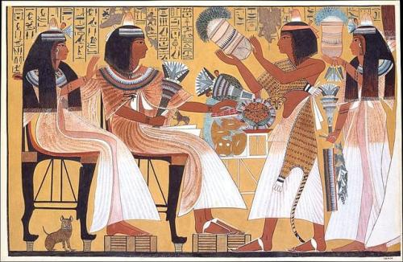
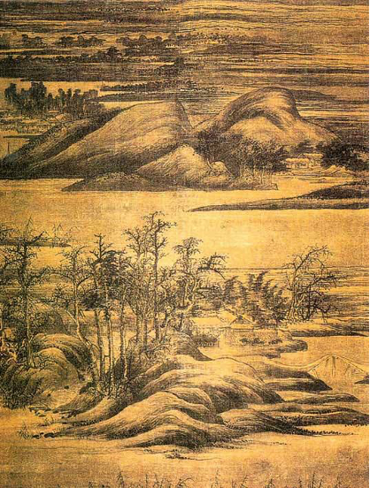
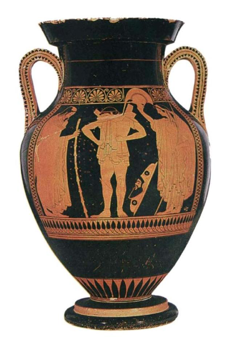
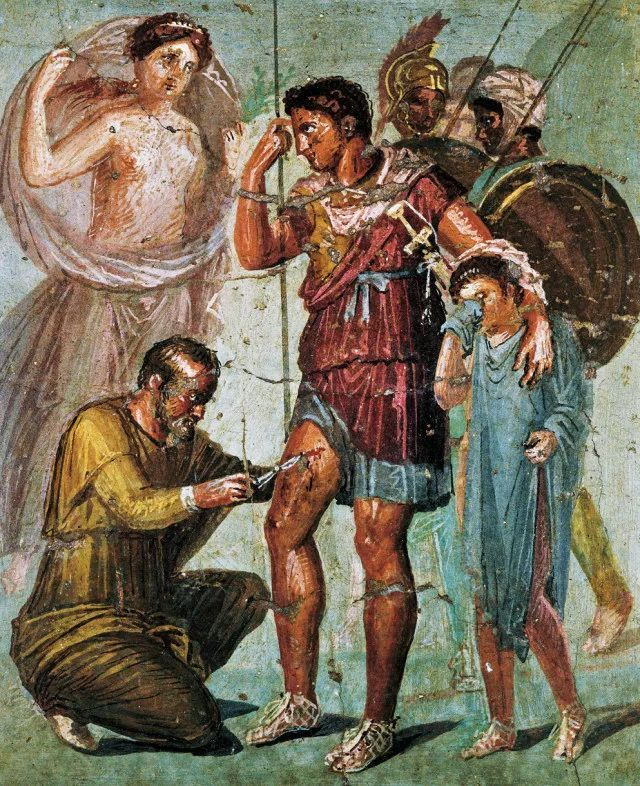

## 一句话总结

打破"画得像 = 画得好"的成见——中世纪画得不像是**不为**不是**不能**。论证路径：用古希腊文献 ([[宙克西斯 Zeuxis]] / [[帕拉西奥斯 Parrhasius]])、瓶画里的 [[短缩法 Foreshortening]]、罗马 [[马赛克 Mosaic]]、[[法尤姆肖像 Fayum Mummy Portraits]] 一路反推古希腊写实水平 → 推论"手艺到中世纪并未失传" → 站队 [[李格尔 Alois Riegl]] 对 [[瓦萨里 Giorgio Vasari]] 的反驳。

## 核心论点

1. **像 ≠ 好**：希腊艺术求真，但古埃及艺术家**心里知道什么**比"眼睛看到什么"更重要（[[正身侧面律 Composite View]]）；中国文人画"求似"被士大夫斥为匠气，文人画是统治合法性的密码本——**都是有能力画像却故意不为**。
2. **古希腊画的水准间接可证**：
   - 文献：色诺芬记苏格拉底 vs. 帕拉西奥斯对话；老普林尼记 [[宙克西斯 Zeuxis]] vs. [[帕拉西奥斯 Parrhasius]] **画葡萄 vs. 画幕布**的比试；
   - 瓶画：BC 500 陶罐上一只前伸的脚需要 [[短缩法 Foreshortening]]——埃及程式画不出来；
   - 罗马旁证：庞贝壁画是二流货色但马赛克 ([[街头乐师 Street Musicians]]、[[在吕克莫德斯的女儿中找出阿喀琉斯 Achilles Among the Daughters of Lycomedes]]) 仍承继希腊水准；
   - 偏远幸存：[[法尤姆肖像 Fayum Mummy Portraits]]（1–4 世纪罗马治下埃及）展示晚至 4 世纪希腊手艺仍未失传。
3. **瓦萨里 vs. 李格尔之争**：
   - [[瓦萨里 Giorgio Vasari]]：中世纪黑暗、手艺失传、米开朗基罗"中兴"——**不能**派；
   - [[李格尔 Alois Riegl]]：中世纪绘画的主顾是教会，教会的诉求变了（传播教义而非写实），画家是**不为**——技术与意愿要分开看。
4. **顾衡站队李格尔**：与 [[时代之眼 Period Eye]] 一致——风格变化要回到主顾、社会、目的去看，不是技术线性进步。
5. **罗马为什么从壁画转向马赛克**：(a) 东方化奢侈品味随征服而来；(b) 写实推到极致后审美疲劳——这两条共同构成 [[古罗马艺术 Ancient Roman Art]] 的媒介漂移。

## 涉及实体

### 时代

- [[古典时代 Classical Antiquity]] —— 古希腊 + 古罗马
- 隐含：中世纪（lecture 004–006 将专题）

### 流派

- [[古希腊古典时期 Greek Classical Period]] —— 绘画失传但可旁证
- [[古埃及艺术 Ancient Egyptian Art]] —— 对照系
- [[古罗马艺术 Ancient Roman Art]] —— 新建：本课罗马艺术的首篇主入口
- 提及未展开（下两课展开）：拜占庭艺术、哥特艺术
- 提及作为对照（未建页）：中国文人画

### 人物

- [[瓦萨里 Giorgio Vasari]] —— "中世纪手艺失传"派代表
- [[李格尔 Alois Riegl]] —— "中世纪是主动选择"派代表，顾衡支持
- [[帕拉西奥斯 Parrhasius]] —— 古希腊线条派画家
- [[宙克西斯 Zeuxis]] —— 古希腊明暗派画家
- [[马丁尼 Simone Martini]] —— 14 世纪锡耶纳画派，[[圣母领报 (马丁尼·梅米) The Annunciation]] 共作者
- 利波·梅米 (Lippo Memmi) —— [[圣母领报 (马丁尼·梅米) The Annunciation]] 共作者（在马丁尼页里收录）
- 路人式引述（未建页）：苏格拉底、色诺芬、老普林尼、董仲舒、董源
- 课程后续将专题讲解（本篇仅举例）：米开朗基罗 (lecture 012)

### 技法

- [[正身侧面律 Composite View]] —— 古埃及人体程式（新建）
- [[短缩法 Foreshortening]] —— 古希腊视觉策略（新建）
- 提及未展开：壁画 / 马赛克 / 蛋彩 / 油画 (后续多次涉及)

### 作品

- [[圣母领报 (马丁尼·梅米) The Annunciation]] —— 中世纪 / 锡耶纳画派代表
- [[街头乐师 Street Musicians]] —— 罗马马赛克 (公元前 3 世纪原作的罗马复制)
- [[在吕克莫德斯的女儿中找出阿喀琉斯 Achilles Among the Daughters of Lycomedes]] —— 罗马 3 世纪马赛克
- 提及未建页：庞贝古城壁画 (BC 80 通指)、古希腊陶罐 (BC 500)、董源《寒林重汀图》(中国五代)、古埃及壁画 (通指)

### 概念

- [[法尤姆肖像 Fayum Mummy Portraits]] —— 类型样本，folder-mode（新建）
- 隐含：[[时代之眼 Period Eye]] 在此案例上的应用

## 与其他课程的连接

- 上承：
  - [[002｜古希腊雕塑：为什么做得这么逼真？]] —— 002 论证希腊**雕塑**写实水平；003 把同样的论证套到希腊**绘画**上（绘画失传所以更曲折）
  - [[001｜总导论：艺术到底属于谁？]] —— 001 的"艺术史四方法"在 003 里以"瓦萨里 vs. 李格尔"形式具体落地
- 下接：
  - [[004｜拜占庭艺术：程式化的艺术是怎么回事？]] —— 004 接续"中世纪为什么主动选择不写实"
  - [[005｜哥特艺术1：为什么说它是文艺复兴的前奏？]] / [[006｜哥特艺术2：为什么在意大利发生了分化？]] —— 圣母领报的完整解读在这里
  - [[007｜文艺复兴是怎么发生的？]] —— 顾衡的逻辑会接续"中世纪是选择 → 文艺复兴是另一次选择"

## 我的反应

<!-- 留空给用户 -->

## 原文

> 来源：https://www.dedao.cn/course/article?id=e1k8gp2WGMzqJ3mb1vK5YmP6DOjxAL
> 出处：[[顾衡·西方美术100讲]] · 11分08秒　顾衡 亲述

你好，我是顾衡。

上一讲，咱们介绍了古希腊的雕塑。在雕塑艺术上，希腊人达到了令人惊叹的成就。

希腊的雕塑美，大家伙儿一眼就能看出来，因为它是求真的，做得像嘛。

这就要说到一个老生常谈，说西方艺术是写真，东方艺术是写意。可是我们看看中世纪欧洲的绘画，画得也是一点儿都不像。

%20The%20Annunciation/01.jpg)
<!-- src: https://piccdn3.umiwi.com/img/202103/10/202103101406254244959179.jpg -->
<!-- artwork: [[圣母领报 (马丁尼·梅米) The Annunciation]] -->

马丁尼、梅米 Simone Martini & Lippo Memmi
圣母领报 The Annunciation
锡耶纳主教堂 1333

所以就有人说，中世纪绘画画得不像，是因为中世纪黑暗。到文艺复兴又画得像了，就是进步了。

这就给人一种感觉：画得像就等于画得好。假如画得不像，那是因为没法画得像。是不是这样呢？并不是。

这一讲，我就围绕艺术的"像"和"好"这个问题多说两句。对这个问题的理解加深了，对后面理解中世纪的美术，到理解整个西方美术史都很有帮助。

上一讲说，古希腊人从埃及人那里学会了如何制作大型雕像以后，特殊的宗教观，导致了他们在艺术上疯狂追求眼睛所见的真实。 但是，并不是所有艺术家都像希腊人这样，追求这种真实的。

比如跟希腊人同时代的、教给他们手艺的 埃及艺术家 。

他们的兴趣并不在于呈现眼睛看到了什么，而是在于表现他们心里知道什么。

埃及艺术家画人体，会把下肢和脸庞画成侧面像，同时却把躯干和眼睛画成正面像。这个画法被称为 **"正身侧面律"** 。

埃及艺术家认为，把重要的东西交待清楚最要紧。而至于眼睛看上去是什么样子，这根本不重要。

古埃及的艺术家并不是没有能力画得像，而是认为用绘画和雕塑欺骗眼睛没有意义。

<!-- src: https://piccdn3.umiwi.com/img/202103/10/202103101407595268727963.jpg -->
<!-- 配图：古埃及壁画通例，示意 [[正身侧面律 Composite View]] -->

古埃及壁画

我们可以再拿中国的文人画来说明一下。中国的文人画，是求眼睛所见的真实的吗？当然不是！一味求真，那是匠人的想法。士大夫追求画得像，岂不是失了身份。

中国文人为什么要画画呢？为什么要强调"诗书画印，四合为一"呢？

因为早在西汉时期，董仲舒就提出了一个天道的概念。这个天道，就是统治合法性。

统治合法性的解释权在谁手上呀？就在读书人手上。

那么，自从隋唐开科取士，选拔读书人去做官，读书人既不能拒绝，又不甘心把对统治合法性的解释权拱手相让。怎么办呢？那就只能分裂。

如此一来，知识精英们就要画些梅兰竹菊互相打气。咱可不能把统治合法性的解释权交出去呀！

中国的文人画你可以把它理解成一个密码本，山间水上松下竹中，传递的信息都是"我绝不向统治者让渡合法性的解释权"。

<!-- src: https://piccdn3.umiwi.com/img/202103/10/202103101409097826004185.png -->
<!-- 配图：董源《寒林重汀图》五代，作中国文人画对照 -->

董源 寒林重汀图 五代

埃及的艺术家和中国文人，都是有能力画得像而故意"不为"。

那么欧洲中世纪的画家画得不像，是"不为"呢，还是"不能"呢？

《艺苑名人录》作者，也就是艺术史这门学科的开山鼻祖瓦萨里，认为是"不能"。他说罗马毁灭于蛮族之手后，中世纪黑暗啊，手艺都失传了。熬了一千多年，终于盼来了米开朗基罗。

啥叫文艺复兴啊？就是把古希腊前辈的手艺给捡回来了呗。

瓦萨里的这个说法，奥地利的艺术史家李格尔就不同意。

他认为中世纪的绘画是以传播基督教为目的的。中世纪绘画之所以背离了"画得像"的古希腊传统，是因为教会对艺术家提的要求发生了变化，和技术无关。

这两个人谁是对的呢？我的态度倾向于李格尔。 中世纪绘画画得不像，并非不能，实不为也。

为什么这么说呢？要想回答这个问题，我们就要往回看，去了解中世纪之前的绘画到底是个什么样子。

先看古希腊。古希腊的艺术成就主要是在雕像，绘画一幅都没传下来，这可如何是好呢？那就只能靠猜。

**首先我们来看文献。**

苏格拉底死后，他的学生色诺芬写了一本《回忆苏格拉底》，纪念他的老师。书里记载了苏格拉底对当时雅典最著名的画家帕拉西奥斯的一次拜访。

- 苏格拉底问："帕拉西奥斯，绘画是要创造眼睛所见的相似物吗？想必你是用色彩来表现隆起和凹陷、黑暗和光明、坚硬和柔软、粗糙和平滑、年轻和年迈的身体？"
- 画家回答说："我的确是这样做的。"

这段对话清晰地表明了，当时希腊的画家和雕塑家一样，都是把表现眼睛所见的真实视为最要紧的事情。

这位帕拉西奥斯，老普林尼在他的《自然史》中也提到过，说他曾经和另一位著名画家宙克西斯比赛。

- 宙克西斯画的是葡萄，帕拉西奥斯却用一块幕布蒙在自己的画上。
- 宙克西斯把画拿出来之后，竟然有小鸟跑来啄食，宙克西斯大为得意，跑去掀帕拉西奥斯蒙在画上的幕布，发现这块幕布竟然是画上去的。
- 宙克西斯当场认输，说："我只骗过了小鸟，而你却骗过了我。"

这个故事，可信度当然不高。希腊人爱吹牛也会吹牛，在欧洲是出了名的。

但是，老普林尼还记载了一件事，说这场比赛是源于这两位画家的一次争论。

怎么才能让一幅画达到乱假成真的效果呢？宙克西斯认为用色调的明暗去营造纵深更为重要，而帕拉西奥斯却认为线条的准确更为重要。从比赛结果来看，主张线条的帕拉西奥斯赢了。

在二维的平面上如何营造三维的错觉，这是个很难，也很专业的事情。作为作家的老普林尼，不可能杜撰出这样的情节。

如果古希腊的画家们曾经讨论过轮廓更重要还是明暗更重要的话，那我们大致可以相信，古希腊画家已经有能力在一个二维平面上制造出令人信服的三维效果。

**其次，古希腊的绘画虽然没有留下来，但是我们还是挖出了很多带图案的陶罐。**

用陶罐上的图案来推测绘画作品当然不靠谱，就像我们不能举着个景德镇的瓷瓶去猜当时中国画家在纸上和绢上都画了什么一样。

但是这只公元前500年左右的陶罐却展示了一个重要的信息。

<!-- src: https://piccdn3.umiwi.com/img/202103/10/202103101411221667937387.png -->
<!-- 配图：BC 500 古希腊陶罐，示意 [[短缩法 Foreshortening]] 已存在 -->

我们看中间这个年轻人，他的左脚是向前的。这种画法在埃及壁画里从未出现过。

要准确地画出这只向前的脚，就需要用到 **短缩法** 。所谓短缩法，就是当我们观看的物体与视线有角度时，会呈现出变形。

现在人手一个手机，大家都知道，拍女朋友的时候要趴在地上拍，才能拍出大长腿的效果。如果你是举在头顶往下拍呢，那女朋友就和你分手了。

有角度的东西要画得准确，这可一点儿都不容易。即使是到了文艺复兴之后，这对于画家们来说也仍然是个挑战。

古希腊和中世纪离得太远，我们再看一个离得近一点的窗口，就是罗马。

虽然罗马人很仰慕希腊人的文化，虚心向希腊人学习修辞、文学、戏剧、医学，甚至还有法律。但是就艺术而言，罗马人却不是一个合格的学生。

根据老普林尼的说法，公元一世纪刚开始不久，罗马的富人就醉心于马赛克画。只有不怎么富裕的人，为了省钱才会选择壁画。那么可想而知，他们能请到的壁画画家就只是些二流货色。

所以，目前艺术史界普遍认为，被火山毁灭的庞贝古城发现的壁画，完全不能体现出古希腊鼎盛时期的水准。

<!-- src: https://piccdn3.umiwi.com/img/202103/10/202103101415444578109422.jpg -->
<!-- 配图：庞贝古城壁画通例（BC 80 左右，二流画家作） -->

庞贝古城壁画
公元前80年左右

不过幸运的是，我们在遥远的古罗马，也看到了"礼失，求诸野"的现象。

就像今天日本反而更好地保留了唐宋时期中国的建筑风格和风俗礼仪一样。同样的，虽然在罗马本土，希腊绘画艺术已经失传了，但是在埃及的法尤姆地区，发现了很多1－4世纪的肖像画。

我们可以从这些肖像画中，遥想当年古希腊的绘画达到了怎样的水准。

<!-- src: https://piccdn3.umiwi.com/img/202103/10/202103101416162439379189.png -->
<!-- concept: [[法尤姆肖像 Fayum Mummy Portraits]] -->

埃及法尤姆壁画

虽然马赛克画也非常精美，但是论到乱真的程度，当然远赶不上希腊人传下来的壁画。但是，罗马人却舍弃了壁画，选择了马赛克。

<!-- src: https://piccdn3.umiwi.com/img/202103/10/202103101422265167925737.jpg -->
<!-- artwork: [[街头乐师 Street Musicians]] -->

马赛克 街头乐师 罗马复制品
原作于公元前3世纪

<!-- src: https://piccdn3.umiwi.com/img/202103/10/202103101423158011226330.jpg -->
<!-- artwork: [[在吕克莫德斯的女儿中找出阿喀琉斯 Achilles Among the Daughters of Lycomedes]] -->

马赛克 在吕克莫德斯的女儿中找出阿喀琉斯
公元3世纪前半叶

为什么呢？有两个原因。

一是老普林尼说的，随着罗马人征服了近东和中东，自然也沾染上了东方奢华的风气。用宝石镶嵌而成的画，画面富贵逼人，也能保存得更长久，于是深得富人的喜爱。

二是，艺术家创作也好，画主的趣味也好，都是求变的。一种艺术风格一旦达到完美，过不了多久就会让人厌倦。每幅画都跟照片似的，每一尊雕塑都跟真人涂了一层石膏似的，这有多无聊呢？

古罗马人趣味的变化，也能从侧面证明了，古希腊画家在追求眼睛所见的真实上，达到了怎样的高度。

我们总结一下。虽然古希腊的绘画作品一幅也没有流传下来，但是我们可以通过文献记载、瓶画和罗马时期的考古发现，对古希腊的绘画水平进行猜测。

虽然西罗马帝国在公元476年就灭亡了，但是东罗马帝国又延续了将近1000年，它的文明并没有发生断裂。从埃及的法尤姆肖像画来看，晚至四世纪，希腊人的手艺也并没有失传。

所以，中世纪的绘画呈现出与古希腊完全不同的风格，这就不是个技术问题，而是主动选择的问题。

具体来说，就是画家的主顾，也就是教会的想法发生了变化，他们不认为画得像等于画得好了。

所以，瓦萨里和李格尔两个人，我认为李格尔是对的，瓦萨里是错的。中世纪绘画画得不像，并非不能，实不为也。

那么，中世纪教会为什么对绘画是这么个态度呢？好，我是顾衡，感谢你的收听，咱们下一讲见！

### 划重点

1. 绘画是否真实，不能拿来评判绘画水平的高低，而是跟画家的理念有关。
2. 根据中世纪以前的绘画水平，可以作出这种推测：中世纪绘画画得不像，并非不能，实不为也。

<!-- src: https://piccdn3.umiwi.com/img/202103/12/202103121611305667865636.jpg -->
<!-- shared course footer (appears at end of every lecture) -->
