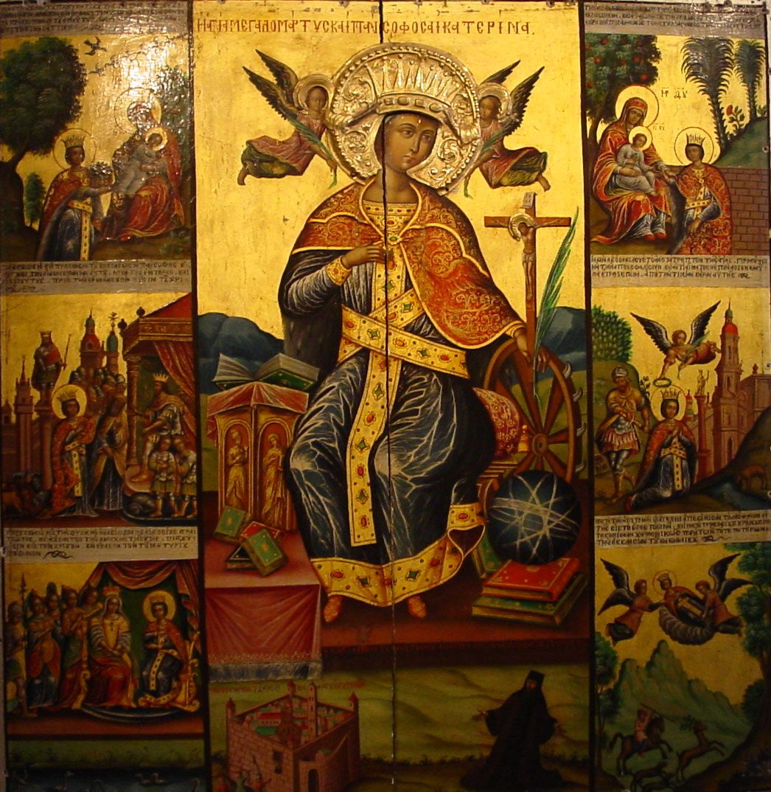

## 一句话总结

正式进入 [[中世纪 Middle Ages]]。要理解中世纪欧洲艺术，得从东方的 [[拜占庭艺术 Byzantine Art]] 看回去——拜占庭在《十诫》"禁偶像"与基督教对图像的刚需之间的拧巴中，发展出"重色彩重装饰重程式化"的独特宗教视觉语言，在 12 世纪前一直支配西欧。

## 核心论点

1. **政教结合**：基督教从被罗马迫害到 313 年《米兰敕令》合法、330 年君士坦丁迁都，再到 395 年东西分裂——拜占庭"用一神教重建身份认同"，是中世纪艺术的母体。
2. **为什么必须先看拜占庭再看西欧**：
   - 蛮族文化太弱，西欧中世纪一直受拜占庭支配；
   - 教会直到 1054 年才东西分裂，6–11 世纪内部沟通畅通；
   - 查士丁尼反攻 (拉文纳样板间) + 利奥三世毁坏圣像运动 → 大量拜占庭艺术家流入欧洲。
3. **《十诫》vs. 图像需求的拧巴** → 发展出 [[圣像 Icon]]（非偶像）的概念，绕过禁令。
4. **拜占庭艺术五大特征**：
   - 技术克制（不画立体感，但希腊衣纹手艺仍在）
   - 东方多视角拼贴（参见 [[基督受洗 (阿利亚诺洗礼堂) Arian Baptistery Mosaic]] 的人物平视 + 河水俯视）
   - 程式化造型（长脸长鼻、大眼、长手指；婴儿基督画成小大人）
   - 对称构图（[[查士丁尼及其随从 Emperor Justinian and His Attendants]] 的文武分列）
   - 对色彩与光的极致追求（[[马赛克 Mosaic]] + 金底；玻璃 tesserae 倾斜角度计算 → "天堂之光"幻象）
5. **政教格局的视觉宣言**：[[查士丁尼及其随从]] 里皇帝挡住主教的十字架——拜占庭**教权臣服于王权**；这与西欧天主教教权独立的格局对照。
6. **方法论引用**：[[贡布里希 E.H. Gombrich]] —— "艺术史并不是技术进步成熟的历史，而是思想和观念变化的历史。"

## 涉及实体

### 时代

- [[中世纪 Middle Ages]] —— 新建，本课起本课程进入中世纪
- 上承：[[古典时代 Classical Antiquity]]（罗马帝国结束）

### 流派

- [[拜占庭艺术 Byzantine Art]] —— 新建，本课主角
- 关联未展开：哥特艺术 (lecture 005-006 将专题)、罗马式 / 加洛林 (待 ingest)
- 影响来源：[[古希腊古典时期 Greek Classical Period]] (衣纹手艺)、[[古埃及艺术 Ancient Egyptian Art]] (多视角程式)、[[古罗马艺术 Ancient Roman Art]] (镶嵌画技术)

### 人物

- [[贡布里希 E.H. Gombrich]] —— 引用方法论名言
- 路人式引述（未建页，宗教/政治背景）：耶稣、彼拉多、圣保罗、君士坦丁皇帝、利奥三世皇帝、查士丁尼皇帝（在 [[查士丁尼及其随从]] artwork page 中详述）、圣凯瑟琳、主教马克西米安努斯（同上）

### 技法

- [[马赛克 Mosaic]] —— 新建（拜占庭主要媒介）
- 关联：[[正身侧面律 Composite View]]（拜占庭多视角程式的远祖）

### 作品

- [[五饼二鱼 The Miracle of the Loaves and Fishes]] —— 拉文纳新圣阿波利奈尔教堂 (~520)
- [[基督受洗 (阿利亚诺洗礼堂) Arian Baptistery Mosaic]] —— 拉文纳阿利亚诺洗礼堂 (~490)
- [[弯曲宝座上的圣母子 Madonna and Child on a Curved Throne]] —— 13 世纪拜占庭
- [[查士丁尼及其随从 Emperor Justinian and His Attendants]] —— 拉文纳圣维塔莱 (547)
- [[弗拉基米尔的圣母 Virgin of Vladimir]] —— 1131 拜占庭原作
- 提及未建页：西奈圣凯瑟琳修道院 (548-565)，作为"基督徒不得不创造圣像"的历史插曲提及

### 概念

- [[圣像 Icon]] —— 新建，绕开《十诫》的关键概念
- 反复呼应：[[时代之眼 Period Eye]]（教会主顾的诉求变化决定形式）、[[艺术史四种方法 Four Approaches to Art History]] 中 "绘画与社会环境的互动" 路径

## 与其他课程的连接

- 上承：
  - [[003｜画得像和画得好是一回事吗？]] —— 003 论证"中世纪是不为不是不能"，004 把这个"不为"具体化为拜占庭的形式语言
  - [[002｜古希腊雕塑：为什么做得这么逼真？]] —— 提供希腊衣纹手艺作为"拜占庭画家仍掌握"的对照基准
- 下接：
  - [[005｜哥特艺术1：为什么说它是文艺复兴的前奏？]] —— 拜占庭支配 12 世纪后由哥特艺术接棒
  - [[006｜哥特艺术2：为什么在意大利发生了分化？]] —— 锡耶纳画派与佛罗伦萨派的分化
  - [[007｜文艺复兴是怎么发生的？]] —— 拜占庭艺术家逃亡到意大利是文艺复兴的种子之一（待证）

## 我的反应

<!-- 留空给用户 -->

## 原文

> 来源：https://www.dedao.cn/course/article?id=vWbYRP1mxqd2VGd6jQJQjM096EBkr8
> 出处：[[顾衡·西方美术100讲]] · 11分53秒　顾衡 亲述

你好，我是顾衡。从这一讲开始，我们正式进入中世纪。

说到中世纪，从政治的角度，是指公元476年西罗马帝国灭亡到文艺复兴，这段1000年的欧洲历史。

一说中世纪，咱们最先想到的是西欧。可是从艺术史的角度来看，要想了解中世纪的艺术，从东方的拜占庭往欧洲看，这是一个比反过来要好得多的角度。

为什么说拜占庭才是理解欧洲中世纪艺术的前提和基础呢？答案就是两个字： 宗教 。

咱们还是要从基督教的兴起和东西罗马帝国的分裂说起。

古希腊古罗马时期的宗教是多神的，古罗马人还建了个万神殿，征服了某个民族，就把人家的神请到万神殿里来，大家爱拜啥拜啥。各美其美，美美与共。

万神殿很类似于安卓系统，罗马人只负责建个平台，各种插件、各种应用，你们自己来。

到耶稣被彼拉多钉十字架的四十天后，奉他为主的宗教组织，也就是基督教成立了。基督教是个苹果的ios，它是一神的，并且是绝对排它的。

《十诫》明文规定不能拜偶像。他们自己不拜偶像，还不许别人拜。

圣保罗跑到以弗所，见人就说"人手所作的，不是神"。跑到雅典去，说啊呀到处都是偶像，呸呸呸。总之和安卓系统完全不兼容。

罗马的皇帝们想了各种办法，也不顶事儿，基督教信徒越来越多。到公元313年，君士坦丁皇帝只好认怂，颁布《米兰敕令》，宣布基督教合法。

公元330年，又迁都君士坦丁堡，这是一个标志性事件，意味着罗马帝国从以前的安卓系统切换到苹果的ios。

也就是说，他要用一神教的基督教作为基础，重建罗马帝国臣民的身份认同。

虽然罗马帝国正式分裂成东西两块是在公元395年，但是从君士坦丁迁都君士坦丁堡那一刻起，罗马帝国从上到下，心理上就已经接受了分裂的现实。东边是说希腊语、基督教占优势的地区，西边是说拉丁语、传统多神教占优势的地区。

君士坦丁迁都100多年后，欧洲这边法兰克蛮族入侵，西罗马帝国在一神教和多神教的摇摆当中灭亡了，这就是欧洲中世纪的开始。

而东边，以基督教为基础建立起了政教合一的崭新帝国，称为东罗马帝国，也就是拜占庭帝国。

为什么说了解欧洲中世纪艺术，要往东边看呢？原因有这么几个。

首先 是蛮族那边的文化实在是太落后，无法与罗马帝国的文化形成抗争，所以欧洲中世纪一直深受拜占庭的影响。

其次 ，虽然西罗马帝国早在公元476年就沦陷了，教会却一直保持着统一，一直到1054年才分裂成东边的东正教和西边的天主教。

也就是说，虽然早在五世纪罗马帝国就少了一半，但是一直到十一世纪，教会内部的沟通还是顺畅的。

第三 ，拜占庭这边，公元六世纪的查斯丁尼大帝反攻欧洲大陆也好，公元八世纪的皇帝利奥三世发起的毁坏圣像运动也好，都主动、被动地，向一片废墟的欧洲提供了大量拜占庭艺术家。

比如，查士丁尼收复了意大利之后，在拉文纳大兴土木，把拜占庭艺术直接搬到了欧洲，相当于为欧洲建了个样板间。

所以，一直到12世纪之前，是拜占庭艺术支配着欧洲中世纪。

拜占庭这个一神的、拒斥偶像的基督教帝国，对艺术产生了与以前多神教古典时期完全不同的诉求。

贡布里希说： "艺术史并不是技术进步成熟的历史，而是思想和观念变化的历史"。

这句话，正是我们理解中世纪艺术最关键的一把钥匙。

但是基督教得势之后，发现了一个大问题。就是，他们也需要图像啊！

比方说圣凯瑟琳。她爸爸是埃及亚历山大城的行政长官。她信了基督教之后天天反偶像，谁画个什么雕个什么她就去说人家。

据说皇帝派了50个哲学家和她辩论，终不能胜，一怒之下就将她处死了。大批教徒要来悼念要来致敬，这可怎么办呢？

没办法，凯瑟琳死后，基督徒们把她的尸体运到西奈山脚下，在那里建了一座修道院，并且把她的形象画在了墙上。这实在是个莫大的讽刺。

<!-- src: https://piccdn3.umiwi.com/img/202103/10/202103101628429679494969.jpg -->
<!-- 配图：西奈的圣凯瑟琳修道院 (548-565)，作为基督徒"不得不创造圣像"的历史插曲 -->

西奈的圣凯瑟琳修道院
548-565

《十诫》里明文规定了不许有偶像崇拜，可是没有图像又不行。这可如何是好呢？

正是在这样的纠结中，拜占庭艺术开始了它光辉的旅程，并对中世纪的欧洲产生了决定性的影响。

归纳起来，拜占庭艺术有这么几个特点：

首先是技术上的克制， 把事情说明白就行了，不必要的技巧炫耀就被禁止了。 具体说来就是不能把人画出立体感来。

这幅《五饼二鱼》图就很明显地表现出这个倾向。

<!-- src: https://piccdn3.umiwi.com/img/202103/10/202103101504116791033927.png -->
<!-- artwork: [[五饼二鱼 The Miracle of the Loaves and Fishes]] -->

五饼二鱼The Miracle of the Loaves and Fishes
约520年
新圣阿波利奈尔教堂

虽然人物没有什么立体感，但是我们看衣褶、看衣物与人体的关系，希腊传下来的手艺还是在的。画面虽然看上去很幼稚，但是和没有技术的小孩绘画是两回事儿。

其次，我们看到了东方，尤其是古埃及艺术理念对拜占庭的影响。

就是不再追求再现眼睛所见的真实，而是用最方便的角度来表现故事所必不可少的元素。

比如这幅《基督受洗》。

%20Arian%20Baptistery%20Mosaic/01.png)
<!-- src: https://piccdn3.umiwi.com/img/202103/10/202103101505045849239031.png -->
<!-- artwork: [[基督受洗 (阿利亚诺洗礼堂) Arian Baptistery Mosaic]] -->

基督受洗Arian Baptistery
约490年
意大利拉文纳阿利亚诺洗礼堂天顶镶嵌画

右边的施洗者约翰、中间的耶稣基督和左边的河神，都是平视的角度。可是河水却是俯视的角度。这样的处理手法，我们在埃及人画池塘的时候已经领略过了。

不仅人物不能有立体感，画面也不追求三维的视觉错觉，人物的造型还要高度程式化。

什么是程式化呢？就是咱们京剧的脸谱一样。以《弯曲宝座上的圣母子》为例。

<!-- src: https://piccdn3.umiwi.com/img/202103/10/202103101505493735357599.png -->
<!-- artwork: [[弯曲宝座上的圣母子 Madonna and Child on a Curved Throne]] -->

弯曲宝座上的圣母子 Madonna and Child on a curved throne
13世纪拜占庭绘画

圣母被描画成不真实的长脸、长鼻子和小嘴，眼睛被不成比例地放大，手指细长。

基督虽然是个婴儿，却被画成个小大人的形象。因为当时人们认为如果把基督画成个小孩子，会有损他的威严。

在高度程式化的约束下，拜占庭艺术发展出了一种特殊的形式美，就跟咱们的京剧一样。

希腊的雕塑美不美，大家伙儿一眼就能得出判断，因为它是求真的。

可是你要了解形式美，却需要一双训练多年的眼睛。就像你得作为票友浸淫多年，才能感受到京剧大师一举手一投足的魅力。

在构图上呢，拜占庭绘画特别注重对称性。

这幅《查士丁尼及其随从》就很好地体现了这个特点。

<!-- src: https://piccdn3.umiwi.com/img/202103/10/202103101506445085783463.png -->
<!-- artwork: [[查士丁尼及其随从 Emperor Justinian and His Attendants]] -->

查士丁尼及其随从Emperor Justinian and His Attendants
镶嵌画 547年
拉文纳圣维塔莱教堂

皇帝的右边是廷臣和卫士，左边是教士，算是个文武百官分列两旁的意思。

另外，这幅画中还有多个细节体现出拜占庭帝国皇权与教权的关系。

- 首先，教士站在左边。咱们中国是左为尊，西方却是反的，站在左边意味着地位低下。
- 其次，皇帝手上拿着金色的圣餐碟，挡住了主教马克西米安努斯举着十字架的右胳膊，再次强调了主与宾的关系。

**事实上，拜占庭也好，后来的俄国、保加利亚也好，教权臣服于王权，是东正教国家一个普遍的特点。**

这也正是当年君士坦丁迁都的初衷所在，就是宗教必须为皇权服务。

而在欧洲一片废墟中成长起来的天主教，教权却是独立于王权，甚至在很长的时间内压王权一头的。

拜占庭艺术最后一个，也是最重要的特征，就是对色彩和光线的追求。

基督教刚产生对绘画的需求时，正是镶嵌画在罗马帝国流行的时期，用镶嵌画来表现圣经故事就成了必然的选择。但是，因为要刻意回避形体上的真实感，拜占庭艺术家就只好把精力放在对 光线 的追求上。

常规操作是把彩色玻璃小方块，插入混凝土中，并在半透明的玻璃块后面衬上小金箔片，让整个画面呈现出金碧辉煌的效果。

又因为教堂里的画都要画在教徒们够不着的高处，镶嵌画的玻璃小方块就没必要切割得太细。

如此一来，艺术家们就有了更多的时间和精力研究每一个玻璃小方块的朝向，让圣像在阳光的照耀下，产生出摄人心魄的精神幻象。

当时的人们认为，正是通过圣像的反射，尘世的众生才能感受到来自天堂的光芒。

**拜占庭人对光的追求，也体现了早期基督徒对《圣经》的原教旨解读立场。**

比如，《创世纪》中上帝说的"要有光"。《马太福音》里的经文"那坐在黑暗里的百姓，看见了大光"，等等。

在基督教教义中，光是一个非常核心的意象，它经常用来指代圣灵，甚至就用来指代基督本人。

这幅弗拉基米尔的圣母子，几乎就是拜占庭艺术中圣母与基督的标准像了。

圣母和圣子沐浴在一片金色之中，这既让信徒们的心灵得到充盈，又彰显了圣母圣子的神性。

<!-- src: https://piccdn3.umiwi.com/img/202103/10/202103101508534606245619.jpg -->
<!-- artwork: [[弗拉基米尔的圣母 Virgin of Vladimir]] -->

圣母子 Virgin of Vladimir
1131年

好，最后我们总结一下。西罗马帝国灭亡后，东罗马帝国也就是拜占庭帝国，通过与基督教彻底结合，重新建立起了全体臣民的身份认同，得以又延续了一千多年。

源起于拜占庭的基督教艺术，在不许有偶像崇拜的《十诫》教义和没有画像又不行的拧巴中，不得不刻意回避了希腊式的求真，转而追求超自然的幻象效果。

在表现手法上，不可避免地吸纳了东方，主要是古埃及的风格。

拜占庭艺术，总的说来是东方式的，是重色彩而轻线条的，是重装饰而轻真实的。更为重要的是，它是高度程式化的。

拜占庭的这些艺术特点，在12世纪结束之前，一直支配着欧洲中世纪的艺术创作。这就是我们一开始所强调的那个角度，要理解欧洲中世纪的艺术，必须要先了解拜占庭。

那么，欧洲艺术后来又走向了何方呢？好，我是顾衡，感谢你的收听。咱们下一讲见。

### 划重点

1. 拜占庭帝国在与基督教彻底结合后，在不许偶像崇拜和对画像有刚需的拧巴中，发展出了独特的宗教艺术。
2. 十二世纪之前，拜占庭艺术对中世纪欧洲的影响是支配性的。
3. 拜占庭艺术的特点有：重色彩而轻线条，重装饰而轻真实，以及高度程式化。

<!-- src: https://piccdn3.umiwi.com/img/202103/12/202103121613474579312506.jpg -->
<!-- shared course footer (appears at end of every lecture) -->
