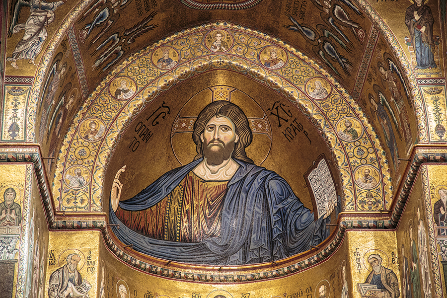
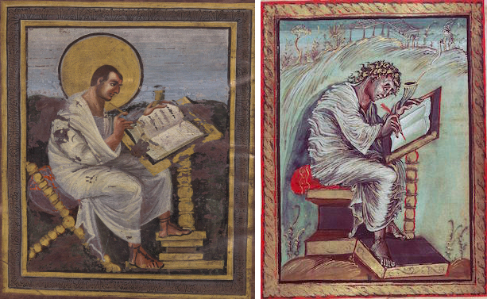
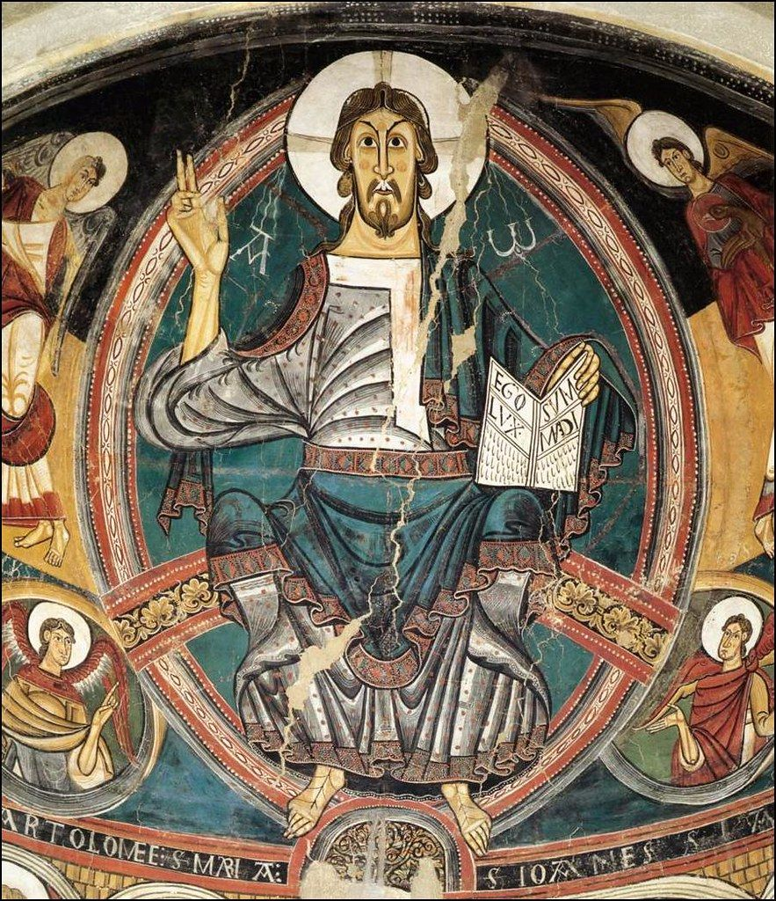
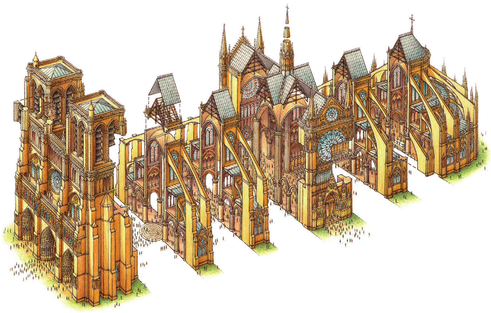

## 一句话总结

哥特艺术是 12 世纪法兰西的一次**复古运动**——把古希腊古罗马的写实主义重新带入基督教艺术。它体现了教权与王权的斗争，发明了彩窗+尖拱建筑，并为意大利文艺复兴铺了路。

## 核心论点

1. **欧洲 vs. 拜占庭：题材的分歧**
   - 拜占庭岁月静好（圣母子）；欧洲苦出身教会偏渲染钉刑下架（[[基督下十字架 (沃拉泰拉) Volterra Deposition]]）—— 悲情需要写实，欧洲埋下回归古典的种子。
   - 5 世纪之前欧洲基督是年轻罗马牧羊人（[[善良的牧羊人 (加拉·普拉西提阿陵墓) Good Shepherd Mosaic]]），甚至照搬太阳神阿波罗；6 世纪查士丁尼反攻后才接受了东方"消瘦留须中分"基督。
2. **教权 vs. 王权的视觉解读**
   - 800 年教皇利奥三世为查理曼大帝加冕 → 加洛林复古狂潮，圣马太手抄本插图向写实靠拢。
   - 1077 年卡诺萨之辱后教权全面压王权 → 1000 年前后《奥托三世福音书》[[基督为使徒洗足 (奥托三世福音书) Christ Washing the Feet (Otto III Gospels)]] 拜占庭风重新得势。
   - 1054 东西教会分裂后拜占庭对欧洲影响衰减，**最弱的法兰西成为哥特发源地**。
3. **哥特艺术的形式语言**
   - 雕塑：从浮雕到圆雕，S 造型回归（[[圣母雕像 (珍妮·德·埃弗勒) Virgin of Jeanne d'Évreux]]、[[沙特尔大教堂 Chartres Cathedral]] 立柱、[[第戎的摩西井 Puits de Moïse]]）。
   - 建筑：尖拱 + 飞扶壁 + 大彩窗（[[巴黎圣母院 Notre-Dame de Paris]]、[[沙特尔大教堂 Chartres Cathedral]]），墙体不承重 → [[彩色玻璃花窗 Stained Glass]] 大行其道。
   - 与拜占庭似而不同：[[马赛克 Mosaic]] vs [[彩色玻璃花窗 Stained Glass]] 表面相似（光色平面），底层逻辑相反——哥特已在雕塑层面回归写实。
4. **命名的偏见**：[[瓦萨里 Giorgio Vasari]] 称之为"哥特人的艺术，粗鄙不堪"；顾衡用弗洛伊德"强化的自恋"反驳——意大利人恼火法兰西先于自己。
5. **元论点：中世纪不是科学的敌人**
   - 引《科学史》作者丹皮尔："天主教是科学的接生婆"；
   - 引康德"人为自然立法"：现代理性主义的认知装置正是中世纪经院神学锻炼出来的；
   - 顾衡："西方现代理性主义，不过是上帝换了个名字而已。"——为后续文艺复兴的连续性铺垫。

## 涉及实体

### 时代
- [[中世纪 Middle Ages]]（哥特段）

### 流派
- [[哥特艺术 Gothic Art]] —— 主角，新建
- [[罗马式 Romanesque]] —— 哥特建筑前身，新建
- [[拜占庭艺术 Byzantine Art]] —— 哥特要"摆脱"的支配影响
- 预告（待 lecture 006）：杜乔的 锡耶纳画派、乔托的 佛罗伦萨画派

### 人物
- [[克洛斯·斯吕特尔 Claus Sluter]] —— [[第戎的摩西井]] 雕塑家，新建
- [[瓦萨里 Giorgio Vasari]] —— 命名"哥特"的贬称者，已存在，追加 source
- 路人式引述（未建页）：查理曼大帝、教皇利奥三世（800 年加冕者，与 04 的拜占庭利奥三世皇帝重名但不同人）、亨利四世（卡诺萨）、珍妮·德·埃弗勒（王后，捐赠者，列入相应 artwork 页）、弗洛伊德、丹皮尔、康德、牛顿、布鲁诺
- 课程后续将专题（本篇仅预告）：杜乔、乔托

### 技法
- [[彩色玻璃花窗 Stained Glass]] —— 哥特核心新媒介，新建
- 关联：[[马赛克 Mosaic]]（与之对照）、[[S 造型 Contrapposto]]（雕塑回归古希腊的物证）

### 作品
- [[巴黎圣母院 Notre-Dame de Paris]] —— 哥特建筑示例
- [[沙特尔大教堂 Chartres Cathedral]] —— 哥特建筑+雕塑+彩窗三合一
- [[善良的牧羊人 (加拉·普拉西提阿陵墓) Good Shepherd Mosaic]] —— 5 世纪欧洲基督形象
- [[基督下十字架 (沃拉泰拉) Volterra Deposition]] —— 欧洲苦出身教会的悲情题材
- [[基督为使徒洗足 (奥托三世福音书) Christ Washing the Feet (Otto III Gospels)]] —— 卡诺萨之辱前后拜占庭风回潮
- [[圣母雕像 (珍妮·德·埃弗勒) Virgin of Jeanne d'Évreux]] —— S 造型回归
- [[第戎的摩西井 Puits de Moïse]] —— 圆雕写实回归古罗马
- [[弗拉基米尔的圣母 Virgin of Vladimir]] —— 已存在，追加 02.jpg（拜占庭岁月静好对照点）
- 提及未建页：蒙雷阿莱主教座堂壁画（1174–1182）、加洛林圣马太手抄本插图（830）、塔胡尔圣克莱门特教堂壁画（1123）

### 概念
- 隐含援引：[[时代之眼 Period Eye]]（教权-王权-题材的互动）、[[艺术史四种方法 Four Approaches to Art History]]（与社会环境互动路径）

## 与其他课程的连接

- 上承：
  - [[004｜拜占庭艺术：程式化的艺术是怎么回事？]] —— 哥特要走的是与拜占庭相反的路径
  - [[003｜画得像和画得好是一回事吗？]] —— 中世纪"不为不是不能"，005 用哥特复古证明手艺一直在
- 下接：
  - [[006｜哥特艺术2：为什么在意大利发生了分化？]] —— 哥特进入意大利分化为杜乔的锡耶纳和乔托的佛罗伦萨
  - [[007｜文艺复兴是怎么发生的？]] —— 哥特是奏鸣曲的前奏，文艺复兴是主乐章

## 我的反应

<!-- 留空给用户 -->

## 原文

> 来源：https://www.dedao.cn/course/article?id=nAge3MrB5aPdV5n9LoJwD2ky4jvENQ
> 出处：[[顾衡·西方美术100讲]] · 12分03秒　顾衡 亲述

你好，我是顾衡。

上一讲说到，拜占庭风格在《十诫》规定不能崇拜偶像、可是对图像又有刚需的拧巴当中，发展出了独特的程式化风格，支配了欧洲中世纪早期的艺术。

这么着到了12世纪，在法兰西地区吹起了一股新风，就是这一讲要说的哥特艺术。

"哥特"这个词我们并不陌生，经常跟黑暗的中世纪联系在一起。比如巴黎圣母院就是哥特式的建筑，很多人介绍完它的尖顶之后，经常还跟一句"让人匍匐在神的威严之下"。

<!-- src: https://piccdn3.umiwi.com/img/202103/16/202103161451426619416999.jpg -->
<!-- artwork: [[巴黎圣母院 Notre-Dame de Paris]] -->

巴黎圣母院外观

那问题就来了：这个风格，我们一眼就看得出来，和拜占庭风格不一样。

那么，它是从哪儿来的呢？看名字，是来自哥特人。

但是事实上，哥特艺术是中世纪的一次复古运动。复的这个古，就是古希腊古罗马的风格，又回到"人眼所见的真实"去了。

所以，我们甚至可以把它看成是文艺复兴的前奏。

为什么这么说呢？先来看看哥特艺术出现之前的欧洲。

上一讲说拜占庭对中世纪的影响是支配性的，确实如此。但是东西毕竟有别，两边的差别还是一直存在的。

比如五世纪之前，欧洲这边的 基督 一直是个年轻罗马牧羊人的样子，刚开始的时候艺术家甚至直接就借用了太阳神阿波罗的形象。

%20Good%20Shepherd%20Mosaic/01.jpg)
<!-- src: https://piccdn3.umiwi.com/img/202103/10/202103101534222158373910.jpg -->
<!-- artwork: [[善良的牧羊人 (加拉·普拉西提阿陵墓) Good Shepherd Mosaic]] -->

善良的牧羊人 Good Shepherd
402年
加拉·普拉西提阿陵墓的马赛克镶嵌画

等到六世纪查士丁尼大帝反攻欧洲之后，欧洲才开始接受了基督是个东方人的形象，也就是我们今天所熟悉的那个消瘦、留须、头发中分的年轻人。

<!-- src: https://piccdn3.umiwi.com/img/202103/10/202103101535329117785556.jpg -->
<!-- 配图：意大利蒙雷阿莱主教座堂壁画 (1174-1182)；查士丁尼之后东方基督形象示例 -->

意大利蒙雷阿莱主教座堂壁画
1174-1182年

另外，在罗马帝国时期，只有最低贱、犯下最不齿罪行的人才会被判钉死在十字架上，所以以前欧洲这边的教徒们都不好意思提这茬。

但是从十世纪开始，拜占庭和欧洲两边的教会，在 绘画题材 上出现了明显的分歧。

拜占庭那边教权臣服于王权，算是嫁入豪门了吧，所以就岁月静好的，画个圣母子，少妇抱个娃。

<!-- src: https://piccdn3.umiwi.com/img/202103/10/202103101537371637757057.jpg -->
<!-- artwork: [[弗拉基米尔的圣母 Virgin of Vladimir]]（本页 02：与 004 配图为同一作品的不同 CDN 版本/裁剪） -->

圣母子 Virgin of Vladimir
1131年

欧洲这边的教会可是苦出身啊！每一分香火钱都要靠自己打拼，就特别偏爱渲染悲苦的题材，基督被钉在十字架上的形象几乎成了所有教堂的标配。

%20Volterra%20Deposition/01.jpg)
<!-- src: https://piccdn3.umiwi.com/img/202103/10/202103101606078932677654.jpg -->
<!-- artwork: [[基督下十字架 (沃拉泰拉) Volterra Deposition]] -->

基督下十字架
1228年
沃拉泰拉主教座堂

对悲情渲染的需要，就为欧洲中世纪绘画埋下了写实的种子。

孔子所谓"文胜质则史，质胜文则野"，用来形容两边风格和题材上的差异，也算是"虽不中，亦不远"吧。

拜占庭帝国是实现了政教合一，教权臣服于王权了，但是西方的教会就要强势一些，有的时候还要压王权一头。

我们甚至可以从绘画作品中，解读出 欧洲中世纪的教权与王权之争 。

西罗马帝国刚灭亡那些年，罗马教会对法兰克蛮族是正眼都懒得看，一门心思盼着东罗马帝国来光复欧洲。

可是倒霉不倒霉呢，查士丁尼眼看着就要大功告成了，拜占庭帝国后方却爆发了大瘟疫，欧洲就没光复成。

罗马教会翘首盼王师又盼了200多年，终于熬不住。

公元800年，当时的教皇利奥三世为法兰克国王查理曼大帝加冕，并亲吻了查理曼脚下的土地，称他为"所有罗马人的皇帝"。这就是神圣罗马帝国的由来。

查理曼大帝泥腿子洗脚上岸后，立即掀起了复古狂潮。

你对比一下这两幅手抄本中的圣马太插图，右边这张创作于公元830年。

<!-- src: https://piccdn3.umiwi.com/img/202103/10/202103101549226178968767.jpg -->
<!-- 配图：加洛林手抄本《圣马太》(830) 与拜占庭式对照 -->

虽说是久疏战阵，技巧上有诸多缺陷，但毕竟头上的光环也没了，衣褶也飘动起来了，圣马太身后的风景虽然只是寥寥几笔，却有着逼真的纵深感。画风明显向古希腊古罗马的写实主义靠近。

当然这个复古运动也不是一帆风顺。我们再来看这幅《基督为使徒洗足》，是创作于1100年左右。

%20Christ%20Washing%20the%20Feet%20(Otto%20III%20Gospels)/01.jpg)
<!-- src: https://piccdn3.umiwi.com/img/202103/10/202103101551383614499756.jpg -->
<!-- artwork: [[基督为使徒洗足 (奥托三世福音书) Christ Washing the Feet (Otto III Gospels)]] -->

基督为使徒洗足
997-1002年
选自《奥托三世福音书》

这个时期正是卡诺萨之辱之后没几年，就是神圣罗马帝国的亨利四世在雪地里跪了三天三夜，恳求教皇宽恕。这也正是教权全面压制皇权的时期。看，浓浓的拜占庭风又回来了！

可想而知的是，东西教会于1054年大分裂之后，拜占庭对欧洲大陆的影响也就衰落了。

相比之下，德意志地区因为皇帝与拜占庭通婚，意大利地区因为与拜占庭之间频繁的贸易，这种衰落就不太明显。

而在法兰西地区，拜占庭的影响衰落得很厉害，所以成了哥特式风格的发源地。

从12世纪开始，法国新修建的教堂里，比如著名的沙特尔大教堂、亚眠大教堂和巴黎圣母院，出现了大量罗马风格的雕像。

那你想，在拜占庭风格占优的时期，雕像是被绝对禁止的。

一开始还只敢搞些浮雕，假装是柱子和墙体的一部分。

<!-- src: https://piccdn3.umiwi.com/img/202103/10/202103101554027232684720.png -->
<!-- artwork: [[沙特尔大教堂 Chartres Cathedral]] —— 立柱雕像 -->

沙特尔大教堂立柱
1194-1220年重建

后来胆子越来越大，不仅搞了圆雕，圣母连著名的Ｓ造型都摆出来了。

%20Virgin%20of%20Jeanne%20d'Évreux/01.jpg)
<!-- src: https://piccdn3.umiwi.com/img/202103/10/202103101559099498447368.jpg -->
<!-- artwork: [[圣母雕像 (珍妮·德·埃弗勒) Virgin of Jeanne d'Évreux]] -->

圣母雕像
珍妮·德·埃弗勒于1339年捐赠给法国圣但尼修道院

再稍晚一些，当时著名的雕塑家克洛斯·斯吕特尔创作的《第戎的摩西井》，与古罗马时期的雕塑相比已经难分伯仲了。

<!-- src: https://piccdn3.umiwi.com/img/202103/10/202103101600599298253877.jpg -->
<!-- artwork: [[第戎的摩西井 Puits de Moïse]] -->

克洛斯·斯吕特尔 Claus Sluter
第戎的摩西井 Puits de Moïse
1395-1403

这说明古希腊老祖宗传下来的手艺，至少在远离罗马的法兰西并没有丢。

那你说，法兰西人搞出来的东西，为什么叫哥特艺术呢？

就是因为文艺复兴之后，意大利人瓦萨里对400年前这场发生于法兰西的复古运动大肆诋毁，说这是哥特人的艺术，粗鄙不堪。哥特艺术的名称，就是这么来的。

瓦萨里的心情可以理解。我觉得这就是弗洛伊德所说的"强化的自恋"，人总是仇恨与自己相似的东西。

不过，这场发轫于12世纪法国的艺术运动，除了绘画和雕塑，如今最令人们津津乐道的还是它的教堂建筑和彩窗。

在12世纪以前，欧洲的教堂都是罗马式的，也就是拱型建筑。为了抵抗拱顶向外的张力，墙体就要被造得很厚，窗户也得是小小的。所以，罗马式教堂内总是有大片的墙壁用来画壁画。

<!-- src: https://piccdn3.umiwi.com/img/202103/11/202103111331363386376519.jpg -->
<!-- 配图：西班牙塔胡尔圣克莱门特教堂壁画 (1123)；罗马式厚墙壁画范型，详见 [[罗马式 Romanesque]] -->

西班牙塔胡尔圣克莱门特教堂壁画 Sant Climent de Taüll
1123年

但是哥特式建筑的思维却完全不一样。

它类似于我们今天建温室，就是用很细的竹子搭个结构，外面再盖一层塑料布。

所以哥特式建筑的拱是从房顶一直通到地面的，墙体并不受力。巴黎圣母院就是按这个思路建起来的。

<!-- src: https://piccdn3.umiwi.com/img/202103/11/202103111234536654298595.png -->
<!-- 配图：巴黎圣母院结构解剖示意图 -->

巴黎圣母院解剖图

如此一来，墙就不受力了，拱与拱之间大片空隙就可以用彩窗装饰。

具体的办法是先用黑色的铅条形成边缘，然后在里面镶嵌各种颜色的彩色玻璃，以形成图案。

这个黑色的铅条或者轮廓线，有点类似于咱们中国景泰蓝工艺的掐丝。

哥特式教堂可以把圣母和圣经故事呈现在玻璃上，阳光一照，形成了强烈的色彩和光线效果。

<!-- src: https://piccdn3.umiwi.com/img/202103/10/202103101609040198584255.jpg -->
<!-- artwork: [[沙特尔大教堂 Chartres Cathedral]] —— 彩窗 -->

沙特尔大教堂彩窗

如果只看彩窗，我们会误以为哥特艺术与拜占庭艺术很类似。它们都是平面的，并且极度强调光线和色彩的效果。 但是细究起来，二者的底层逻辑是完全不同的。

**首先，** 哥特艺术的雕塑已经强烈回归到古希腊古罗马的写实主义传统中去了。

**其次，** 从摆件和挂饰品来看，哥特艺术极为强调材质的贵重。这显然是受了古希腊人"把最好的东西献给神"的理念的影响。

至于彩窗与拜占庭镶嵌画效果的相似，这不过是建筑形态所导致的意外结果。

在随后到来的文艺复兴运动中，法国人表现出对写实主义的强烈偏好，这并不是偶然的。

所以，我们还是要从"礼失，求诸野"的角度，把哥特艺术理解为一场复古运动。

如果意大利文艺复兴运动是一首奏鸣曲的话，法国的哥特艺术则是这首曲子的前奏部分。

一提到欧洲中世纪教会，大家普遍的印象就是黑暗、愚昧、反科学。但是你发现没有呢，从哥特艺术、再到后来文艺复兴这些创作，恰恰是出现在教堂当中，由教会主导的。

《科学史》的作者丹皮尔认为，天主教不仅不是科学的敌人，甚至简直就是科学的接生婆。

即使你是个不信神的人，天主教的经院哲学和神学，也为科学人预先提供了必要的逻辑训练，因为天主教神学断言，上帝是人的心灵所能把握和部分理解的。

这就维持了理性的崇高地位，并为科学铺平了道路。因为，科学正是从"理性可以被理解"的这个港口，扬帆起航的。

那么，是不是天主教神学和经院哲学在"上帝存在"这个元命题下一通辗转腾挪，锻炼了我们的抽象思维能力之后，我们现代人就搬开"上帝"这块大石头，在科学的康庄大道上一路狂奔到了今天呢？

康德认为不是，就拿牛顿来说吧。

康德说：

- 牛顿定律虽然因为观察而得到了确认，但它本身却并不是观察的产物，而是我们固有思维方式活动的结果。也就是，为了整理感觉和知觉、建立关系、同化和理解感觉而运用我们的思维方式的结果。

这就是康德所谓的"人为自然立法"。

我们打个比方，如果把认识世界的过程比作解一道数学题的话，这道题目的答案一直在变，但是我们解题过程中所使用的2＋3＝5，2 x 3＝6的四则运算法则却一直没有变。这个四则运算法则就是我们常说的方法论呗。

康德认为这是人的大脑先天结构决定的。而我却认为，这是欧洲中世纪文明留下的最宝贵的遗产。

说这几句闲话，是希望大家打破对中世纪的刻板印象。不要一提中世纪就是反科学就是烧死布鲁诺。

要知道，西方现代文明不是从石头里蹦出来的孙猴子，它正是中世纪文明的亲生儿子。为教会服务，恰恰是我们理解欧洲中世纪艺术那把至关重要的钥匙。

所谓西方现代理性主义，不过是上帝换了个名字而已。

好，虽然哥特艺术诞生在法国，但它的影响不仅限在法国。这场崭新的艺术运动后来传入了一直深受拜占庭影响的意大利。

在巨大的冲击下，意大利的艺术流派产生了重大的分化，形成了分别以杜乔为代表的西耶那派和以乔托为代表的佛罗伦萨派。这对中世纪艺术产生了怎样的影响呢？

好，我是顾衡，感谢你的收听，咱们下一讲见！

### 划重点

1. 哥特艺术发源于12世纪的法国，是中世纪的一次复古运动，是对古希腊古罗马写实主义的回归。
2. 哥特艺术曲折的发展过程，体现了中世纪教权与王权的斗争。
3. 哥特建筑的彩窗和拜占庭镶嵌画有相似之处，但底层逻辑完全不同。
4. 欧洲中世纪教会孵化了文艺复兴，为教会服务是理解中世纪艺术的重要角度。

<!-- src: https://piccdn3.umiwi.com/img/202103/12/202103121614154285741240.jpg -->
<!-- shared course footer (appears at end of every lecture) -->
