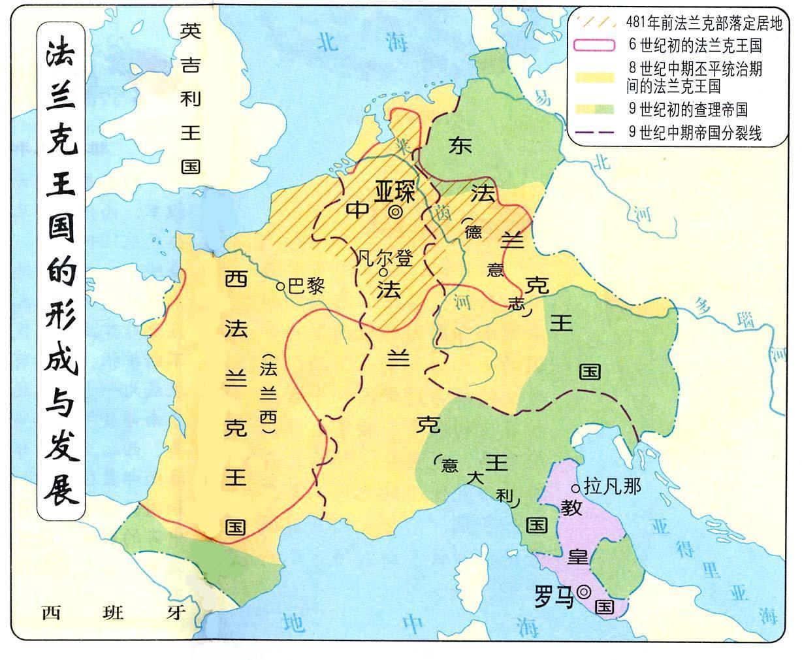
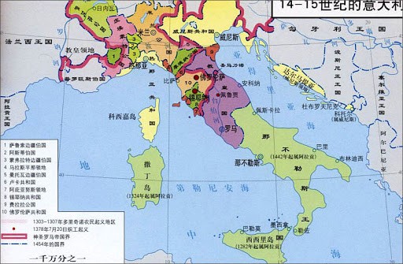

## 一句话总结

哥特艺术传入意大利后**分化为两条对立路径**——佛罗伦萨派（[[契马布埃 Cimabue]] → [[乔托 Giotto]]）追逼真，锡耶纳派（[[杜乔 Duccio]] → [[马丁尼 Simone Martini]]）强化程式。分化根源在意大利"小国林立"的政治生态：竞争、流动、独立空间共同孕育差异化。

## 核心论点

1. **意大利特殊环境**：欧洲西部"汉堡-变-肉夹馍"格局——东、西法兰克长子继承制 → 强统一；中法兰克老子死儿子分 → 一盘散沙。阿尔卑斯山阻隔了北部瓜分，意大利得以小国林立。
2. **小国林立有利学术艺术** ：方便竞争交流 + 政治宽松 + 各邦发展自己风格 → 必然差异化。
3. **意大利哥特绘画 vs. 法国 / 德国哥特**：法国全是彩窗没墙作画 → 雕塑建筑领先；意大利仍有大墙面 → 壁画绘画领先。
4. **佛罗伦萨派：追逼真**
   - [[契马布埃 Cimabue]] 在 [[宝座上的圣母子 (契马布埃) Santa Trinita Maestà]] (1280-85) 给四使徒**第一次塑造立体感**；
   - 徒弟 [[乔托 Giotto]] 在 [[宝座上的圣母子 (乔托) Ognissanti Madonna]] (1310) **第一次画圣母隆起的胸部**；
   - [[圣母怜子 (乔托) Lamentation of Christ]] (1305) 用矮墙分前后景 + 戏剧化情绪 + 圣约翰双臂后张代替绞手程式。
5. **锡耶纳派：强化程式**
   - [[杜乔 Duccio]] 在 [[宝座上的圣母子 (杜乔) Maestà]] (1308) **有立体感但强化拜占庭程式**——观念上的反叛宣言；
   - [[马丁尼 Simone Martini]] + 利波·梅米《[[圣母领报 (马丁尼·梅米) The Annunciation]]》(1333)：哥特圣母领报的代表，圣母身向后躲表达惊诧，加百列穿**中国织金锦**——可能受元朝传教士带回的中国艺术影响（法国学者 波西纳 论点）。
6. **观念差异**：锡耶纳人认为佛罗伦萨派"炫耀技巧、制造错觉，浅薄"；锡耶纳人要"为不识字者保留通向上帝的桥梁"。丹纳："呈现的不是存在而是观念。"
7. **哥特 ↔ 文艺复兴的连续性**：13-14 世纪意大利艺术该算"晚期哥特"还是"早期文艺复兴"——这个争吵本身说明哥特艺术与文艺复兴一脉相承；圣但尼教堂 叙热院长 "材质奢华具有精神辅助作用" 来自古希腊。

## 涉及实体

### 时代
- [[中世纪 Middle Ages]]（哥特段晚期）

### 流派
- [[佛罗伦萨画派 Florentine School]] —— 新建
- [[锡耶纳画派 Sienese School]] —— 新建
- [[哥特艺术 Gothic Art]] —— 已存在，本课接续 005
- [[拜占庭艺术 Byzantine Art]] —— 锡耶纳的母体；佛罗伦萨要走出的影响

### 人物
- [[契马布埃 Cimabue]] —— 新建，佛罗伦萨派初代
- [[乔托 Giotto]] —— 新建，西方绘画之父，本课的主角之一
- [[杜乔 Duccio]] —— 新建，锡耶纳派创始人
- [[马丁尼 Simone Martini]] —— 已存在，追加 source（锡耶纳画派水准最高、对后人影响最大）
- [[丹纳 Hippolyte Taine]] —— 已存在，追加 source（评 14 世纪锡耶纳）
- 路人式（未建页）：但丁、彼得拉克、薄伽丘（佛罗伦萨文人三杰，提供画家评价文本）、腓特烈二世（神圣罗马帝国皇帝）、查理曼大帝、叙热院长（圣但尼，"材质奢华"主张者）、波西纳（法国学者，欧洲艺术受中国影响论的代表）、利波·梅米（已收入 [[马丁尼 Simone Martini]]）
- 课程后续将专题（本篇仅举例）：达·芬奇、米开朗基罗、拉斐尔、波蒂切利

### 技法
- 隐含援引：[[彩色玻璃花窗 Stained Glass]]（法国哥特不画壁画的物质原因）、壁画 fresco（意大利哥特的载体）

### 作品
- [[宝座上的圣母子 (契马布埃) Santa Trinita Maestà]] —— 1280-85
- [[宝座上的圣母子 (乔托) Ognissanti Madonna]] —— 1310
- [[圣母怜子 (乔托) Lamentation of Christ]] —— 1305 帕多瓦
- [[宝座上的圣母子 (杜乔) Maestà]] —— 1308 锡耶纳
- [[圣母领报 (马丁尼·梅米) The Annunciation]] —— 已存在 (003)，本课作为锡耶纳派代表追加 source；图片清单+02（局部 / 织金锦）

### 概念
- 隐含援引：[[时代之眼 Period Eye]]（小国林立 → 哥特分化的方法论应用）、[[艺术史四种方法 Four Approaches to Art History]]（与社会环境互动的具体落点）

## 与其他课程的连接

- 上承：
  - [[005｜哥特艺术1：为什么说它是文艺复兴的前奏？]] —— 005 介绍法国哥特母体，006 处理意大利分化
  - [[004｜拜占庭艺术：程式化的艺术是怎么回事？]] —— 锡耶纳派是拜占庭程式在意大利的延续；佛罗伦萨派是对它的告别
  - [[003｜画得像和画得好是一回事吗？]] —— 003 提及马丁尼·梅米《圣母领报》作为"中世纪不像不是不能"的范例；006 把锡耶纳"不为"具体化
- 下接：
  - [[007｜文艺复兴是怎么发生的？]] —— 顾衡明示 13–14 世纪意大利艺术"算晚期哥特还是早期文艺复兴"的争论本身就是连续性证据
  - [[008｜文艺复兴到底复兴了什么？]]
  - [[009｜波蒂切利：如何解读"理念美"？]] 等佛罗伦萨派文艺复兴系列

## 我的反应

<!-- 留空给用户 -->

## 原文

> 来源：https://www.dedao.cn/course/article?id=BQe6EGjvO7zRKZqzn2XnDrkMLPgAp9
> 出处：[[顾衡·西方美术100讲]] · 11分10秒　顾衡 亲述

你好，我是顾衡。

上一讲咱们说的是，随着教会的分裂和拜占庭国力的式微，欧洲迎来了第一次发展自己艺术风格的空间，这就是12世纪的哥特艺术。

哥特艺术发源于法国，100年后又得到了当时神圣罗马帝国皇帝腓特烈二世的加持。那就不难理解，今天我们说起哥特艺术，会先想到法国和德国。

而说起意大利，一般就直接想到文艺复兴了。

但其实在文艺复兴开始之前，哥特艺术这股新风也吹到了意大利。

如果说哥特艺术的雕塑问题被法国解决了，那在意大利的成就主要表现在绘画上。为什么呢，因为法国的教堂全是彩窗，没地方画壁画。

咱们这一讲就来说说哥特艺术到了意大利之后，有了什么新发展。

跟法国和德国相比，意大利的哥特艺术有了一个很明显的区别： 它在意大利的不同区域，分化出了迥然不同的风格。

为什么哥特风在意大利会分化如此明显呢？ 用一句话说，这是意大利特殊的政治环境造成的。

这个意大利，不是我们今天说的国家，而指的是亚平宁半岛这个地区。

咱们来看欧洲的版图。

<!-- src: https://piccdn3.umiwi.com/img/202103/11/202103111424142097048829.jpg -->
<!-- 配图：中世纪欧洲版图，神圣罗马帝国 + 法兰克王国 + 中间一盘散沙的意大利 -->

之所以形成这样的局面，跟法兰克人的一个习俗有关，国王死后王国一定要在几个儿子中间平分。

查理曼大帝只有一个儿子活到成年。但是儿子死后，帝国被查理曼的三个孙子分为东、中、西法兰克王国。

东和西两块迅速改成了长子继承制，可是中间这一块因为还是老子死了儿子分，迅速成为一盘散沙。这么着，当时的欧洲西部看上去就像一个汉堡。

过了没多久，东、西法兰克王国就把中法兰克王国的北边一半给瓜分了，汉堡就成了个肉夹馍。

南边一半为啥不分呢？有个阿尔卑斯山挡着，爬过去费劲呗。

南边的意大利一直维持着小国林立的状态。

<!-- src: https://piccdn3.umiwi.com/img/202103/11/202103111447561861473928.jpg -->
<!-- 配图：意大利半岛小国林立的政治版图 -->

小国林立的政治生态，总是有利于思想活跃的。就像古希腊的城邦，或者咱们先秦的诸子百家。

为什么小国林立总是有利于学术和艺术的繁荣呢？

首先因为 方便竞争和交流 嘛！帕多瓦要修个教堂，你从维琴察赶过去投个标也不是啥难事儿。听说佛罗伦萨有一幅画画得特别好，那你从乌尔比诺赶过去偷师学艺也很方便。

还有 政治上的宽松 。因为如果你管得太严，那你地盘上的读书人和艺术家一抬腿就跑光了。

这种小国林立的环境，还必然导致另一个结果，就是小国之间相对独立，有空间发展自己的艺术风格，自然会 产生差异化 。

这样一来，哥特风在意大利发生各种分化，也就不奇怪了。

说完了意大利的政治生态，咱们回头来说艺术。

哥特风吹进意大利之后就产生了很多变化和流派，这一讲就拣最典型的佛罗伦萨和锡耶纳来说一说。看地图，这两座城市离得很近，但是它们一直互为仇敌、竞争激烈。

哥特绘画在这两个城市共和国，走上了迥然不同的方向： 佛罗伦萨选择追求逼真的效果，锡耶纳则用它来继续丰富了自己的拜占庭式的程式化绘画。

先看佛罗伦萨。这个城市出过很多著名的文艺复兴画家，比如达·芬奇和米开朗基罗，但是哥特绘画的成就也很高。

第一个有名气的画家是 契马布埃 ，但丁在《神曲》里提到过他。我们来看他的这幅《宝座上的圣母子》。

%20Santa%20Trinita%20Maestà/01.jpg)
<!-- src: https://piccdn3.umiwi.com/img/202103/11/202103111450357626208849.jpg -->
<!-- artwork: [[宝座上的圣母子 (契马布埃) Santa Trinita Maestà]] -->

契马布埃 Giovanni Cimabue
宝座上的圣母子 Santa Trinita Maestà
1280–1285

乍一看，浓浓的拜占庭风，金碧辉煌的，每个人脑袋上顶个大光环，圣母也还是程式化的长鼻子小嘴。

但是你看画面下方的四个使徒，契马布埃通过色调的明暗变化，塑造出了立体感。这还是基督教艺术中的第一次。

要知道，欧洲中世纪的画家们把人物画成平面已经画了1000年。所以，这最先迈开的一小步，虽然效果上和以后的达·芬奇和拉斐尔没法比，但是却是非常重要的一步。

契马布埃的徒弟 乔托 则更是有名。乔托生前就功成名就，被同时代的彼得拉克称为 "我们时代的王子"。

今天，任何一本艺术史著作都少不了对乔托大书特书，瓦萨里更是把乔托捧成了"西方绘画之父"。

乔托也画过和师傅同样的题材，也就是《宝座上的圣母子》。

%20Ognissanti%20Madonna/01.jpg)
<!-- src: https://piccdn3.umiwi.com/img/202103/11/202103111428080479091186.jpg -->
<!-- artwork: [[宝座上的圣母子 (乔托) Ognissanti Madonna]] -->

乔托 Giotto di Bondone
宝座上的圣母子 Ognissanti Madonna
1310年

与师傅相比，乔托的圣母与宝座的关系交待得更清楚。圣母的立体感十足，乔托甚至还刻画了圣母隆起的胸部。这个也是第一次。

圣母仍然是长脸长鼻子，但程式化的程度明显减轻了。这是一张在现实世界中能看到的脸庞。

难怪薄伽丘的《十日谈》里这么说乔托："他画中的图景能瞒过很多人的眼睛，真的不敢相信那是用画笔画出来的。"

前面我们也多次提到过，拜占庭的艺术是高度程式化的。艺术家把画面中的每一个元素都理解为一个符号。通过这个符号，来与超自然的力量，也就是神进行沟通。所以它必然是蔑视物质，蔑视眼睛所见的真实的。

而乔托却回归到古希腊和古罗马的艺术传统，不遗余力地追求逼真的效果，让观者如亲临其境。

如此一来，还是像以前那样让人物死板地坐在那儿排排座吃果果就不行了。人必须要动起来，以形成故事情节。

比如这幅《圣母怜子》。

%20Lamentation%20of%20Christ/01.jpg)
<!-- src: https://piccdn3.umiwi.com/img/202103/11/202103111428448458303513.jpg -->
<!-- artwork: [[圣母怜子 (乔托) Lamentation of Christ]] -->

乔托 Giotto di Bondone
圣母怜子 Lamentation of Christ
1305年

虽然乔托还不知道怎么运用透视法，但是他巧妙地借一堵矮墙把画面分成前景和远景，并用色调的明暗强调了纵深。

另外，乔托还把圣约翰传统的绞手姿势改成了双臂向后张开，以进一步渲染哀恸的情绪。

再来看看锡耶纳。

今天我们说起意大利艺术，第一个想到的就是佛罗伦萨，对锡耶纳就比较陌生。

但我们还是要长个心眼。毕竟，但丁、瓦萨里和彼得拉克这些学者，都是乔托的佛罗伦萨老乡。而它的宿敌锡耶纳当时有没有著书立说的学者呢？没有！

那么，当时佛罗伦萨文人对锡耶纳画家的评价很可能就是不公平的。

锡耶纳画派的创始人是 杜乔 。

杜乔与契马布埃是同时代人，哥特风劲吹而来后，锡耶纳人选择了和佛罗伦萨人迥然不同的道路。

在杜乔的笔下，圣母也表现出了一定的立体感，但是拜占庭风格却丝毫没有减弱，圣母五官的程式化风格反而得到了加强。

%20Maestà/01.jpg)
<!-- src: https://piccdn3.umiwi.com/img/202103/18/202103181142149203562723.jpg -->
<!-- artwork: [[宝座上的圣母子 (杜乔) Maestà]] -->

杜乔 Duccio di Buoninsegna
宝座上的圣母子 Maestà
1308年

锡耶纳画派水准最高、对后人影响最大的画家是西蒙内·马丁尼。我们来看一下他和他的妹夫梅米一起创作的《圣母领报》。

%20The%20Annunciation/01.jpg)
<!-- src: https://piccdn3.umiwi.com/img/202103/11/202103111433005959219212.jpg -->
<!-- artwork: [[圣母领报 (马丁尼·梅米) The Annunciation]]（与 003 配图为同一文件，MD5 相同复用） -->

马丁尼、梅米 Simone Martini & Lippo Memmi
圣母领报 The Annunciation
锡耶纳主教堂 1333

圣母仍然是一身黑衣，长鼻子小嘴的拜占庭风格。和传统圣母的处变不惊不同的是，马丁尼把圣母画成身子向后躲的姿态，表达出惊诧的神态。

这幅画的用典出自《路加福音》，天使加百列告知圣母玛利亚，她将从圣灵感孕而生下耶稣。

听到加百列带来的消息，圣母的第一个反应是："我还没有出嫁，怎么有这事呢？"

这幅画还需要注意一个细节，就是天使加百列穿的衣服，是产自中国的织金锦。

%20The%20Annunciation/02.png)
<!-- src: https://piccdn3.umiwi.com/img/202103/11/202103111433203229003270.png -->
<!-- artwork: [[圣母领报 (马丁尼·梅米) The Annunciation]] —— 局部，加百列衣物上的织金锦 -->

《圣母领报》局部

从元世祖忽必列开始一直到元朝末年，天主教一直可以在中国合法传教。传教士们自然就会把中国的艺术品和工艺品带回欧洲。当年，中国很可能对欧洲的艺术产生过很重大的影响。

法国学者波西纳就主张说，欧洲十三世纪末、十四世纪初艺术风格产生了急剧的变化，其主要渊源就是来自于中国。

这是个有趣的话题，是真是假，以待方家吧。

为什么佛罗伦萨和锡耶纳的哥特绘画，会有那么大的差别呢？还是因为 观念的差异 。

在锡耶纳人看来，佛罗伦萨人致力于炫耀技巧，制造错觉。这非常浅薄。

锡耶纳人在教堂里满怀虔诚地制作图像，既是为了让神迹和圣徒在人们心中保持鲜活的记忆，也是为了让无知者和不识字的人同样能蒙神的恩宠。

如果说佛罗伦萨的风格像话剧，那么锡耶纳的风格就是像京剧。

锡耶纳的画家们拒绝回到古罗马异教的怀抱中，而是通过对哥特风格的运用，把中世纪绘画艺术的形式美提到了一个后人难以启及的高度。

《艺术哲学》的作者丹纳是这样评价十四世纪锡耶纳画派的："如果你进入那个时代的精神，就会发现，他们所要呈现的不是存在而是观念。"

什么观念呢？就是对上帝的敬畏。正是对上帝的敬畏，让锡耶纳的画家们用画笔表达出了虔敬和谦卑。

好，总结一下。

哥特艺术，我认为本质上是从程式化的拜占庭基督教艺术向写实主义的古罗马异教艺术的回归。

首先， 哥特艺术起源于法国，这符合"礼失，求诸野"的文化继承规律。

其次， 任何人都无法无视哥特式教堂内外众多雕像与古罗马艺术的相似之处。

最后， 哥特艺术在装饰上极为强调材质的华丽和昂贵，这正是古希腊古罗马人的想法。

12世纪，负责重建圣但尼教堂的叙热院长主张，在艺术上的奢侈投入具有精神上的辅助作用。

这种见解显然来自于古希腊，而与基督教文明大相径庭。

所以不奇怪的是，关于13世纪和14世纪的意大利艺术应该算什么，有的学者说应该算晚期哥特式，有的说应该算早期文艺复兴。这个争吵本身，也说明哥特艺术与文艺复兴有着一脉相承的内在逻辑。

下一讲，我们就正式进入文艺复兴时期。我是顾衡，感谢你的收听，咱们下一讲见！

### 划重点

1. 意大利小国林立的政治特点，使得哥特艺术传到意大利后发生了分化。
2. 佛罗伦萨的哥特绘画更追求逼真的效果，锡耶纳则更偏向保留拜占庭式的程式化风格，原因在于双方观念的差异。
3. 哥特艺术与文艺复兴之间，有一脉相承的内在逻辑。

<!-- src: https://piccdn3.umiwi.com/img/202103/12/202103121616031194476188.jpg -->
<!-- shared course footer (appears at end of every lecture) -->
