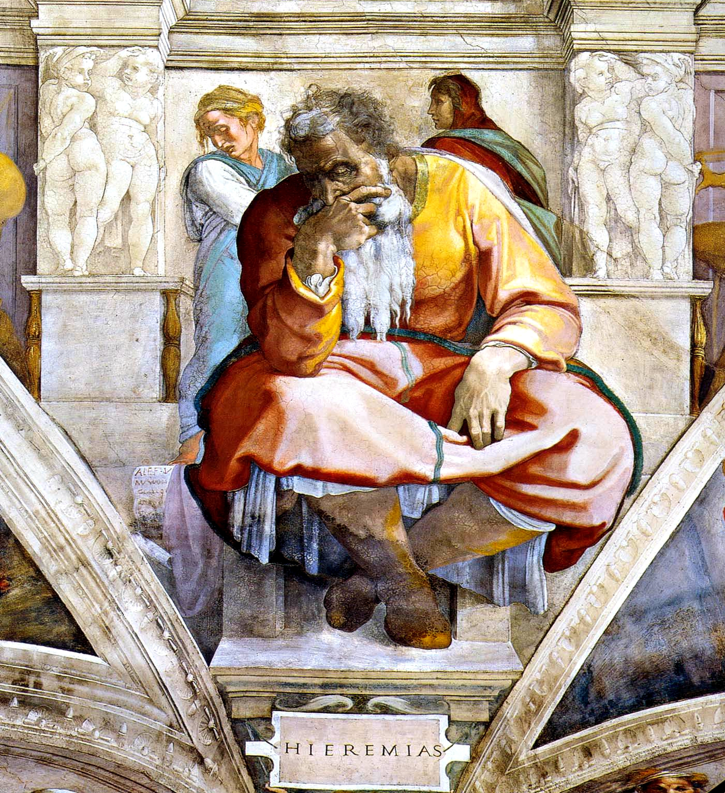

## 一句话总结

驳"文艺复兴 = 复兴古罗马艺术"——本质上是教会把 [[新柏拉图主义 Neoplatonism]] 作为外部资源、由 [[费奇诺 Marsilio Ficino]] 整合进基督教教义，**用 [[理念美 Idea of Beauty]] + [[仰望星空母题 (出神) Star-gazing Motif]] 两大美学装置重塑权威**的一次努力。

## 核心论点

1. **驳"复兴古罗马艺术"**——
   - 技法上：古希腊罗马画家没发明透视，只是毛估估。"说达·芬奇是再生了古罗马的绘画，相当于在说一个大学毕业生达到了他小学三年级时的水平。"
   - 神学上：古希腊古罗马是多神异教，与基督教教义对不上。
2. **真正复兴的是 柏拉图哲学**（不是绘画）——为重树教会权威服务。
3. **整合者**：13 世纪 [[瓦萨里 Giorgio Vasari]] 同代之前的 **托马斯·阿奎那** 把亚里士多德整合进基督教；15 世纪 [[费奇诺 Marsilio Ficino]] 接力，把柏拉图整合进基督教——亚里士多德 退场，柏拉图 上位。
4. **柏拉图哲学对绘画的两个核心影响**：
   - **追求 [[理念美 Idea of Beauty]]**——采百花酿一蜜，画原型而非现实。代价：千人一面（[[圣塞巴斯蒂安 (拉斐尔) St Sebastian]]）。
   - **神秘主义 / [[仰望星空母题 (出神) Star-gazing Motif]]**——普罗提诺"凝神静气找神秘通道"，费奇诺基督教化为"圣徒通过智性观照被上帝圣爱充满"=出神 (ekstasis)。范例：[[圣塞西莉亚 St Cecilia]]、[[圣凯瑟琳 (拉斐尔) St Catherine of Alexandria]]、[[忏悔的抹大拉 (提香) Penitent Magdalene]]、[[圣特蕾莎的狂喜 Ecstasy of Saint Teresa]]。
5. **[[雅典学院 The School of Athens]] 深度细节**（追加）：
   - 柏拉图（手指天，《蒂迈欧篇》）vs 亚里士多德（手指地，《尼各马可伦理学》）
   - 第欧根尼斜躺台阶挡亚里士多德路 —— 消极对积极的诘难
   - 拉斐尔把柏拉图画成白胡子老头、亚里士多德画成 40 岁中年 → 气势上柏拉图赢
   - 据 达尼埃尔·阿拉斯 考证，这"白胡子老头"其实是中世纪流传的**亚里士多德**形象 —— 拉斐尔移花接木，暗示新柏拉图主义取代了亚里士多德学说
   - 赫拉克利特用了米开朗基罗的脸 —— 拉斐尔偷艺西斯廷礼拜堂构图后公开"致敬"，米开朗基罗不解风情，两人闹翻
6. **方法论收束**：要真正理解波蒂切利、达·芬奇、拉斐尔、提香、米开朗基罗，必须用 [[巴克森德尔 Michael Baxandall]] 的 [[时代之眼 Period Eye]]——回到他们的年代，用**新柏拉图主义所塑造的审美观**来评判。

## 涉及实体

### 时代
- [[文艺复兴期 Renaissance]] —— 已存在，追加 source

### 人物
- [[费奇诺 Marsilio Ficino]] —— 新建（新柏拉图整合者）
- [[米开朗基罗 Michelangelo]] —— 新建（stub for 012，本课为西斯廷天顶 + 偷艺案 + 美第奇雕塑学校学徒）
- [[提香 Titian]] —— 新建（stub for 016）
- [[贝尔尼尼 Bernini]] —— 新建（stub for baroque lecture 022+）
- [[拉斐尔 Raphael]] —— 已存在，追加 source（本课为深度作品分析）
- [[瓦萨里 Giorgio Vasari]] —— 已存在，追加 source（"文艺复兴复兴古罗马艺术"主张被驳）
- [[巴克森德尔 Michael Baxandall]] —— 已存在，追加 source（方法论收束）
- 路人式（未建页）：普罗提诺 Plotinus、托马斯·阿奎那、柏拉图、亚里士多德、第欧根尼、赫拉克利特、丢勒（lecture 020 主篇预告）、鲁迅、王尔德、达尼埃尔·阿拉斯

### 概念
- [[新柏拉图主义 Neoplatonism]] —— 新建，本课核心
- [[理念美 Idea of Beauty]] —— 新建
- [[仰望星空母题 (出神) Star-gazing Motif]] —— 新建（folder-mode）

### 作品
- [[圣塞巴斯蒂安 (拉斐尔) St Sebastian]] —— 新建（理念美 / 千人一面例）
- [[圣塞西莉亚 St Cecilia]] —— 新建（三层音乐 + 出神范型）
- [[圣凯瑟琳 (拉斐尔) St Catherine of Alexandria]] —— 新建（仰望星空母题）
- [[忏悔的抹大拉 (提香) Penitent Magdalene]] —— 新建（威尼斯派出神）
- [[圣特蕾莎的狂喜 Ecstasy of Saint Teresa]] —— 新建（巴洛克极致）
- [[雅典学院 The School of Athens]] —— 已存在，追加深度细节（柏拉图/亚里士多德对位、第欧根尼、阿拉斯考证、米开朗基罗八卦），图片清单+02 (柏拉图/亚里士多德局部) + 03 (整体图)
- 提及未建页：米开朗基罗西斯廷天顶画《先知耶利米》局部（作为 decoration 处理，详细见 lecture 012）

## 与其他课程的连接

- 上承：
  - [[007｜文艺复兴是怎么发生的？]] —— 007 给出"为什么需要文艺复兴"（教会权威危机），008 给出"具体复兴了什么"（柏拉图哲学）
  - [[001｜总导论：艺术到底属于谁？]] —— 巴克森德尔方法论的应用案例
- 下接：
  - [[009｜波蒂切利：如何解读"理念美"？]] —— 标题直接呼应 008 的 [[理念美 Idea of Beauty]] 概念
  - [[010｜达芬奇：他为什么一生抑郁不得志？]]、[[011｜拉斐尔：为什么说他是"集大成者"？]]、[[012｜米开朗基罗：他为什么能被艺术史家"封神"？]]
  - [[013｜恩怨：文艺复兴三杰如何相互影响？]] —— 008 的"偷艺八卦"在 013 全面展开
  - [[016｜提香：为什么业界评价比达芬奇还高？]]
  - [[022｜巴洛克：华丽等于没内涵吗？]] 系列 —— 出神母题在巴洛克的极致

## 我的反应

<!-- 留空给用户 -->

## 原文

> 来源：https://www.dedao.cn/course/article?id=oezW9aA7r8pGX8Bl1xVlY4jRMdvmbE
> 出处：[[顾衡·西方美术100讲]] · 12分26秒　顾衡 亲述

你好，我是顾衡。

上一讲，我们介绍了文艺复兴运动的性质。和很多人的想法不一样，它并不是反宗教的。恰恰相反，它是由渴望重树威信的教会推动的。

今天我们再来讨论另一个很流行的说法：意大利艺术理论家瓦萨里说，文艺复兴就是复兴古罗马的艺术、再现古罗马的艺术。这个说法靠谱吗？

我觉得不靠谱。原因有两个：

首先从技法上看， 虽然古希腊古罗马的画家们已经知道了如何在二维的平面上去表达立体效果，但是他们并没有发明透视法，只是出于本能，用远小近大毛估估一下。

透视法这个东西对绘画非常重要。它一方面是营造出了逼真的空间错觉，另一方面也给绘画带来了众多崭新的课题。比如线条与色彩、明暗与色调、画面主题与空间统一性之间的平衡，等等。

说达·芬奇是再生了古罗马的绘画，这相当于是在说一个大学毕业生经过刻苦努力，达到了他小学三年级时的水平。

其次，对于教会来说，再次树立起权威才是目的。

可是，古希腊古罗马文化是多神的，是异教的。怎么和基督教的教义打通呢？那直接复兴古希腊古罗马文化的这个事情，也说不通。

那么，文艺复兴到底复兴了什么呢？

对于教会来说，古希腊古罗马的文化只是资源，而怎么把它和基督教的神学进行整合，达到重振权威的目的，这才是要关注的事情。

把古希腊思想和基督教神学整合起来，13世纪的神学家托马斯·阿奎那干过一次。

他写了一本《神学大全》，把亚里士多德的哲学与基督教的神学进行了整合，成为了当时的正统。

可是过了这么久，亚里士多德那套不管用了，得换一套说法。换谁呢？ 柏拉图 。

这个任务，就落在了马尔西略·费奇诺的身上。

费奇诺正是美第奇家族赞助成立的柏拉图学院的院长，他写了一本《柏拉图主义神学》。看书名你就猜得出来，意思是亚里士多德那套不管用了，现在得拿柏拉图说事儿。

柏拉图哲学对文艺复兴的影响在何处呢？

第一个影响，就是追求"理念美"。

古希腊人认为，世界由四个元素，也就是水、火、土、气构成。

柏拉图这个人特别喜欢几何学。他办个学校，学校大门口还要竖个牌子"不懂几何学者不得入内"。

出于对几何学的热爱，柏拉图就得出个结论，说水、火、土、气这些基本元素的结构，肯定都是正多面体，这样才称得上完美。柏拉图所说的正多面体，一共有五个。

基本元素是四个，正多面体却是五个，多出来的一个咋整呢？

柏拉图就说，水、火、土和气的上面，还有一层专门供神呼吸的干净空气，亚里士多德后来还给起了个名，叫 "以太" 。

到了费奇诺这儿，为了与基督教教义整合，他说这个"以太"，就是造物主的意志。

以太往下，就是各种元素。柏拉图说这些元素必须具备几何学的完美性质。这些完美的元素，可以被理解为"以太"的具象化。柏拉图给起了个名儿，叫 "原型" 。

原型再往下，就是 现实世界 。现实世界就让柏拉图很不满意了，树是歪的，河是弯的，一点儿都不完美。

用柏拉图自己的话说就是："现实世界不过是理念世界的苍白倒影。"

所以，如果艺术家专注于再见眼睛所见的真实，那弄出来的不过是一个复制品的复制品。这有什么价值可言呢？

你看，虽然古希腊古罗马的艺术家到后来也有了所谓风格化的倾向，但本质上却是在追求眼睛所见的真实。可是文艺复兴时期的艺术创作，目的却是表达柏拉图所说的理念美。 这是二者根本的不同。

柏拉图和费奇诺甩点"以太"和"原型"的大词，这很简单。可是到了画家这里，他们怎么表达理念美呢？

丢勒的一段话就很好地解释了柏拉图式绘画。他说：

- 要想画出美的人体，你必须从这里找一张脸，从那里找一双手，再去别的地方找一双腿……完美由众美聚合而成，就像蜂蜜采自百花。

鲁迅也说过一模一样的话：

- 采百种花，酿一种蜜。

所谓学院派绘画的理念，根子就在这儿。他们一天到晚跟祥林嫂似地唠叨："艺术来源于生活，却高于生活。"艺术为啥高于生活啊？追求理念美嘛！

那么，这种追求原型的绘画理念，会不会导致千人一面呢？会的。毕竟完美的标准只有一个嘛！

我们还是拿拉斐尔举例子。记住他的这幅《圣塞巴斯蒂安》。你会发现，这张脸在拉斐尔的画作中反复出现，尤其是他的早期作品。

%20St%20Sebastian/01.jpg)
<!-- src: https://piccdn3.umiwi.com/img/202103/11/202103111702059644188123.jpg -->
<!-- artwork: [[圣塞巴斯蒂安 (拉斐尔) St Sebastian]] -->

拉斐尔 Raffaello Sanzio da Urbino
圣塞巴斯蒂安 St Sebastian
1501-1502

柏拉图哲学对绘画的第一个影响是追求理念美。现在我们再来看第二个影响： 艺术创作中出现了神秘主义的倾向。

柏拉图说我们对原型的知识是先天就有的，灵魂被肉体束缚之后，只能通过"回忆"才能与更高级智慧形成沟通。

可是灵魂到底怎么回忆呢？这个，柏拉图并没有说清楚。

到了公元三世纪，在柏拉图思想基础上发展出了一个新的哲学流派，叫 新柏拉图主义 。

这一派的代表人物 普罗提诺 认为，个别灵魂可以通过凝神静气，找到一个神秘通道，向上直达神意。

这有点儿像咱们这边和尚的打坐修禅。我们这边的和尚是闭着眼睛的，而西方人却是仰望星空的造型。

就像王尔德说的：

- 我们所有人都生活在阴沟里，但是某些人在仰望星空。

那么，王尔德所说的"某些人"到底是些什么人呢？

《马太福音》里给出了答案，就是圣徒。《马太福音》是这么说的：

- 为义受迫害的人有福了，因为天国是你们的。应当欢喜快乐，因为你们在天上的赏赐是大的。

根据这套理念，费奇诺声称，圣徒通过一种纯粹智性的目光与上帝沟通，即可被上帝的圣爱所充满。这个状态，叫 "智性观照" 。而这个过程，则被称为 "出神" 。

通过"出神"，也就是仰望星空，新柏拉图主义上达神意的神秘通道，就可以被转化为基督教上帝的圣爱。

这一通绕下来，柏拉图哲学和基督教神学就给打通了。

哲学的东西有些烧脑，我们还是用拉斐尔的这幅《圣塞西莉亚》来举例说明一下。

<!-- src: https://piccdn3.umiwi.com/img/202103/11/202103111704187612896307.jpg -->
<!-- artwork: [[圣塞西莉亚 St Cecilia]] -->

拉斐尔
圣塞西莉亚 St Cecilia
1514年

圣塞西莉亚发誓婚后也要为主守童贞，所以在婚礼上，她听到的不是世俗的音乐，而是来自天上的音乐。她因而也成了音乐和乐器的保护人。

脚下 已经朽毁的乐器，象征着五音乱耳的世俗音乐，也象征着鄙俗的现实世界。

圣塞西莉亚 手里 拿的管风琴，是教堂演奏圣乐的指定乐器，象征着第二层，也就是音乐的理念和原型。

最上面 则是神的、永恒的音乐。

圣塞西莉亚身边站着四个圣徒。

画面左边的圣保罗，就是穿红袍子的那个，他边上是圣约翰，代表着初始的圣洁。右边的抹大拉和圣奥古斯丁，代表着通过忏悔洗清罪孽重新获得的纯洁。

圣塞西莉亚通过"出神"，得以与上天的音乐沟通，并被上帝的圣爱充盈。

正是新柏拉图主义所主张的通过出神与更高级智慧沟通，让仰望星空的这个姿势，成了西方绘画的一个大母题。

比如拉斐尔的《圣凯瑟琳》。

%20St%20Catherine%20of%20Alexandria/01.jpg)
<!-- src: https://piccdn3.umiwi.com/img/202103/11/202103111705330845487823.jpg -->
<!-- artwork: [[圣凯瑟琳 (拉斐尔) St Catherine of Alexandria]] -->

拉斐尔
圣凯瑟琳 St Catherine of Alexandria
1507-1508

提香的《抹大拉》。

%20Penitent%20Magdalene/01.jpg)
<!-- src: https://piccdn3.umiwi.com/img/202103/11/202103111706240088115037.jpg -->
<!-- artwork: [[忏悔的抹大拉 (提香) Penitent Magdalene]] -->

提香 Titian
忏悔的抹大拉 The Penitent Magdalene
1555-1565

和贝尔尼尼的《圣特雷莎的狂喜》。

<!-- src: https://piccdn3.umiwi.com/img/202103/11/202103111706411156681492.png -->
<!-- artwork: [[圣特蕾莎的狂喜 Ecstasy of Saint Teresa]] -->

贝尔尼尼 Gian Lorenzo Bernini
圣特蕾莎的狂喜 Ecstasy of Saint Teresa
1645-1652

<!-- src: https://piccdn3.umiwi.com/img/202103/11/202103111706508393366198.png -->
<!-- artwork: [[圣特蕾莎的狂喜 Ecstasy of Saint Teresa]] — 局部 -->

圣特蕾莎的狂喜 局部

虽说是人心不古、世风日下，越往后越是肉欲横流。但是其背后，却都是天主教教会将柏拉图哲学与天主教教义进行整合的努力。

以后你看到仰望星空这个造型，就知道它背后是什么了。

明白了柏拉图哲学对文艺复兴的影响，咱们再来看一下拉斐尔的《雅典学院》这幅画，就能看出很多名堂。

<!-- src: https://piccdn3.umiwi.com/img/202103/11/202103111707063678272114.jpg -->
<!-- artwork: [[雅典学院 The School of Athens]] —— 03（整体图，与 007 配图为不同 CDN 版本） -->

拉斐尔 Raffaello Sanzio da Urbino
雅典学院The School of Athens
1509-1510

在这幅画中，处于画面正中的是柏拉图和亚里士多德。

柏拉图腋下夹着他的代表作《蒂迈欧篇》，手指着天，强调着理念和原型。

亚里士多德手里拿着他的代表作《尼各马可伦理学》，手指着地，强调知识来源于经验。

<!-- src: https://piccdn3.umiwi.com/img/202103/11/202103111707347199601968.jpg -->
<!-- artwork: [[雅典学院 The School of Athens]] —— 02（局部，柏拉图与亚里士多德） -->

拉斐尔安排了两个细节，宣示了柏拉图对亚里士多德的胜利。

第一个细节是，台阶上躺着猪一样的第欧根尼，挡住了亚里士多德的去路，暗示了消极出世的第欧根尼对积极入世的亚里士多德的诘难。

第二个细节是，拉斐尔把柏拉图画成一个白胡子老头，把亚里士多德画成40岁左右的中年人，这让亚里士多德在气势上就输了。

好笑的是，根据法国著名艺术史学者达尼埃尔·阿拉斯考证，这个白胡子老头，其实是中世纪流传甚广的亚里士多德的形象。

拉斐尔移花接木，把它错置到柏拉图身上，暗示了新柏拉图主义代替了亚里士多德的学说，成为正统。

这里还有个八卦，画面前方用手拄着脸颊的黑发人是那个主张"人不能两次踏进同一条河流"的赫拉克里特。

拉斐尔画《雅典学院》的时候，那个时候米开朗基罗正在西斯廷教堂画天顶画《创世纪》。

拉斐尔晚上去偷艺，借鉴了米开朗基罗画的先知耶利米的构图。

<!-- src: https://piccdn3.umiwi.com/img/202103/18/202103182102024260671073.jpg -->
<!-- 配图：米开朗基罗西斯廷天顶画《先知耶利米》局部 (1508-1512)；与 [[雅典学院]] 中拉斐尔笔下的赫拉克利特构图对照 -->

米开朗基罗 Michelangelo
西斯廷天顶画局部 先知耶利米
1508-1512

拉斐尔就想，既然图都是偷来的，干脆模特也用米开朗基罗，公开致敬一下算了。没想到米开朗基罗不解风情，跳着脚地指责拉斐尔偷他的技术和创意，两个人为此闹得挺不愉快。

最后，咱们总结一下。文艺复兴运动，本质上是教会把柏拉图哲学思想作为外部资源，与基督教教义进行整合，以重新树立权威的一次努力。

早在公元三世纪，新柏拉图主义的代表人物普洛提诺曾经向自己提出过这样一个问题：

作为在物质的泥沼中沉沦挣扎的人类，如何得到救赎呢？如何才能做到，如柏拉图建议的那样，尽可能地与神相似呢？

为了回答这个问题，艺术家们用凿子和画笔纷纷写下了自己的答案。

今天，我们凭着自己的喜好，给波蒂切利、拉斐尔、达·芬奇、提香、米开朗基罗判下分数。

但是要想真正理解他们的作品，我们却需要听从英国艺术史家巴克森德尔的劝告，就是首先要穿越回画家们所处的那个年代，用当时的标准去评判当时的他们。

什么标准呢？就是由新柏拉图主义哲学思想所塑造的审美观。

那么，波蒂切利和达·芬奇各自会得多少分呢？

好，我是顾衡，感谢你的收听，咱们下一讲见！

### 划重点

1. 文艺复兴的诉求，并非单纯复兴古典文化，而是要将柏拉图哲学与基督教义整合起来，以重塑教会权威。
2. 柏拉图哲学对绘画产生了两个影响：追求"理念美"，以及神秘主义。
3. 《雅典学院》的细节，反映了当时柏拉图哲学代替亚里士多德的哲学，成为正统。

<!-- src: https://piccdn3.umiwi.com/img/202103/12/202103121619425255771782.jpg -->
<!-- shared course footer (appears at end of every lecture) -->
