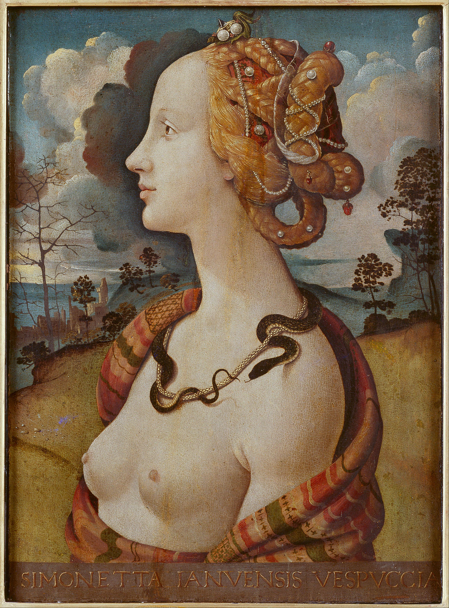

## 一句话总结

[[波蒂切利 Botticelli]] 是把 [[新柏拉图主义 Neoplatonism]] / [[理念美 Idea of Beauty]] **践行到极致**的画家——为美毫不犹豫地对现实进行变形（[[维纳斯 (波蒂切利) Venus (Botticelli)]] 1:8 头身比、左肩"脱臼"）。他是 [[美第奇家族 Medici Family]] 圈子最喜爱的画家，后世学院派绘画的开端。

## 核心论点

1. **波蒂切利风格的来源**：师承 [[利比修士 Filippo Lippi]] 的"冰美人"圣母 → 自己又往前走一步：线条更硬更锐利，神情**清心寡欲到冷漠**——正与摒弃肉欲的柏拉图哲学暗合，所以洛伦佐和他的文人小圈子（皮科、波利齐亚诺）特别喜欢他。
2. **古希腊隐喻进入宗教画**：[[持石榴的圣母 Madonna of the Pomegranate]] 圣子手中石榴典出 珀尔塞福涅 神话——古希腊隐喻为基督教教义服务。
3. **千人一面**：[[春 La Primavera]] 里维纳斯外的所有女性容貌雷同——柏拉图《法律篇》"画匠被禁止任何形式的创新"的视觉化。
4. **波蒂切利 vs. [[马丁尼 Simone Martini]] 的 [[圣母领报 (马丁尼·梅米) The Annunciation]] (1333) 对比**：马丁尼**程式化但表情生动**；波蒂切利 [[圣母领报 (波蒂切利) Annunciation (Botticelli)]] (1489) **更写实但表情淡漠**——情感节制是柏拉图主张。
5. **不全是性冷淡风**：[[维纳斯与马尔斯 Venus and Mars]] (1480) 是恶搞结婚画——奸夫淫妇 + 萨梯戳树洞 + 马尔斯认输的食指。
6. **古罗马衰亡后第一个全裸女神**：[[维纳斯的诞生 The Birth of Venus]] (1477)——古希腊女神回归基督教画面，只有在新柏拉图主义保护下才能合法。
7. **为理念美变形人体**：[[维纳斯 (波蒂切利) Venus (Botticelli)]] 头身比 1:8、左肩脱臼——"人体可以画得更准确，但是波蒂切利却画得更美"。学院派绘画的根。

## 涉及实体

### 时代
- [[文艺复兴期 Renaissance]] 早期

### 流派
- [[佛罗伦萨画派 Florentine School]]

### 人物
- [[波蒂切利 Botticelli]] —— 新建（主角）
- [[利比修士 Filippo Lippi]] —— 新建（师傅）
- [[美第奇家族 Medici Family]] —— 已存在，追加 source（赞助主线）
- 路人式（未建页）：卢克莱修 (古罗马诗人，《春》题材出处)、波利齐亚诺 (洛伦佐门客诗人)、皮科 (洛伦佐门客哲学家)、皮耶罗·迪·科西莫 (西蒙内塔肖像作者)、西蒙内塔·维斯普奇 (模特)、朱利亚诺·美第奇 (洛伦佐弟弟)
- 课程后续将专题：[[拉斐尔 Raphael]] (011)、[[达·芬奇 Leonardo da Vinci]] (010, 待建 stub)、[[米开朗基罗 Michelangelo]] (012)

### 概念
- [[理念美 Idea of Beauty]] —— 已存在，追加 source（本课是 case study）
- [[新柏拉图主义 Neoplatonism]] —— 隐含援引
- [[用手遮挡私处母题 Venus pudica]] —— 已存在，《维纳斯的诞生》是典型再现

### 技法
- [[线性透视 Linear Perspective]] —— 已存在 (波蒂切利 [[圣母领报 (波蒂切利)]] 已娴熟掌握)
- [[S 造型 Contrapposto]] —— 已存在 (波蒂切利维纳斯的标志姿态)

### 作品
- [[圣母子与二天使 (利比修士) Madonna with the Child and Two Angels]] —— 新建（师傅冷美人范例）
- [[持石榴的圣母 Madonna of the Pomegranate]] —— 新建
- [[春 La Primavera]] —— 新建（主作品 + 4 局部）
- [[圣母领报 (波蒂切利) Annunciation (Botticelli)]] —— 新建
- [[维纳斯与马尔斯 Venus and Mars]] —— 新建
- [[维纳斯的诞生 The Birth of Venus]] —— 新建（古罗马衰亡后第一全裸女神）
- [[维纳斯 (波蒂切利) Venus (Botticelli)]] —— 新建（1:8 头身比 + 脱臼左肩，理念美变形范例）
- [[圣母领报 (马丁尼·梅米) The Annunciation]] —— 已存在，作为对照作品；图片清单+03（009 引用的不同 CDN 版本）
- 提及未建页：皮耶罗·迪·科西莫《西蒙内塔·韦斯普奇像》(1480)（decoration 处理，模特身份确认）

## 与其他课程的连接

- 上承：
  - [[007｜文艺复兴是怎么发生的？]]、[[008｜文艺复兴到底复兴了什么？]] —— 理论铺垫
  - [[006｜哥特艺术2：为什么在意大利发生了分化？]] —— 马丁尼《圣母领报》作为锡耶纳哥特范型，被波蒂切利圣母领报回应
- 下接：
  - [[010｜达芬奇：他为什么一生抑郁不得志？]] —— 顾衡明示要用达芬奇作参照来对照波蒂切利的局限
  - [[011｜拉斐尔：为什么说他是"集大成者"？]]、[[012｜米开朗基罗]]
  - [[014｜美第奇家族：甲方如何影响文艺复兴？]] —— 洛伦佐与波蒂切利的关系
  - [[032｜安格尔]] —— 学院派理念的 19 世纪继承者

## 我的反应

<!-- 留空给用户 -->

## 原文

> 来源：https://www.dedao.cn/course/article?id=e1k8gp2WGMzqJ3mb03K5YmP6DOjxAL
> 出处：[[顾衡·西方美术100讲]] · 11分35秒　顾衡 亲述

你好，我是顾衡。

前面我们用了两讲的篇幅介绍了文艺复兴运动的性质和缘由。从这一讲开始介绍文艺复兴时期重要的画家和作品。

说到文艺复兴当中的艺术家，我们首先会想到文艺复兴三杰，也就是达芬奇、拉斐尔和米开朗基罗。但是这一讲先不说他们，先从波蒂切利开始。

为什么要从波蒂切利开始呢？原因很简单。

上一讲说教会到柏拉图哲学那里找灵感，试图将古希腊文化与基督教教义相结合，以重建权威。波蒂切利呢，就是把这种理念践行到极致的一位，也正因为这个，他成了美第奇家族最喜爱的画家。

你可能看过他的《春》，看过他的维纳斯，知道他的画很美。那如果问一句：究竟美在何处呢？解读他的作品，就是要从柏拉图式的理念美入手。

先说说波蒂切利的绘画风格是如何形成的。

波蒂切利叫桑德多，于1445年出生于佛罗伦萨，父亲是一个皮革匠。

波蒂切利并不是姓，而是他的外号，意思是"小桶"。因为他有个哥哥是开当铺的，当铺的招牌就是一只桶。

当时的欧洲，除了贵族，普通人都没有姓。而西方人都从《圣经》里取名字，来来回回就那么几个，这么着就分不清楚，所以就要在名字后面区别一下。

皮耶罗·迪·科西莫就是"科西莫的儿子皮耶罗"的意思。而列奥纳多·达·芬奇呢？就是"来自芬奇镇的那个列奥纳多"的意思。

波蒂切利13岁的时候，父亲送他去一个金匠那里当学徒。但是过了没多久，发现他在绘画上很有天分，就又把他送到 利比修士 的画室里学习绘画。

利比修士虽然是个修士，但是特别热爱俗世生活，两大爱好就是赌博和女人。

50岁那年，在给一个女修道院画壁画的时候，竟然拐走了一个叫柳克丽西娅的修女，还生了两个孩子。教皇震怒，要把他处死。

这个时候，美第奇家族就发挥作用了。洛伦佐·美第奇的爷爷科西莫特别喜欢利比修士的画，不仅把他救了下来，还请他到家里来住。

柳克丽西娅长得非常漂亮。利比修士以她和他们的孩子为模特，画了很多圣母圣子像。

这媳妇是拐来的，所以利比修士特别强调柳克丽西娅恬静和虔诚的一面，总之就是个冰美人吧。

%20Madonna%20with%20the%20Child%20and%20Two%20Angels/01.jpg)
<!-- src: https://piccdn3.umiwi.com/img/202103/15/202103151445057813169080.jpg -->
<!-- artwork: [[圣母子与二天使 (利比修士) Madonna with the Child and Two Angels]] -->

利比修士 Filippo Lippi
圣母子与二天使 Madonna with the Child and two Angels
1460-1465

利比修士这个冷淡的绘画风格，显然影响到了波蒂切利，但波蒂切利往前又走了一步。来看他这幅《石榴圣母》。

<!-- src: https://piccdn3.umiwi.com/img/202103/24/202103242000168735359048.jpg -->
<!-- artwork: [[持石榴的圣母 Madonna of the Pomegranate]] -->

波蒂切利 Sandro Botticelli
持石榴的圣母 Madonna of the pomegranate
1487年

与利比修士相比，波蒂切利的线条更硬，更锐利。圣母的神情恬淡得甚至有些冷漠，一点儿都不亲切。

不过这个清心寡欲、不食人间烟火的神情，正与摒弃肉体欢愉的柏拉图哲学暗合。这是洛伦佐和他的文人小圈子喜爱波蒂切利的根本原因。

画家们往往喜欢在作品中使用隐喻，这就像文人写文章喜欢用典。

这幅画圣子手上的石榴，典出古希腊神话。说的是冥界之神绑架了丰收女神的女儿珀尔塞福涅。如果珀尔塞福涅不吃不喝，本来是有机会返回阳界的。但是不幸，她在冥界吃了六颗石榴籽。最后只好半年住老公家，半年回娘家。

文艺复兴时期的宗教画里出现了大量取材自古希腊古罗马神话的隐喻，体现的正是我们前面说过的：借助古希腊文明重新树立教会权威的努力。

波蒂切利只比洛伦佐大五岁，两个人很快就成了好朋友。洛伦佐当家后，仿照柏拉图《会饮篇》的描述，经常和文人门客们曲水流觞，宴饮畅谈。

其中洛伦佐的两个门客对波蒂切利产生了很大的影响。一个是哲学家皮科，另一个是诗人波利齐亚诺。

就是在这一场场欢宴中，波蒂切利补上了文化课，对古希腊神话和柏拉图哲学有了深入的理解，并在作品中自觉地将柏拉图哲学与基督教神学进行整合。这是解读波蒂切利作品的关键所在。

比如他的名画《春》。

<!-- src: https://piccdn3.umiwi.com/img/202103/15/202103151452372029121822.jpg -->
<!-- artwork: [[春 La Primavera]] -->

波蒂切利
春 La Primavera (Spring）
1481-1482

这幅画的主题出自古罗马诗人卢克莱修的一句诗：

维纳斯缓缓前行

如皇后般庄严

她走过的路

万物萌芽生长

画面中最左侧的墨丘利正在赶走不识相的乌云。美慧三女神翩翩起舞，喻意着人生中最值得珍惜的青春、美丽和欢乐。维纳斯头顶的丘比特用箭指向美慧三女神，将爱情洒向人间。画面右侧的分别是西风神、春之女神和花神弗洛拉。

画面右下角画的是菖蒲，因为这是一幅结婚画。新人是洛伦佐的侄子。洛伦佐亲自为侄子订下了这门亲事。他自己也写过这样一句诗："弗洛拉披满鲜花，人间便充满生机。"

<!-- src: https://piccdn3.umiwi.com/img/202103/23/202103232022169094032870.png -->
<!-- artwork: [[春 La Primavera]] —— 局部 菖蒲 -->

《春》局部 菖蒲

在这幅画中，我们重点看维纳斯。

<!-- src: https://piccdn3.umiwi.com/img/202103/18/202103182117298511641117.png -->
<!-- artwork: [[春 La Primavera]] —— 局部 维纳斯 -->

《春》局部 维纳斯

她小腹隆起，明显是有孕在身。她举起右手，这是中世纪绘画中有话要说的姿势。

波蒂切利为什么要把维纳斯画成一个孕妇呢？她又要说些什么呢？

有艺术史学者说这是祝愿新人早生贵子，也有学者说维纳斯其实是圣母玛丽亚的化身。她举起右手，在异教的神祇中宣告耶稣基督的即将到来。

后一种解读似乎有过度诠释的嫌疑。姑且存疑吧。

<!-- src: https://piccdn3.umiwi.com/img/202103/18/202103182120361709289534.png -->
<!-- artwork: [[春 La Primavera]] —— 局部 -->

<!-- src: https://piccdn3.umiwi.com/img/202103/18/202103182122049973793800.png -->
<!-- artwork: [[春 La Primavera]] —— 局部 -->

还有一个细节需要注意，就是在《春》这幅画中，除了主角维纳斯之外，美慧三女神、春之女神和花神弗洛拉，容貌是高度雷同的，五官并无个性可言。这体现的正是柏拉图对艺术创作的态度。

柏拉图对埃及艺术非常赞赏。他反对变化，反对表现个性。

在《法律篇》中柏拉图说：

- 埃及人对所有的标准类型拟定了一个清单，将样本供奉在神殿。画匠被禁止任何形式的创新，只能遵循传统标准，而且这一禁令至今在艺术和音乐的各个领域仍然有效。如果你到现场考察他们的艺术，你会发现，一万年前的作品不比现在好，也不比现在坏。

如果有人不听话，非要整幺蛾子，怎么办呢？柏拉图说：

- 所有手工艺都必须被监管，任何反对规则的人都不得从事这些手艺。

波蒂切利的作品中，我最喜欢的是这幅《圣母领报》。

%20Annunciation%20(Botticelli)/01.jpg)
<!-- src: https://piccdn3.umiwi.com/img/202103/15/202103151457235656252450.jpg -->
<!-- artwork: [[圣母领报 (波蒂切利) Annunciation (Botticelli)]] -->

波蒂切利
圣母领报 Annunciation
1489年

地面的格子线，汇聚于远处城堡的尖顶，表明了波蒂切利已经娴熟地掌握了透视法。

圣母向后躲的曼妙身姿，不禁让我们想起了前面介绍过的西蒙·马丁尼的同名画作。

%20The%20Annunciation/03.jpg)
<!-- src: https://piccdn3.umiwi.com/img/202103/15/202103151458143965797131.jpg -->
<!-- artwork: [[圣母领报 (马丁尼·梅米) The Annunciation]] —— 03 (009 引用的不同 CDN 版本) -->

马丁尼、梅米 Simone Martini & Lippo Memmi
圣母领报 Annunciation
1333

马丁尼笔下的圣母虽然是高度程式化的，但是圣母的表情却非常生动。

而波蒂切利的圣母虽然更加写实，但是表情却是淡漠的。情感的内敛与节制，正是柏拉图的主张。

当然，波蒂切利的作品也不都是性冷淡风。这幅《维纳斯与马尔斯》就很有意思。

<!-- src: https://piccdn3.umiwi.com/img/202103/15/202103151500280584079561.jpg -->
<!-- artwork: [[维纳斯与马尔斯 Venus and Mars]] -->

波提切利
维纳斯与马尔斯 Venus and Mars
1480年

和《春》一样，这也是一幅结婚画。但是维纳斯和战神马尔斯只是情人关系，维纳斯有老公的，就是锻造之神伏尔甘。那你说人家结婚，你送一幅奸夫淫妇的画像，这不起哄么？

更搞笑的是，画中的维纳斯还是一付欲求不满的样子，怂恿三个调皮的萨梯去叫醒马尔斯。

半人半羊的萨梯，在古希腊神话中本来就是情欲的象征，还要再画个用长矛去戳树洞的情节，喻意再明显不过。

可是马尔斯呢？云雨初歇，酣然睡去，右手下垂弯曲的食指表示认怂投降。

送这么幅画作为人家结婚的贺礼，这是对新郎官多大仇多大怨呢？

当然，波蒂切利最有名的画，还是《维纳斯的诞生》。题材取自波利齐亚诺的一首诗：

她航行在白色波涛的海面上

一个超过人类面貌的年轻贞女

强壮的西风之神将她吹向塞浦路斯海岸

在蓝天下，她出生的贝壳里

<!-- src: https://piccdn3.umiwi.com/img/202103/19/202103191444020209601410.jpg -->
<!-- artwork: [[维纳斯的诞生 The Birth of Venus]] -->

波蒂切利
维纳斯的诞生 The Birth of Venus
1477年

画面左侧仍然是西风神和花神，一个吹着西风，另一个向空间抛洒花瓣，将维纳斯吹向塞浦路斯的帕福斯海岸。海洋女神殷勤地张开披风，迎接维纳斯的到来。

虽然在此之前皮耶罗·迪·科西莫已经画过上身裸露的画作，但是全身赤裸的古希腊女神形象，这还是古罗马衰亡后的第一次，也是基督教文明中的第一次。

《春》和《维纳斯的诞生》两幅画作的模特是同一个人，叫西蒙内塔·维斯普奇，是当时佛罗伦萨全城公认的第一美女，可惜23岁就香消玉殒了。

洛伦佐的弟弟朱利亚诺疯狂地爱着她，甚至在她死后还订制了很多幅她的肖像。波蒂切利画《维纳斯的诞生》时，美人已经离世8年了。

<!-- src: https://piccdn3.umiwi.com/img/202103/18/202103182133342636541587.jpg -->
<!-- 配图：皮耶罗·迪·科西莫《西蒙内塔·韦斯普奇像》(1480)，模特身份确认 -->

皮耶罗·迪·科西莫 Pierro di Cosimo
西蒙内塔·韦斯普奇像 Portrait of Simonetta Vespucci
1480年

波蒂切利画的维纳斯，还是我们熟悉的Ｓ造型。但是波蒂切利的维纳斯，和古希腊的维纳斯雕像可不太一样。

%20Venus%20(Botticelli)/01.jpg)
<!-- src: https://piccdn3.umiwi.com/img/202103/15/202103151510105620425076.jpg -->
<!-- artwork: [[维纳斯 (波蒂切利) Venus (Botticelli)]] -->

波蒂切利
维纳斯 Venus
1482年

首先，维纳斯头身比达到了1：8而不是正常的1：7。

其次，为了强调Ｓ造型和线条的柔美，波蒂切利把维纳斯的左肩画得跟脱了臼似的。很多人对此大加吐槽。

但其实，为了理念美毫不犹豫地对现实加以变形和强化，这正是学院派绘画的理念，一直到19世纪的安格尔都是如此。

毫无疑问，人体可以画得更准确，但是波蒂切利却画得更美。

当然，波蒂切利的这个画法也并不是没有问题。下一讲，我们要请出一个人来作个参照，才能更好地理解波蒂切利。这个参照，就是达·芬奇。

好，我是顾衡。感谢你的收听，咱们下期见！

### 划重点

1. 解读波蒂切利作品的关键，在于新柏拉图主义理念化的审美观。
2. 波蒂切利师从利比修士，并在和美第奇家族的交往中，自觉将柏拉图哲学与基督教神学进行整合，形成了自己的风格。
3. 为了理念美毫不犹豫地对现实加以变形和强化，这正是学院派绘画的理念。波蒂切利被视为后世学院派绘画理念的开端。

<!-- src: https://piccdn3.umiwi.com/img/202103/15/202103151512114120966238.jpg -->
<!-- shared course footer (appears at end of every lecture) -->
