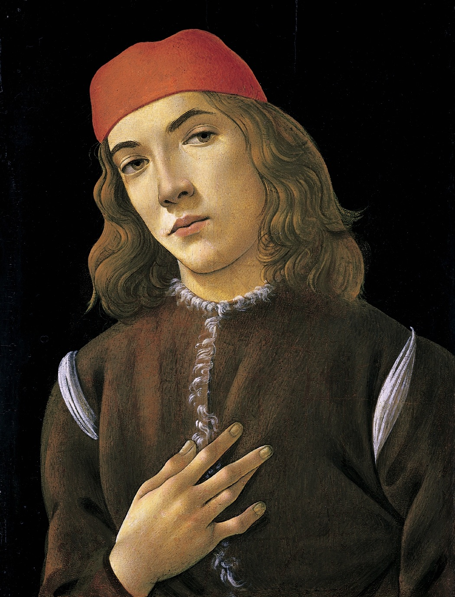
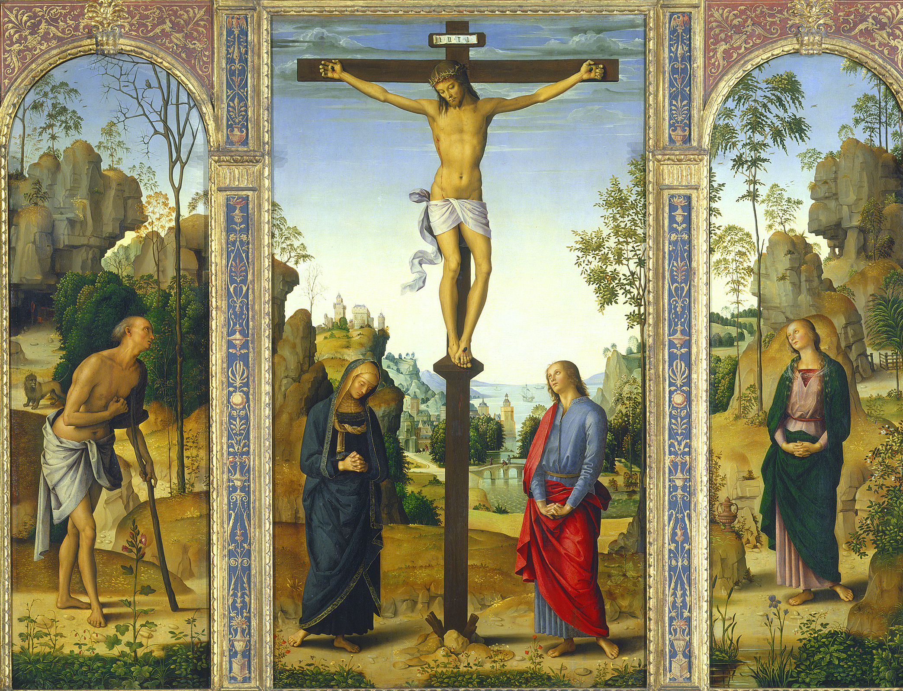

## 一句话总结

[[拉斐尔 Raphael]] 是文艺复兴三杰中**对美术界影响最大的集大成者**——理解他的关键是 **"平衡"**。他在画家面临的三大矛盾（写实 vs. 甲方意愿 / 异教 vs. 基督教 / 透视的技术副作用）之间找到了**近乎满分的妥协**，成为后世学院派的标尺。

## 核心论点

1. **三大矛盾**（贯穿所有文艺复兴画家）：
   - **写实冲动 vs. 甲方意愿**——画家想画得像，甲方却觉得"越写实越好"不是必然 (杜乔仍要塑造立体感、波蒂切利的衣服逼真度不输达芬奇；但甲方教会和美第奇要的是理念美)
   - **如何把异教多神的古希腊神话转化为基督教神学的血肉**——既不能不做，又不能像洛伦佐那样怂恿画"一堆光屁股女人"
   - **透视法带来的技术副作用**——锐利线条 vs. 体积感、空气透视 vs. 朦胧脏——纸片人 (波蒂切利) 与脏抹布 (达·芬奇) 都不行
2. **拉斐尔的"平衡"是高情商 + 高画技的结合**——会做人 + 会画画
3. **三阶段**：
   - **乌尔比诺-佩鲁贾阶段**（[[翁布里亚画派 Umbrian School]]）—— 师承 [[佩鲁吉诺 Perugino]]；17 岁出徒；[[圣母的婚礼 (拉斐尔) Marriage of the Virgin (Raphael)]] (1504) 已青出于蓝
   - **佛罗伦萨阶段** (1503-1508)——see [[蒙娜丽莎 Mona Lisa]] / 波蒂切利作品，迅速 get 到二者分歧，倾倒于达·芬奇；[[粉红圣母 Madonna of the Pinks]] 全方位致敬 [[康乃馨圣母 Madonna of the Carnation]]——但**保留一定线条感、不走达芬奇那么远**。同时仍能为翁布里亚甲方按旧风格作 [[基督下十字架 (拉斐尔) Deposition (Raphael)]] (1507)——情商体现。
   - **罗马阶段** (1508-1520)——尤利乌斯二世给他签字大厅 + [[雅典学院 The School of Athens]]；他成为罗马顶级画家。教皇利奥十世更重用他，让他做圣彼得大教堂建筑与艺术总监 (相当于米开朗基罗的领导)，一幅画 12000 金币；同时养着达·芬奇但每月只给 33 金币生活费，气得达·芬奇日记里写"美第奇创造我，美第奇毁灭我"。
4. **梵蒂冈四主题**——神学 / 诗学 / 哲学 / 法学，"直接击中靶心，为教会重塑古希腊文化继承人身份提供完美方案"。
5. **拉斐尔不缺原创性**——很多人说他原创性最小，顾衡反驳：在一个参数上极致很简单，**在复杂矛盾中做艰难取舍才是真天分**。
6. **巴克森德尔引语**："一幅 15 世纪的绘画是某种社会关系的积淀。一方为画家，另一方为甲方……双方均受到制度和惯例的约束。" 拉斐尔给了近乎满分的答案。
7. **学院派的根**：[[圣家族 (拉斐尔) The Holy Family]] (1518) 最全面表达了"完美掌握技巧但克制使用"——把柏拉图主义节制理念提到更高维度。

## 涉及实体

### 时代
- [[文艺复兴期 Renaissance]] 盛期

### 流派
- [[翁布里亚画派 Umbrian School]] —— 新建（拉斐尔的师承画派）
- [[佛罗伦萨画派 Florentine School]] —— 拉斐尔 1503 起转入

### 人物
- [[拉斐尔 Raphael]] —— 已存在，追加 source（本课为深度专题，多件新作品 + 完整三阶段叙事）
- [[佩鲁吉诺 Perugino]] —— 已存在，追加 source（拉斐尔师傅；翁布里亚画派创始人）
- [[波蒂切利 Botticelli]] —— 已存在，追加 source（与拉斐尔的潜在影响）
- [[达·芬奇 Leonardo da Vinci]] —— 已存在，追加 source（拉斐尔致敬 / 模仿对象；同时被利奥十世边缘化的反例）
- [[米开朗基罗 Michelangelo]] —— 已存在，追加 source（拉斐尔的"领导"对象，下篇主角）
- [[美第奇家族 Medici Family]] —— 已存在，追加 source（教皇利奥十世重用拉斐尔，冷落达芬奇）
- [[巴克森德尔 Michael Baxandall]] —— 已存在，追加 source（引语论证甲方/惯例的约束）
- 路人式（未建页）：教皇尤利乌斯二世（在 [[教皇尤利乌斯二世像 Portrait of Pope Julius II]] 内详描）、教皇利奥十世、教皇西斯图四世、伏尔泰、徐志摩、阿拉斯

### 作品
- **新建**：
  - [[基督下十字架 (拉斐尔) Deposition (Raphael)]] (1507) —— 翁布里亚风格的拉斐尔
  - [[圣母的婚礼 (拉斐尔) Marriage of the Virgin (Raphael)]] (1504) —— 青出于蓝
  - [[康乃馨圣母 Madonna of the Carnation]] (达·芬奇 1478–80) —— 致敬源头
  - [[粉红圣母 Madonna of the Pinks]] (1506–07) —— 拉斐尔致敬达·芬奇
  - [[教皇尤利乌斯二世像 Portrait of Pope Julius II]] (1511)
  - [[西斯廷圣母 Sistine Madonna]] (1512–14)
  - [[披纱女子 Portrait of a Lady (Velata)]] (1512–15)
  - [[圣家族 (拉斐尔) The Holy Family]] (1518) —— 拉斐尔创作思想的最全面表达
- **已存在追加 source**：
  - [[雅典学院 The School of Athens]] —— 图片清单+04 (拉斐尔自画像局部) + 05 (整体图，第三个不同 CDN 版本)
  - [[圣母的婚礼 (佩鲁吉诺) Marriage of the Virgin]] —— 图片清单+02 (011 引用的不同 CDN 版本)
  - [[宝座上的圣母子 (杜乔) Maestà]] —— 010 引用，作为"杜乔也努力塑造立体感"的论点
- **decoration 处理**：波蒂切利《青年男子像》(1483)、佩鲁吉诺《基督受难》(1485)

## 与其他课程的连接

- 上承：[[010｜达芬奇：他为什么一生抑郁不得志？]] —— 010 末预告"求真路子也不是没出路"，011 给出 拉斐尔 的"平衡"路线
- 下接：
  - [[012｜米开朗基罗：他为什么能被艺术史家"封神"？]]
  - [[013｜恩怨：文艺复兴三杰如何相互影响？]] —— 三杰之间的张力在 013 全面展开
  - [[014｜美第奇家族：甲方如何影响文艺复兴？]]
  - [[031｜学院派为什么迅速没落？]] / [[032｜安格尔]] —— 拉斐尔作为学院派圭臬

## 我的反应

<!-- 留空给用户 -->

## 原文

> 来源：https://www.dedao.cn/course/article?id=zl12vGeNAM0YVpPzgeVdmxjOQBP5oL
> 出处：[[顾衡·西方美术100讲]] · 11分03秒　顾衡 亲述

你好，我是顾衡。

上一期咱们介绍的达·芬奇，是文艺复兴三杰中名气最大的。但是要说对美术界影响最大的集大成者，那还要数拉斐尔。

整个学院派的理念，就是建立在对拉斐尔的模仿、致敬和超越上。

咱们前面说波蒂切利和达·芬奇，都是在各自的风格上走到了极致，而拉斐尔有所不同，理解他的关键在于一个词， 平衡 。

具体来说，拉斐尔很好地平衡了当时画家们所面临的三个矛盾。

第一个矛盾，就是艺术家的写实冲动和雇主意愿之间的矛盾。

法国美术史学者阿拉斯就说，自从哥特艺术兴起之后，求真就是画家们创作的第一动力。

即使是固守拜占庭程式化风格的杜乔，也在努力塑造人物的立体感。

%20Maestà/01.jpg)
<!-- src: https://piccdn3.umiwi.com/img/202103/16/202103162015184602497377.jpg -->
<!-- artwork: [[宝座上的圣母子 (杜乔) Maestà]] —— 011 配图与 006 主图 MD5 相同复用 -->

杜乔 Duccio di Buoninsegna
宝座上的圣母子 Maestà
1308年

即使是追求理念美的波蒂切利，在画人物衣服时，逼真的程度就是和达·芬奇比也是一点儿都不差。

<!-- src: https://piccdn3.umiwi.com/img/202103/19/202103191617383517065743.jpg -->
<!-- 配图：波蒂切利《青年男子像》(1483)；作为"理念美派也追求写实"的对照例证 -->

波蒂切利 Sandro Botticelli
青年男子像 Portrait of a young man
1483年

可是甲方不这么想。教堂也好，美第奇家族也好，他们对绘画的评判标准却并不是越写实就越好。

这么着，就产生了第一个矛盾，就是画家们要追求画得像，但是甲方爸爸却不让。

第二个矛盾， 前面我们提到过，就是教会大搞文艺复兴，画维纳斯、画美慧三女神只是手段，目的是重新树立宗教的权威。可是，古希腊神话是多神的、异教的。

如何把这有毒的、危险的古希腊神话转化为滋养基督教神学的血肉呢？

这件事情不做肯定是不行，可是又不能像洛伦佐·美第奇那样怂恿画家画一堆光屁股女人。这个度，怎么把握？

第三个矛盾是技术层面的。

透视法被发明之后，画家们面临的问题比以前要复杂得多。

线条过于锐利，体积感没有了。过于追求空气透视的效果，画面就会显得过于朦胧。

像波蒂切利那样画个纸片人，这不行。像达·芬奇那样把画面搞得跟块脏抹布似的，也不行。

透视法虽然让画家们懂得了如何在二维的平面上营造出三维的错觉，但是它带来的技术上的问题，比它解决的问题要多得多。

这三个矛盾，当时所有的画家都会遇到，不可能彻底解决。

拉斐尔的了不起就在于，他凭借精妙的画技和极高的情商，在各种矛盾中找到了某种平衡，走出了一条自己的路。 这一点上，他是同时代画家中做得最好的。

拉斐尔1483年出生于意大利的乌尔比诺公国。他出生的时候，由教皇西斯图四世发起的轰轰烈烈的罗马重建，已经开始三年了。

拉斐尔的父亲是乌尔比诺公国的宫廷画师，在拉斐尔11岁那年就去世了。临死前，父亲把他托付给好朋友，画家 佩鲁吉诺 。

佩鲁吉诺也是韦罗基奥的徒弟，算是达·芬奇的同门师兄，但是画风与达·芬奇可谓大异其趣。

佩鲁吉诺的家乡是翁布里亚地区的首府佩鲁贾，所以他这一派的风格就被称为 翁布里亚画派 。

这个翁布里亚画派有什么特点呢？

首先 是非常强调构图的左右对称。我们看佩鲁吉诺的作品，他连画个基督受难也是左右对称的。

其次 ，这一画派极端强调远小近大的几何透视，却完全不看重空气透视的效果。远景的树连一片片小树叶都画出来，显得特别假。

最后 ，翁布里亚特别强调画面的故事性和装饰性，却不在意空间和光线的真实性。

总之，就是在小镇照相馆拍全家福的感觉。

<!-- src: https://piccdn3.umiwi.com/img/202103/16/202103162018498083462894.jpg -->
<!-- 配图：佩鲁吉诺《基督受难》(1485)；翁布里亚画派左右对称特征示例 -->

佩鲁吉诺 Pietro Perugino
基督受难 Crucifixion with Saints
1485年

拉斐尔这幅《基督下十字架》就很好地体现了翁布里亚画派的特点。

%20Deposition%20(Raphael)/01.jpg)
<!-- src: https://piccdn3.umiwi.com/img/202103/16/202103162022451115178510.jpg -->
<!-- artwork: [[基督下十字架 (拉斐尔) Deposition (Raphael)]] -->

拉斐尔 Raffaello Sanzio
基督下十字架 Deposition
1507年

远处的树和十字架纤毫可见，近景的十个人虽然姿态和角度各异，但每个人的面部都是打了灯的效果。

如此一来，画作所表达的情感得到了加强，但是统一而可信的空间感就谈不上了。

拉斐尔天分极高，17岁就出徒，并获得大师称号。拉斐尔到底有多厉害，我们拿他和他师傅同一个题材的《圣母的婚礼》来比较一下。

%20Marriage%20of%20the%20Virgin/02.jpg)
<!-- src: https://piccdn3.umiwi.com/img/202103/16/202103162023446648897139.jpg -->
<!-- artwork: [[圣母的婚礼 (佩鲁吉诺) Marriage of the Virgin]] —— 02 (011 引用的不同 CDN 版本) -->

佩鲁吉诺 Pietro Perugino
圣母的婚礼 The Marriage of the Virgin
1500-1504

%20Marriage%20of%20the%20Virgin%20(Raphael)/01.jpg)
<!-- src: https://piccdn3.umiwi.com/img/202103/16/202103162024261024011782.jpg -->
<!-- artwork: [[圣母的婚礼 (拉斐尔) Marriage of the Virgin (Raphael)]] -->

拉斐尔
圣母的婚礼 The Marriage of the Virgin
1504年

师徒二人的构图都是大同小异。但是拉斐尔在前景加了一个细节，就是一个求婚失败者正在用膝盖拗断手上的枝条，这让画面一下子变得生动起来。

另外，拉斐尔的圣母，不仅体态婀娜，颈肩部的曲线更是淋漓尽致地表现出女性的柔美，让人不禁想起徐志摩的那句有名的诗："最是那一低头的温柔, 像一朵水莲花不胜凉风的娇羞。"

相比之下，师傅佩鲁吉诺的圣母不论是从五官、体态和衣物的质感，都要逊色不少。

画这幅《圣母的婚礼》时拉斐尔才刚刚20岁出头，但他显然已经青出于蓝而胜于蓝，成为翁布里亚地区首屈一指的画家了。

成为翁布里亚地区最好的画家，并不能让拉斐尔感到满足。1503年，21岁的拉斐尔前往佛罗伦萨。

当时，美第奇家族四代人对佛罗伦萨60年的统治，已经结束十年了。学者和艺术家聚集在柏拉图学院和美第奇宫的盛况已经不再。

不过，波蒂切利和达·芬奇留下的作品，却让拉斐尔大开眼界。他迅速get到了两位前辈的理念分歧，更是为达·芬奇在技术上的探索和成就而倾倒。

拉斐尔和达·芬奇都画过《康乃馨圣母》，二者的相似是显而易见，都是通过色调的细腻变化来塑造形体，并形成统一的空间感。

<!-- src: https://piccdn3.umiwi.com/img/202103/16/202103162026516127896956.jpg -->
<!-- artwork: [[康乃馨圣母 Madonna of the Carnation]] -->

达·芬奇
康乃馨圣母 Madonna of the Carnation
1478-1480

<!-- src: https://piccdn3.umiwi.com/img/202103/16/202103162027125631096676.jpg -->
<!-- artwork: [[粉红圣母 Madonna of the Pinks]] -->

拉斐尔
粉红圣母 Madonna of the Pinks
1506-1507

所以艺评家瓦萨里就说："拉斐尔是所有画家中与达·芬奇绘画风格最相似的，尤其是那一抹优美的色调。"

但是我们要注意到， 拉斐尔笔下的人物还是包括了一定的线条感。

他理解并欣赏达·芬奇，却并不想走得那么远，而是在各个矛盾的要素之间有所取舍，以保持平衡。

还有一点值得一提，就是拉斐尔相当会做人。 文艺复兴三杰中，他是唯一能和甲方搞得好关系的。

前面提到的那幅《基督下十字架》，创作时间不会早于1507年。那时候拉斐尔在佛罗伦萨已经待了整整四年了。

但是，因为这幅画的甲方来自翁布里亚，拉斐尔就丝毫不介意按照翁布里亚画派的风格来创作，这幅画也还是他早期作品的风格。

前面我们说过，罗马是文艺复兴运动毫无争议的主舞台。当时就有画家说，即使没有报酬，也要争取去罗马露个脸。这和今天央视哪怕不给钱演员也要抢着上春晚是一个道理。

能得到教皇的订单，是艺术家跨入顶级行列的标志。

在文艺复兴时期的历任教皇中， 尤利乌斯二世 是非常重要的一位。

这位教皇非常好斗，给自己起名叫尤利乌斯，就是凯撒的名字，显示了他内心想成为另一个凯撒的渴望。

<!-- src: https://piccdn3.umiwi.com/img/202103/16/202103162031393119518494.jpg -->
<!-- artwork: [[教皇尤利乌斯二世像 Portrait of Pope Julius II]] -->

拉斐尔
教皇尤里乌斯像 Portrait of Pope Julius II
1511年

1508年，拉斐尔在远房亲戚、圣彼得大教堂的首席建筑师的推荐下，得到了为梵蒂冈宫签字大厅画壁画的机会。

拉斐尔为四面墙分别设计了神学、诗学、哲学和法学的主题。表现哲学的就是我们前面介绍过的《雅典学院》。

<!-- src: https://piccdn3.umiwi.com/img/202103/16/202103162032515779416912.jpg -->
<!-- artwork: [[雅典学院 The School of Athens]] —— 05 (011 引用的整体图，与 01/03 异 MD5) -->

拉斐尔
雅典学院The School of Athens
1509-1510

这四个主题，可以说是直接击中靶心，为教会以古希腊文化继承人的身份重塑权威的核心诉求，提供了完美的方案。

草图一完成，尤里乌斯二世就让人把签字大厅已有的壁画全部刮掉，并遣散其他画家，把整个大厅交给了拉斐尔一个人。

拉斐尔把自己画在了画面的最右侧，看着观众，一副志得意满的样子。

<!-- src: https://piccdn3.umiwi.com/img/202103/16/202103162035084641788687.jpg -->
<!-- artwork: [[雅典学院 The School of Athens]] —— 04 局部：拉斐尔自画像 -->

《雅典学院》局部

很多人说文艺复兴三杰中，拉斐尔是原创性最小的。我不太同意这个看法。

在一个参数上任性地走到极致，这其实是相对简单的。而在复杂的矛盾中进行艰难的取舍和平衡，这反而是困难的，需要极高的天分。

艺术史家巴克森德尔说过一句很诚恳的话：

- 一幅15世纪的绘画是某种社会关系的积淀。一方为画家，另一方为甲方。甲方提供资金、确定其用途。双方均受到制度和惯例的约束——商业的、宗教的、知觉的。

面对这些约束，拉斐尔给出了近乎满分的答案。尤其是以异教的、多神的古希腊文化为手段，重塑了教会的权威。在这个最难最核心的问题上，拉斐尔可以说给教会提供了完美的解决方案。

1513年 ，教皇尤利乌斯二世去世后，继任的教皇利奥十世是洛伦佐·美第奇的儿子。虽然小时候在家里见过达·芬奇和米开朗基罗。但是，利奥十世更加重用的却是拉斐尔，而不是那两位昔日的自家门客。

他任命拉斐尔为圣彼得大教堂建筑与艺术总监，相当于是米开朗基罗的领导了。拉斐尔的一幅画，利奥十世给的报酬高达12000个金币。

而同时，利奥十世把达·芬奇养在身边，却不给任何订单，每个月只发33个金币作为生活费，几乎就是打发个要饭的。所以达·芬奇在日记中恨恨地写道："美第奇创造我，美第奇毁灭我。"

拉斐尔被人津津乐道的作品有很多，比如《西斯廷圣母》《披纱女子》。

<!-- src: https://piccdn3.umiwi.com/img/202103/16/202103162037289700693189.jpg -->
<!-- artwork: [[西斯廷圣母 Sistine Madonna]] -->

拉斐尔
西斯廷圣母 The Sistine Madonna
1512-1514

/01.jpg)
<!-- src: https://piccdn3.umiwi.com/img/202103/16/202103162037592605327042.jpg -->
<!-- artwork: [[披纱女子 Portrait of a Lady (Velata)]] -->

拉斐尔
披纱女子 Portrait of a lady
1512-1513

但是我认为这幅《圣家族》才是最全面地表现出拉斐尔的创作思想。

他完美地掌握了各项绘画技巧，却在使用技巧的时候保持着克制，绝不让技术的炫耀损害主题的表达。

%20The%20Holy%20Family/01.jpg)
<!-- src: https://piccdn3.umiwi.com/img/202103/16/202103162038393629312297.jpg -->
<!-- artwork: [[圣家族 (拉斐尔) The Holy Family]] -->

拉斐尔
圣家族 The Holy Family
1518年

可以说， 拉斐尔是把柏拉图主义追求节制的绘画理念提升到了一个更高的维度，这是后来学院派把拉斐尔奉为圭臬根本原因。

伏尔泰对拉斐尔的一句评语深得我心。他说："行家们写了那么多书教人怎么画画，却不如让学生看一眼拉斐尔画的人物头像学得更多。"

好，拉斐尔就介绍完了。下一讲，我们介绍文艺复兴三杰中的最后一位：米开朗基罗。

我是顾衡，感谢你的收听，咱们下一讲见！

### 划重点

1. 拉斐尔时代的画家面临着三个矛盾：艺术家的写实冲动和雇主意愿的矛盾；如何改造异教古典文化的矛盾；透视法带来的技术矛盾。
2. 拉斐尔凭借高超的画技和情商，在各个矛盾的要素之间有所取舍，以保持平衡。
3. 拉斐尔把柏拉图主义追求节制的绘画理念提升到了一个更高的维度，被学院派奉为圭臬。

<!-- src: https://piccdn3.umiwi.com/img/202103/16/202103162039405611154784.jpg -->
<!-- shared course footer (appears at end of every lecture) -->
