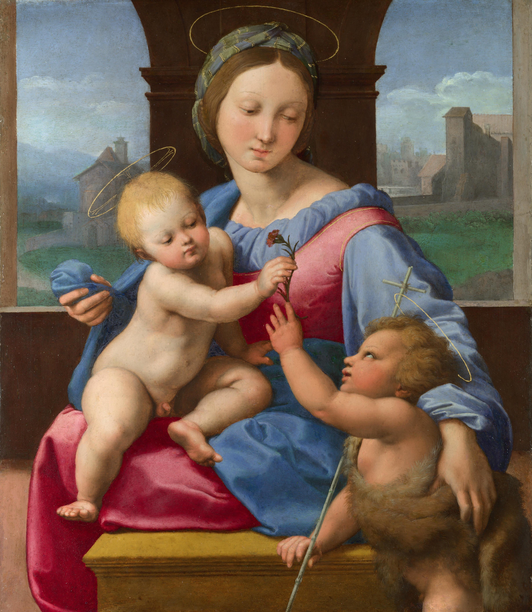

## 一句话总结

把 [[达·芬奇 Leonardo da Vinci]] / [[拉斐尔 Raphael]] / [[米开朗基罗 Michelangelo]] **作为互动系统**来看——三人**关系都不好但艺术上互相学了很多**。他们之间的恩怨同时塑造了文艺复兴艺术的演化轨迹。

## 核心论点

1. **方法论开场**：[[巴克森德尔 Michael Baxandall]] 的 [[时代之眼 Period Eye]] —— 要观察艺术家的"互动关系"，因为**艺术风格演变像生物进化**：自然选择 (外部环境) + 性选择 (内部竞争)。**天才从不喜欢孤独，他们总是扎堆出现**。
2. **三人共同点只有一个：左撇子**。
3. **米开朗基罗 vs 拉斐尔**：
   - 段子：1508 布拉曼特（拉斐尔远房叔叔）进谗言让教皇逼米开朗基罗去画西斯廷天顶画——顾衡判断是无稽之谈，可能是经济原因（陵寝太贵）
   - **偷艺案**：拉斐尔 [[雅典学院 The School of Athens]] 中的赫拉克利特用了米开朗基罗的脸 + 借鉴 [[西斯廷天顶画 Sistine Chapel Ceiling]] 先知耶利米构图
   - **[[伽拉蒂亚的凯旋 The Triumph of Galatea]]** (1512–14)——拉斐尔借鉴米开朗基罗人体处理
   - **[[基督变容 Transfiguration]]** (1518–20)——拉斐尔最后杰作，**用米开朗基罗的手法打败米开朗基罗**（因为对手 Sebastiano del Piombo 请了米开朗基罗帮忙构图）
   - 大街上互怼：米开朗基罗讥"前呼后拥像个领导"，拉斐尔讥"形单影只像个刽子手"
   - 但米开朗基罗人品过得去：四使徒报酬纠纷帮拉斐尔说话"光这四个人物的头就值 500 金币"
4. **拉斐尔 vs 达·芬奇**：
   - 拉斐尔对达·芬奇评价很高，但关系未必好
   - **拉斐尔偷画本事一流**：达·芬奇 [[圣安娜与圣母子 The Virgin and Child with St Anne]] 的三角构图被拉斐尔吸收 → [[草地上的圣母 The Madonna of the Meadow]] 把圣母右腿拉长以便完成三角形——**为构图美变形人体**
5. **达·芬奇 vs 米开朗基罗**：互相讨厌
   - **达·芬奇是同性恋且出柜**：把小情人 萨莱 (Salaì) 养在身边对外称徒弟；[[施洗者约翰 (达·芬奇) St John the Baptist]] 模特就是萨莱；临死把 [[蒙娜丽莎 Mona Lisa]] 留给萨莱
   - **米开朗基罗是同性恋但藏着掖着**：假模假式给一个女人写情诗；真正爱的是 托马索·卡瓦列里；[[胜利之神 The Genius of Victory]] 始终摆在工作室，年轻战士就是托马索
   - 两人几乎所有方面都相反：达芬奇出柜 vs 米开朗基罗 closeted；达没文化 vs 米写诗；达不信上帝 vs 米虔诚；达讲究生活品味 vs 米活得像猪每天睡觉连靴子都不脱
   - **1504 佛罗伦萨擂台**：达芬奇 [[安吉里战役 The Battle of Anghiari]] vs 米开朗基罗 [[卡西纳之战 The Battle of Cascina]]——比赛因财政问题无疾而终
   - **绘画 vs 雕塑之争 [[绘画 vs 雕塑之争 Paragone]]**：达芬奇说绘画更高（更需思考），米开朗基罗回击说"那个人认为绘画比雕塑更高贵，是因为他根本不懂雕塑，在这个问题上我的女佣人都比他有见识"
6. **基佐折衷**：绘画与雕塑各擅胜场；在绘画中追求雕塑感（如米开朗基罗）"是很恶俗的品味"——与雷诺兹评米开朗基罗为"人类自然品味的第一大败坏者"一致
7. **顾衡比喻**：美第奇家族是老爷 → 拉斐尔是宠妇、达·芬奇是弃妇、米开朗基罗是怨妇。**怨妇当然和谁都搞不好；但宠妇与弃妇也不可能建立友谊**。
8. **结论**：三杰之间的恩怨**让文艺复兴的舞台更精彩**——天才扎堆产生的相互推动正是文艺复兴的核心动力。

## 涉及实体

### 人物
- [[达·芬奇 Leonardo da Vinci]] —— 已存在，追加 source（同性恋、萨莱、三角构图、安吉里战役）
- [[拉斐尔 Raphael]] —— 已存在，追加 source（偷艺米开朗基罗 + 偷艺达·芬奇）
- [[米开朗基罗 Michelangelo]] —— 已存在，追加 source（同性恋 closeted、托马索、卡西纳之战）
- [[巴克森德尔 Michael Baxandall]] —— 已存在，追加 source（方法论开场）
- 路人式（未建页）：布拉曼特 (Bramante)、Sebastiano del Piombo (皮翁博)、朱利奥·美第奇 (后来的教皇克莱芒七世)、萨莱 Salaì (达·芬奇情人 / 模特)、托马索·卡瓦列里 Tommaso de' Cavalieri (米开朗基罗情人)、基佐 François Guizot、雷诺兹爵士、弗朗切斯科·乔孔多 (蒙娜丽莎的丈夫)

### 概念
- [[绘画 vs 雕塑之争 Paragone]] —— 新建（达·芬奇 vs 米开朗基罗的方法论之争 + 基佐 / 雷诺兹的折衷批评）
- 隐含援引：[[时代之眼 Period Eye]]、[[理念美 Idea of Beauty]]、[[未完成性 Non-finito]]

### 作品
- **新建**：
  - [[伽拉蒂亚的凯旋 The Triumph of Galatea]] (拉斐尔 1512–14)
  - [[基督变容 Transfiguration]] (拉斐尔 1518–20，绝笔)
  - [[圣安娜与圣母子 The Virgin and Child with St Anne]] (达·芬奇 c.1510)
  - [[草地上的圣母 The Madonna of the Meadow]] (拉斐尔 1505–06)
  - [[施洗者约翰 (达·芬奇) St John the Baptist]] (达·芬奇 1513–16，萨莱模特)
  - [[胜利之神 The Genius of Victory]] (米开朗基罗 1532–34，托马索模特)
  - [[安吉里战役 The Battle of Anghiari]] (达·芬奇 1504，未完成)
  - [[卡西纳之战 The Battle of Cascina]] (米开朗基罗 1504，仅草图)
- **已存在追加 source**：
  - [[雅典学院 The School of Athens]] —— 06.jpg 局部赫拉克利特
  - [[西斯廷天顶画 Sistine Chapel Ceiling]] —— 隐含引用 (《先知耶利米》局部已在 008 decoration)
  - [[蒙娜丽莎 Mona Lisa]] —— 萨莱遗物论辩
- **decoration**：加瓦圣母（拉斐尔 1510，仅一句对照提及）

## 与其他课程的连接

- 上承：[[010｜达芬奇]] / [[011｜拉斐尔]] / [[012｜米开朗基罗]] —— 三杰个人系列
- 下接：[[014｜美第奇家族]] —— 老爷-宠妇/弃妇/怨妇比喻在 014 全面展开
- 后续呼应：[[018｜矫饰主义]] —— 拉斐尔 [[基督变容]] 是矫饰主义先声

## 我的反应

<!-- 留空给用户 -->

## 原文

> 来源：https://www.dedao.cn/course/article?id=obyrmnqGdwxkXW6jWNJelBz2D5ZO8a
> 出处：[[顾衡·西方美术100讲]] · 11分44秒　顾衡 亲述

[完整原文请见 raw/013｜恩怨：文艺复兴三杰如何相互影响？.md 文件——为避免重复浩大正文导致本来源页过于冗长，本次 ingest 在 ## 原文 中仅引用大段，全文保留在 raw/ 备查。]

你好，我是顾衡。前面几讲，我们介绍了文艺复兴三杰。但是你发现没有，大多数时候我们讨论这些艺术家，都是一个个分开来说，这一讲，我们来聊一聊这三个人的关系。

前面我们介绍过巴克森德尔"时代之眼"的观点，就是为了更好地了解一个艺术家，或者一幅作品，我们需要穿越回艺术家所生活的年代和所处的环境来观察。

那么，穿越回去之后，我们应该从何着眼观察呢？

其中一个着眼点，就是 同一时期艺术家们彼此的互动关系 。

为什么互动关系如此重要呢？因为绘画风格的演变，其内在逻辑很像生物进化。

我们知道，一个物种的进化，会同时受到两股力量的驱动，一个是来自于外部环境，就是自然选择；一个是来自物种内部个体之间的竞争，就是性选择。

如果雄孔雀只有一只，它就没必要进化出那么大的一个尾巴。同样道理，如果没有高水平的竞争者同时集中涌现，就不可能有艺术的繁荣。天才从不喜欢孤独，他们总是扎堆出现在世人的面前。

文艺复兴三杰的脾气秉性和创作理念各不相同。三个人的共同点大概只有一个，就是都是左撇子。这三个人关系也非常不好，艺术上却是互相影响，互相学了很多东西。

先说 米开朗基罗和拉斐尔 ，这两个人恩怨很多。

有一个广为人知的段子。是说1508年的时候，拉斐尔得到了为梵蒂冈签字大厅画壁画的订单。同时米开朗基罗正在为教皇尤里乌斯二世修建陵寝。

有人说，圣彼得大教堂的总建筑师布拉曼特是拉斐尔的远房叔叔，就进谗言让教皇逼着米开朗基罗去画西斯廷天顶画，以便让自己的侄子在绘画这个强项上战胜米开朗基罗。

这显然是无稽之谈。就算布拉曼特进过谗言，肯定也是因为修建陵寝太费钱了。钱都用到给教皇修活人墓上了，圣彼得大教堂的重建必然受影响嘛！

米开朗基罗去西斯廷教堂画天顶画，又引出了他跟拉斐尔的新矛盾。就是米开朗基罗指责拉斐尔偷他的技术。

前面咱们说过，《雅典学院》里赫拉克里特的形象，拉斐尔不仅公开借鉴了米开朗基罗西斯廷天顶画中先知耶利米的构图，更是直接把赫拉克里特画成了米开朗基罗的样子。

<!-- src: https://piccdn3.umiwi.com/img/202103/17/202103172010098631912573.jpg -->
<!-- artwork: [[雅典学院 The School of Athens]] —— 06 局部：赫拉克利特 (米开朗基罗的脸) -->

拉斐尔
雅典学院局部 赫拉克利特
1509-1510

<!-- src: https://piccdn3.umiwi.com/img/202103/19/202103191351004365515767.jpg -->
<!-- 配图：[[西斯廷天顶画 Sistine Chapel Ceiling]] 中《先知耶利米》局部；MD5 与 008 decoration 相同复用 -->

米开朗基罗
西斯廷天顶画局部 先知耶利米
1508-1512

除此之外，我们看拉斐尔的这幅《迦拉蒂亚的凯旋》，从构图到人物造型，要说没从米开朗基罗那里有所借鉴，那我是不信的。

<!-- src: https://piccdn3.umiwi.com/img/202103/17/202103172010492105928323.jpg -->
<!-- artwork: [[伽拉蒂亚的凯旋 The Triumph of Galatea]] -->

拉斐尔
伽拉蒂亚的凯旋 The Triumph of Galatea
1512-1514

咱们再看拉斐尔最后一幅杰作《基督变容》。

拉斐尔之前的宗教作品都是以恬静优雅为特征。他的众多圣母像已经臻于化境，达到了后人难以企及的高度。

<!-- src: https://piccdn3.umiwi.com/img/202103/17/202103172015550115864676.jpg -->
<!-- 配图：拉斐尔《加瓦圣母》Garvagh Madonna (1510)；作为"拉斐尔以前的宗教作品恬静优雅"的对照 -->

拉斐尔
加瓦圣母 The Garvagh Madonna
1510年

可是这幅《基督变容》却与他以前的作品大异其趣，人物充满了紧张而扭曲的动感，画面的布光也呈现出舞台剧的夸张感。

<!-- src: https://piccdn3.umiwi.com/img/202103/17/202103172012020151569643.jpg -->
<!-- artwork: [[基督变容 Transfiguration]] -->

拉斐尔
基督变容 Transfiguration
1518-1520

为什么拉斐尔的这幅作品表现出这么大的变化呢？

因为1517年，法国国王弗朗索瓦一世把朱利奥·美第奇，也就是后来的教皇克莱芒七世，任命为法国著名的纳博讷大教堂的主教。

朱利奥就想为他的教堂画一幅新的祭坛画。为此，他同时向威尼斯画派的画家皮翁博和拉斐尔下了订单，让他俩竞争。

本来，拉斐尔并没把这个放在心上。因为他是教皇利奥十世红得发紫的红人，区区一个红衣主教的订单，他未必放在眼里，更何况还要竞争上岗。

但是当听说皮翁博请了米开朗基罗帮忙一起构图之后，拉斐尔的好胜心被激发起来。

拉斐尔之所以要把《基督变容》画成这个样子，就是想用米开朗基罗的手法打败米开朗基罗。

所以你看，艺术家彼此之间的关系，是影响其创作的一个非常重要的因素。

有一个段子也说明两个人关系很不好。

米开朗基罗有一次在大街上遇到拉斐尔和他的一大帮朋友，就说你一个画画的，每次出门前呼后拥搞这么大阵仗，整得跟个领导似的，有意思？

拉斐尔反唇相讥，说你每次出门都是形单影只，看上去就像个刽子手。

不过有一件小事能够说明，米开朗基罗只是脾气不好，嘴臭，人品还是过得去的。

拉斐尔有一次给一个银行家画了四个使徒像，预付了500个金币。

画完之后，拉斐尔认为500个金币只是首付，银行家却认为是报酬的全部。双方一致同意找米开朗基罗来看看。

虽然米开朗基罗不喜欢拉斐尔，但是他跑来一看，就说"光是这四个人物的头就值500个金币"。银行家只好乖乖地又掏了400个金币。

再来说拉斐尔和达·芬奇。

拉斐尔对达·芬奇评价非常高。但你要说这两个人关系有多好，那也未必。

不过拉斐尔确实也从达·芬奇那里学到了很多东西。拉斐尔这个人，偷画本事确实是一流。

我们都知道，达·芬奇对三角构图的喜爱几乎到了病态的程度，你看他的这幅《圣安娜与圣母子》，为了三角型构图，达·芬奇一点儿都不介意让圣母坐在圣安娜的腿上。

<!-- src: https://piccdn3.umiwi.com/img/202103/17/202103172018050642898591.jpg -->
<!-- artwork: [[圣安娜与圣母子 The Virgin and Child with St Anne]] -->

达·芬奇
圣安娜与圣母子 The Virgin and Child with St. Anne
1510年

受达·芬奇的影响，拉斐尔也开始用三角型构图来画圣母子。但是拉斐尔的构图更简洁，更规整。

你看《草地上的圣母》，为了让三角形更完美，拉斐尔毫不犹豫地把圣母的右腿拉长了，以便让她的右脚到达"应该到达的位置"。

<!-- src: https://piccdn3.umiwi.com/img/202103/17/202103172018405629475948.jpg -->
<!-- artwork: [[草地上的圣母 The Madonna of the Meadow]] -->

拉斐尔
草地上的圣母 The Madonna of the meadow
1505-1506

前面说过，三个人除了拉斐尔情商比较高，剩下两位脾气都很差。那达·芬奇和米开朗基罗互相讨厌，是尽人皆知的。

达·芬奇是同性恋，他把小情人萨莱养在身边，对外声称是徒弟。他的这幅《施洗者约翰》，据说模特就是萨莱。

%20St%20John%20the%20Baptist/01.jpg)
<!-- src: https://piccdn3.umiwi.com/img/202103/17/202103172101192905222998.jpg -->
<!-- artwork: [[施洗者约翰 (达·芬奇) St John the Baptist]] -->

达·芬奇
施洗者约翰 St John the Baptist
1513-1516

虽说这个小情人非常顽劣，经常偷东西，但是达·芬奇非常爱他，临死时还把《蒙娜丽莎》送给了他。

<!-- src: https://piccdn3.umiwi.com/img/202105/20/202105201518574408212371.jpg -->
<!-- artwork: [[蒙娜丽莎 Mona Lisa]] —— 与 010 配图 MD5 相同复用 -->

达·芬奇
蒙娜丽莎 Mona Lisa
1502-1506

后来有人说这个施洗者约翰长得非常像蒙娜丽莎，可见蒙娜丽莎其实画得也是萨莱。这就是胡扯了。

蒙娜丽莎的身份早就搞清楚了。她是佛罗伦萨一个叫弗朗切斯科·乔孔多的商人的妻子。达·芬奇画她的时候娃都生了两个了。

米开朗基罗也是同性恋，但是他藏着掖着死也不肯承认。为了掩人耳目还假模假式坚持给一个女人写了好几年情诗，心里却憋得是翻江倒海。

他的爱人叫托马索·卡瓦列里。米开朗基罗有一座雕像《胜利之神》始终摆在自己的工作室里，不离左右。原因我打赌你能猜得出来。

<!-- src: https://piccdn3.umiwi.com/img/202103/17/202103172102508563797863.png -->
<!-- artwork: [[胜利之神 The Genius of Victory]] -->

米开朗基罗
胜利之神 The Genius of Victory
1532-1534

那会儿不比现在，同性恋不招待见。所以达·芬奇和米开朗基罗脾气都不好，与人难相处，多少和性取向有关。

达·芬奇和米开朗基罗两个人，在几乎所有地方都是相反的，很难不互相讨厌。

两个人虽然都是同性恋，但是达·芬奇出柜了，米开朗基罗没有。

达·芬奇没啥文化，也讨厌文学哲学这些虚头巴脑的东西，而米开朗基罗却热衷于写诗。

达·芬奇不太信上帝，米开朗基罗却很虔诚。

达·芬奇长相俊美，特别讲究生活品味，天天好吃好喝，衣轻乘肥的。

米开朗基罗却很邋遢，鼻梁还在一次打架中被一拳打塌了。他活得简直跟个猪一样，每天睡觉连靴子都不脱，嫌第二天还要再穿上太麻烦。

两个人关系的公开恶化，源于佛罗伦萨市政府的挑事儿。

1504年，佛罗伦萨市政府请两个人在市政大厅相对的两面墙上各画一幅壁画。这就是打擂台了呗。两个人在素描打底阶段，就引起了无数同行的关注和市民的围观。

达·芬奇选的题材是佛罗伦萨与米兰的安吉里战役。嘶鸣的战马、狰狞的骑士，达·芬奇用复杂的构图把这场比赛变成了他单方面的素描炫技。

<!-- src: https://piccdn3.umiwi.com/img/202103/17/202103172111280895906774.jpg -->
<!-- artwork: [[安吉里战役 The Battle of Anghiari]] -->

达·芬奇
安吉里战役 The Battle of Anghiari
1504年

米开朗基罗的构思非常巧妙，他选的题材是佛罗伦萨与比萨的卡西纳之战。表现的是正在河里洗澡的战士听到敌人来袭的消息迅速从河水里爬出来的瞬间。

<!-- src: https://piccdn3.umiwi.com/img/202103/17/202103172112308075932854.jpg -->
<!-- artwork: [[卡西纳之战 The Battle of Cascina]] -->

米开朗基罗
卡西纳之战草图 The Battle of Cascina
1504年

可惜这场竞赛无疾而终。因为到第二年，1505年，佛罗伦萨市政府财政出了问题，每个月只能付给达·芬奇15个金币。这和他在米兰每个月160个金币的收入相比实在是差太远了。

正好，米开朗基罗也被教皇尤里乌斯二世，十二道金牌召到罗马给他做雕塑去了。

我觉得幸好比赛没有进行下去，不然达·芬奇肯定就要丢大脸了。因为虽然在素描阶段达·芬奇明显技高一筹，但是壁画需要速度，这恰恰是达·芬奇的短板。

达·芬奇和米开朗基罗的交恶，引发了一个至今仍在热烈讨论的话题，就是雕塑和绘画哪个更难、更高级。

达·芬奇当然认为绘画更难。他说："绘画是一件需要更多思考和技巧的事情……雕塑家只能毫无技巧地展示自然界物体的形状。"

对此米开朗基罗的回答是："那个人认为绘画比雕塑更高贵，是因为他根本不懂雕塑。在这个问题上，我的女佣人都比他有见识。"

关于绘画和雕塑哪个更难、更高级，我认为法国政治家和历史学家基佐说得很有道理。

他认为，虽然绘画和雕塑都是造型艺术，但是二者的实现手段迥然不同。各擅胜场，也各有局限。

基佐认为在绘画中追求雕塑感，这是很恶俗的品味。而这正是米开朗基罗最热衷去做的事情。

前面我们提到过，英国皇家美院的首任院长雷诺兹指责米开朗基罗是"人类自然品味的第一大败坏者"。

在对米开朗基罗的评价上，他和基佐可以说是英雄所见略同。

如果我们把美第奇家族比喻为一个老爷，那么拉斐尔就是宠妇，达·芬奇是弃妇，米开朗基罗则是怨妇。

怨妇当然和谁关系都搞不好。但是宠妇和弃妇，也不太可能建立起友谊。所以这三个人关系都不好。

但是，恰恰是三杰之间的恩怨，文艺复兴的舞台才得以更加精彩。

好，这三个人的关系就介绍完了。说了这么久艺术家，下一讲，我们来介绍三杰的甲方，美第奇家族，是如何影响文艺复兴的。

我是顾衡，感谢你的收听，咱们下期见！

### 划重点

1. 文艺复兴三杰的脾气秉性和创作理念各不相同，彼此关系非常不好，在技艺上互相竞争学习。
2. 在人体表现方面，拉斐尔对米开朗基罗有借鉴之处，引起了争议。
3. 拉斐尔很推崇达·芬奇的三角构图，但也融入了自己的风格。
4. 达·芬奇和米开朗基罗的交恶，还引发了后世绘画与雕塑孰高孰低的争论。

<!-- src: https://piccdn3.umiwi.com/img/202103/17/202103172115083728966501.jpg -->
<!-- shared course footer (appears at end of every lecture) -->
