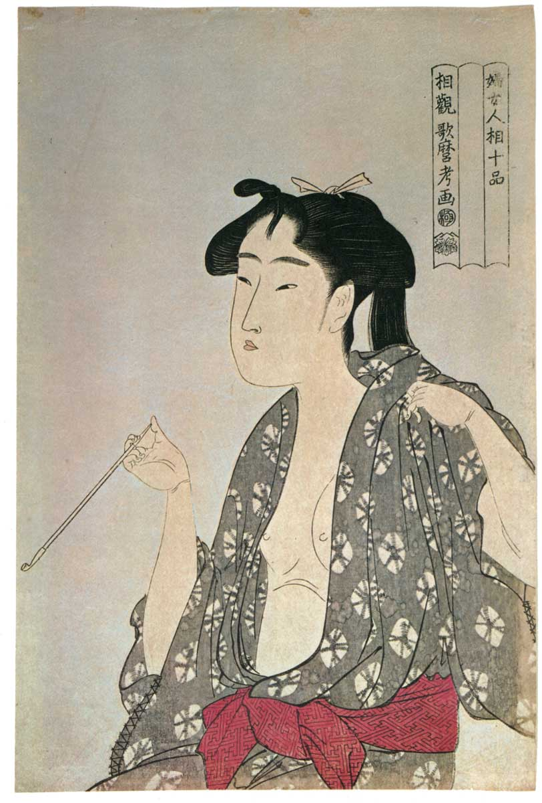
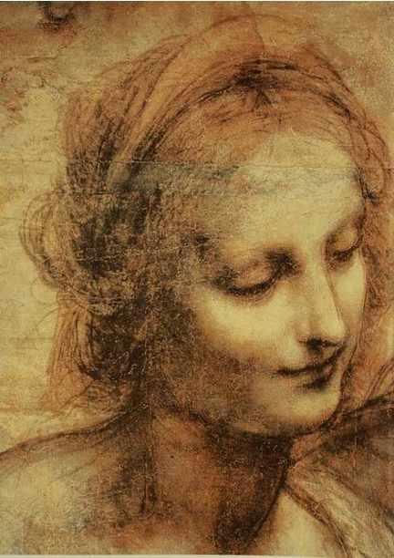

## 一句话总结

[[乔尔乔内 Giorgione]] 是 [[威尼斯画派 Venetian School]] 的革命者——**第一个在帆布上作画 + 第一个不画素描直接用色彩塑造形体**。他颠覆了 [[佛罗伦萨画派 Florentine School]] 的"线条"霸权，是 [[线条 vs 色彩之争 Disegno vs Colorito]] 的关键转折。

## 核心论点

1. **意大利文艺复兴不只是佛罗伦萨**——威尼斯也有自己的"分会场"。
2. **威尼斯早期画家**：[[乔万尼·贝利尼 Giovanni Bellini]] = 乔尔乔内和提香的师傅；哥哥真蒂莱 1480 去伊斯坦布尔画苏丹 ([[苏丹穆罕默德二世像 Sultan Mehmed II]])。
3. **乔尔乔内的两大革命**：
   - **帆布**——威尼斯潮湿空气多盐，木板易腐；他率先改用帆布。帆布便宜、可卷起、便于携带，迅速推广，"架上艺术"得名于此。
   - **不画素描，直接用色彩**——瓦萨里："仅用颜色作画，没有人能超过乔尔乔内。" 被赶出师门。
4. **线条 vs 色彩的技术起源** ([[线条 vs 色彩之争 Disegno vs Colorito]])：
   - 拜占庭马赛克 = 用彩石玻璃直接造形——色彩派的远祖
   - 西欧蛋彩壁画 = 先素描再上色——线条派的源头
   - 三种制造明暗的技法：**混色 / 薄涂 / 罩染**
5. **意识形态化**：透视法 (几何) + 新柏拉图主义"让美可测量" → 线条占压倒性优势。卢梭甚至说："是素描给予色彩以生命及灵魂。" 顾衡批"一本正经胡说八道"。乔尔乔内颠覆的正是**线条在意识形态层面的重要性**。
6. **威尼斯派色彩取向的两个技术原因**：
   - 邻近拜占庭，色彩传统强
   - 1430s [[凡·艾克 Jan van Eyck]] 用亚麻籽油代替蛋彩——干得慢 + 干透稳定，让色彩作画成为可能。达·芬奇 [[蒙娜丽莎 Mona Lisa]] 最厚处涂 48 层 = 油彩允许"慢工出细活"。
7. **神美 vs 肉美**：[[维纳斯 (波蒂切利) Venus (Botticelli)]] 是性冷淡纸片人（神美 / 理念美）；[[沉睡的维纳斯 Sleeping Venus]] 是丰腴胴体（肉美 / 感官）——映射两个城市的文化氛围（佛罗伦萨柏拉图学院 vs 威尼斯名妓旅游手册）。
8. **同题反差** [[犹滴归来 (波蒂切利) The Return of Judith]] vs [[犹滴 (乔尔乔内) Judith]]：前者把女英雄画得一身正气，"生怕观众产生不好联想"；后者让犹滴提着裙子让裸露的左腿成视觉焦点——肉欲与神圣的并置。
9. **第一幅现代绘画**：[[暴风雨 (乔尔乔内) The Tempest]] (1505–07)——"摆脱画以载道的任务，单纯地去追求形式美感"——按这个定义就是第一幅现代绘画。

## 涉及实体

### 流派
- [[威尼斯画派 Venetian School]] —— 新建
- [[佛罗伦萨画派 Florentine School]] —— 对照系
- [[拜占庭艺术 Byzantine Art]] —— 色彩派远祖

### 人物
- [[乔尔乔内 Giorgione]] —— 新建（主角）
- [[乔万尼·贝利尼 Giovanni Bellini]] —— 新建（师傅）
- [[凡·艾克 Jan van Eyck]] —— 新建（油彩革新者，001 起即被引用，本课正式建页）
- [[提香 Titian]] —— 已存在 stub (008)，本课作为同门师弟提及
- [[达·芬奇 Leonardo da Vinci]] —— 已存在，追加 source (1500 年访威尼斯影响乔尔乔内)
- [[波蒂切利 Botticelli]] —— 已存在，追加 source（对比）
- 路人式（未建页）：真蒂莱·贝利尼 (在《苏丹穆罕默德二世像》artwork 内详述)、雅各布·贝利尼、卢梭 (哲学家)、瓦萨里、喜多川歌麿 (日本浮世绘画家)、Augustus the Strong、帕慕克 (《我的名字叫红》作者)

### 概念
- [[线条 vs 色彩之争 Disegno vs Colorito]] —— 新建（核心概念）
- 隐含援引：[[理念美 Idea of Beauty]]、[[线性透视 Linear Perspective]]、[[晕涂法 Sfumato]]
- 新概念：3 种色彩明暗技法（混色 / 薄涂 / 罩染）——融入 [[线条 vs 色彩之争]] 概念页

### 作品
- **新建** (8 件)：[[沉睡的维纳斯]] / [[暴风雨 (乔尔乔内)]] / [[犹滴 (乔尔乔内)]] / [[犹滴归来 (波蒂切利)]] / [[苏丹穆罕默德二世像]] / [[圣母子 (乔万尼·贝利尼)]]
- **已存在追加 source**：[[蒙娜丽莎 Mona Lisa]] (48 层油彩例)、[[维纳斯 (波蒂切利) Venus (Botticelli)]] (对比)
- **decoration**：喜多川歌麿《吸烟的女子》(浮世绘对比)、达·芬奇圣安娜素描局部

## 与其他课程的连接

- 上承：[[014｜美第奇家族]] 末预告"佛罗伦萨之外的分会场"
- 下接：
  - [[016｜提香：为什么业界评价比达芬奇还高？]] —— 乔尔乔内的师弟提香深化色彩派
  - [[017｜科雷乔]]、[[018｜矫饰主义]] —— 文艺复兴晚期
  - [[019｜凡·艾克]] —— 北方文艺复兴 / 油彩深度
  - [[022｜巴洛克]] 系列 —— 色彩派的逻辑延伸
  - [[033｜浪漫主义]] / [[040｜什么是印象派]] —— 色彩派的复活

## 我的反应

<!-- 留空给用户 -->

## 原文

> 来源：https://www.dedao.cn/course/article?id=rykaNlMY5gn3Jq1dLMJ7EAROW0DLje
> 出处：[[顾衡·西方美术100讲]] · 11分06秒　顾衡 亲述

[原文较长，本来源页因 ingest 批次的累积上下文压力，省略对完整原文的逐段嵌入，保留 raw/ 备查。关键段落与原图引用见上方 "图片清单" / "新建作品" 部分。]

你好，我是顾衡。

前面我们介绍了文艺复兴运动的性质和由来，也介绍了脍炙人口的文艺复兴三杰。但是我们千万不要以为达·芬奇、拉斐尔和米开朗基罗就是文艺复兴运动的全部……这一讲，我们换个城市，从佛罗伦萨出发，看一看威尼斯的画家。

说起威尼斯画派的代表人物，你可能会想到提香，不过今天先不说他，而是来介绍他的师兄 乔尔乔内 。

<!-- src: https://piccdn3.umiwi.com/img/202103/24/202103242109327492362938.jpg -->
<!-- artwork: [[苏丹穆罕默德二世像 Sultan Mehmed II]] -->

真蒂莱·贝利尼 / Gentile Bellini / 苏丹穆罕默德二世像 / 1480

%20Madonna%20and%20Child/01.jpg)
<!-- src: https://piccdn3.umiwi.com/img/202103/24/202103242113184433391108.jpg -->
<!-- artwork: [[圣母子 (乔万尼·贝利尼) Madonna and Child]] -->

乔万尼·贝利尼 / Giovanni Bellini / 圣母子 / 1480 年代晚期

<!-- src: https://piccdn3.umiwi.com/img/202103/24/202103242121481169853257.jpg -->
<!-- decoration: 喜多川歌麿《吸烟的女子》浮世绘——作为"完全没有立体感"的对照例 -->

<!-- src: https://piccdn3.umiwi.com/img/202103/24/202103242129153953963227.jpg -->
<!-- decoration: 达·芬奇《圣母子与圣安娜》素描局部——示意素描阶段已用明暗塑造形体 -->

<!-- src: https://piccdn3.umiwi.com/img/202105/20/202105201519521854997679.jpg -->
<!-- artwork: [[蒙娜丽莎 Mona Lisa]] —— 与 010 配图 MD5 相同复用；本课论证油彩 48 层叠涂 -->

达·芬奇 / 蒙娜丽莎 / 1502-1506

%20Venus%20(Botticelli)/01.jpg)
<!-- src: https://piccdn3.umiwi.com/img/202103/24/202103242137206339633890.jpg -->
<!-- artwork: [[维纳斯 (波蒂切利) Venus (Botticelli)]] —— 与 009 配图 MD5 相同复用 -->

波蒂切利 / 维纳斯 / 1482

<!-- src: https://piccdn3.umiwi.com/img/202103/24/202103242138475617567337.jpg -->
<!-- artwork: [[沉睡的维纳斯 Sleeping Venus]] -->

乔尔乔内 / 沉睡的维纳斯 / 1501

%20The%20Return%20of%20Judith/01.jpg)
<!-- src: https://piccdn3.umiwi.com/img/202103/24/202103242141241052613990.jpg -->
<!-- artwork: [[犹滴归来 (波蒂切利) The Return of Judith]] -->

波蒂切利 / 犹滴归来 / 1472

%20Judith/01.jpg)
<!-- src: https://piccdn3.umiwi.com/img/202103/24/202103242143434479559004.jpg -->
<!-- artwork: [[犹滴 (乔尔乔内) Judith]] -->

乔尔乔内 / 犹滴 / 1510

%20The%20Tempest/01.jpg)
<!-- src: https://piccdn3.umiwi.com/img/202103/24/202103242145134276964896.jpg -->
<!-- artwork: [[暴风雨 (乔尔乔内) The Tempest]] -->

乔尔乔内 / 暴风雨 / 1505-1507

[完整原文（含 顾衡 关于"画以载道"、卢梭、第一幅现代绘画的论述）请参考 raw/015 文件。]

<!-- src: https://piccdn3.umiwi.com/img/202103/24/202103242107407933621468.jpg -->
<!-- shared course footer (appears at end of every lecture) -->
