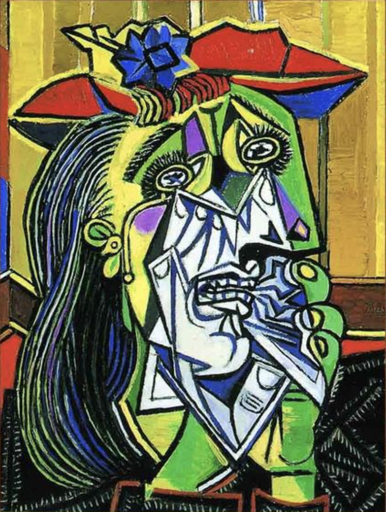
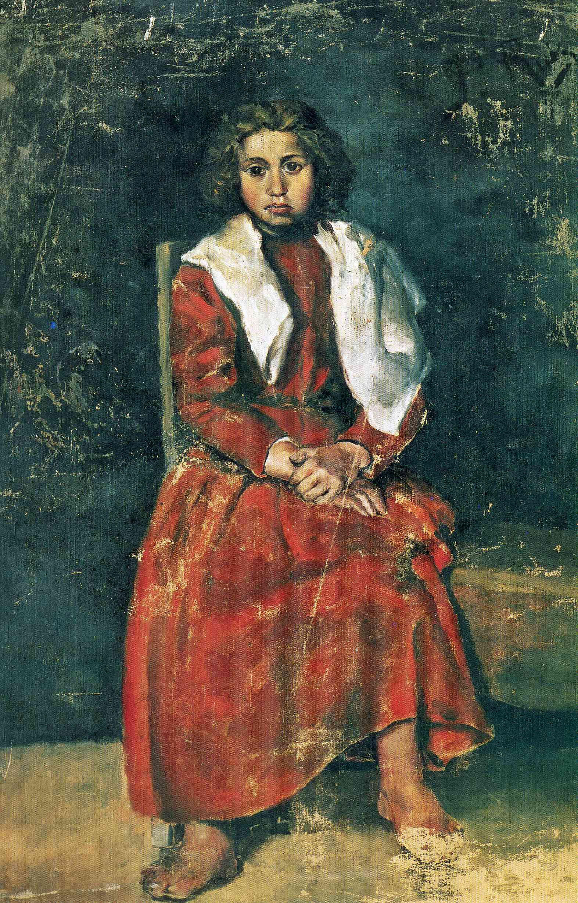
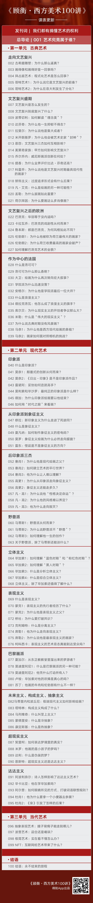

## 一句话总结

课程发刊词。顾衡阐明本课的方法论与主线——借鉴 [[巴克森德尔 Michael Baxandall]] 的 [[时代之眼 Period Eye]]，以"画家把画卖给谁"为主线，把西方美术史划成 [[三阶段框架 (古典·现代·当代) Three-Stage Periodization|古典(订制)/现代(画廊)/当代(资本)]] 三个阶段来讲。

## 核心论点

1. **既有的艺术普及路径都不够好**：学术著作充斥行话，画家自己又"会画不会说"——美国艺术史家普雷齐奥西说画家是"话筒一递到嘴边，清晰性就惊人地消失了"。需要一个**读书人**把图像转码为文字。
2. **1970 年代以来艺术史的方法论转向**——从「六经注我」（先有美学概念，再去阐释画作）转向「我注六经」（用具体的社会、技术、物质条件去理解作品）。代表人物是 [[巴克森德尔 Michael Baxandall]]，代表概念是 [[时代之眼 Period Eye]]。
3. **方法论的边界**——艺术风格演变还有其内在、与外界无关的动力和逻辑；本课不否认这一面，但**重点放在艺术与社会的互动上**。
4. **课程主线** = 「画家把画卖给谁」，据此把西方艺术史读成 [[三阶段框架 (古典·现代·当代) Three-Stage Periodization|订制时代 / 画廊时代 / 资本时代]]。
5. **学画必须看画**——课程每讲都附图，听完后建议在文稿区慢慢欣赏。

## 涉及实体

### 人物

- [[巴克森德尔 Michael Baxandall]] —— 提出 [[时代之眼 Period Eye]]，方法论奠基者
- 路人式引述（未建页）：普雷齐奥西（美国艺术史家，"清晰性消失"引语作者）、朵拉·玛尔（Dora Maar，毕加索情人 + 模特）、爱德华·扬格（Edward Young，英国诗人，"我们出生时富有原创、辞世时是复制品"）、巴斯基亚（Jean-Michel Basquiat，举例当代艺术高价拍品）
- 课程将专题讲解（本篇仅举例提及，未建页）：毕加索 Pablo Picasso（lecture 064–067）、[[塞尚 Paul Cézanne]]（lecture 052–054）（暂未建页）

### 流派

- 顾衡用"画家把画卖给谁"为标尺把全部流派分为三段；具体流派分布见 [[三阶段框架 (古典·现代·当代) Three-Stage Periodization]]。

### 概念

- [[时代之眼 Period Eye]] —— 本课方法论
- [[三阶段框架 (古典·现代·当代) Three-Stage Periodization]] —— 本课组织主线

### 作品

- 毕加索《哭泣的女人》Weeping Woman ——发刊词以此为引子讨论"为什么把朵拉·玛尔画成歪鼻歪眼"（暂未建专页，将随 lecture 064–067 处理）

## 与其他课程的连接

- 下接：[[001｜总导论：艺术到底属于谁？]]（待 ingest，预计延展"画家把画卖给谁"主线）
- 三阶段主线的具体落点：
  - 订制时代：[[002｜古希腊雕塑：为什么做得这么逼真？]] 已 ingest；后续文艺复兴 / 巴洛克 / 洛可可 / 新古典 / 学院派
  - 画廊时代：印象派（lecture 038–046）、后印象 / 象征 / 立体 / 表现主义系列
  - 资本时代：lecture 095–099（当代艺术 / 波普 / NFT）
- 方法论 [[时代之眼 Period Eye]] 将在解释 **任何** 流派起因时被反复调用——例如解释毕加索为何把朵拉·玛尔画得变形，会用到「非洲木雕在巴黎风行 + 塞尚对毕加索的影响」这两条"画布外"因素。

## 我的反应

<!-- 留空给用户 -->

## 原文

> 来源：https://www.dedao.cn/course/article?id=W32axR8enbzBJ9plDzVkDEgM6ApPl9
> 出处：[[顾衡·西方美术100讲]] · 09分03秒　顾衡 亲述

你好，我是顾衡。

不论你是第一次见面的新朋友，还是从《顾衡好书榜》过来的老朋友，欢迎来到《西方美术100讲》。

一说西方美术，你脑子里肯定蹦出好些词，断臂维纳斯、达·芬奇、安格尔、梵高、莫奈、毕加索、达利……没准还有印象派、立体主义、达达主义什么的。

然后问题就来了，这派那派，这主义那主义的，到底都是什么意思？梵高一幅画拍出八千万欧元，到底好在哪儿？

而且，越到离咱们近的，艺术好像越看不懂了。毕加索，把朵拉·玛尔画得鼻子眼睛歪歪斜斜的，叫《哭泣的女人》，咱没意见，那是他自己的情人。可是，他画的时候一本正经地要求他的情人坐在那儿当模特，这又有什么必要呢？

<!-- src: https://piccdn3.umiwi.com/img/202103/08/202103081801470808816732.png -->
<!-- 引子配图：毕加索《哭泣的女人》系列示意（CDN 未附 caption） -->

不懂就要看书。可是专业艺术书都写了些啥呢？我摘一段给你听听哈：

- 塞尚对表现手段的掌握使他独立于人们称为的立体主义主题。他能将这一手段运用于风中树叶那样难以捕捉的效果并完成富于结构的杰作。

一脸懵，完全看不懂这是在说啥。是吧？而且我要告诉你，这并不是少数现象，而是艺术史著作中的普遍现象。

那知识分子不靠谱，找个专业画家来给我们讲讲，怎么样呢？这个就更行不通了。因为画家是手艺人，会画不会说。

我们把画家揪过来，让他自己说说，你画的是个啥，你当时咋想的。每一次，都像美国著名艺术史学家普雷齐奥西说的那样："话筒一递到嘴边，清晰性就惊人地消失了"。

啥叫清晰性消失了呀？就是不说人话了呗！

怎么办？顾老师我就挺身而出了呗！

为什么我能胜任这个工作呢？我觉得有这三个理由吧：

**首先，** 我和你们一样，曾经也是个外行，特别能理解咱们外行的苦恼。我在黑暗中摸索了好多年，遭了不少罪。那我遭过的罪，你们就不用再遭一遍了。

**其次，** 对绘画进行解释，说破大天去，就是把图像转码为文字进行解释和表达。那文字表达这事儿，就得是读书人来干。我就是个读书人，而且擅长把复杂的东西说得通俗易懂。

**最后，** 自从上世纪七十年代以来，艺术史这门学科自身，也发生了非常可喜的变化。

以前的艺术史基本上都是六经注我。知识分子今天发明个概念，明天发明个概念，空对空一通吹，云山雾罩的。

但是最近这五十年，艺术史这门学科从以前的六经注我改成我注六经，开始说人话了。

这其中的一个代表人物，就是英国著名艺术史学者巴克森德尔。

巴克森德尔是什么路数呢？他提了个概念，叫 "时代之眼" 。意思是在对绘画进行解读时，我们首先要做的工作，就是还原画家当时所处的环境。

他主张，每个绘画流派的出现，都跟当时的社会有关系。大到当时流行什么哲学思潮，有什么科学技术上的突破，小到画家们的画架、颜料、画笔有什么变化，都可能促成新流派的诞生。

说回刚才提过的毕加索。

其实，毕加索的绘画基本功是非常厉害的，他十五岁的时候，就能把邻家女孩儿画得跟照片一样像。

<!-- src: https://piccdn3.umiwi.com/img/202103/12/202103121229067943162242.jpg -->
<!-- 配图：毕加索 15 岁前后的写实期作品（CDN 未附 caption） -->

可是三十年后，他却把情人朵拉·玛尔画成了这个样子，左脸是绿的，右脸是黄的。

<!-- src: https://piccdn3.umiwi.com/img/202103/12/202103121229481835233180.png -->
<!-- 配图：毕加索画朵拉·玛尔（与本页第 1 张为同一图片，CDN 同源） -->

这两幅画，要说哪一幅更符合普通人的"审美"，当然是第一幅。可是毕加索为什么要画第二幅呢？

用巴克森德尔的"时代之眼"来解释，我们就会提到当时非洲木雕在巴黎风行一时，也会提到法国画家塞尚对毕加索的影响。

那么多画家，毕加索为什么偏偏挑中塞尚管人家叫爸爸呀？可能是真被塞尚的理念打动了，也可能只是他在塞尚画了一辈子的圣维多利亚山的山脚下买了一块地，想开个民宿？

这种在画布之外为各绘画流派提供解释的方法，就有效地摆脱了艺术史"自说自话"的窘境，从而为我们提供了更容易理解、也更令人信服的诠释。

可是，仅用社会外界这一个因素，能解释艺术的全部吗？并不能。

艺术的风格演变，也有其内在的、与外界无关的动力和逻辑，这部分内容，我在课里也会有所涉猎，但是重点还是会放在艺术与社会的互动上。

正是受了巴克森德尔的启发，我打算盯着这样一条主线来讲艺术史。就是"画家把画卖给谁"。

你可能也听过西方美术可以分成古典艺术、现代艺术和当代艺术三个阶段。

你要是请个学院派的人给你从艺术内部去分析，肯定各种甩大词儿，给你讲得云里雾里。

但我们要是从这条线索入手，重新理解这三个阶段，艺术就可能在你面前，脱去面纱露出原型：

所谓 古典艺术 ，也就是订制时代。这个时代，订画者、甲方决定画什么，如何构图、使用什么材质和颜色。在这个阶段，画家只是匠人，谈不上什么创作自由。

而到了 现代艺术 ，画家的画不再是某个甲方的订件，而是通过画廊向不特定人群销售。所以，画家们急切地想知道大众想什么，要什么。

更为重要的是，这个阶段的各个绘画流派，其实是当时哲学思潮和文学运动的具像化。比如，孔德的实证主义起来了，艺术界就出现了印象派；象征主义文学起来了，艺术界又出现了象征主义，等等。

将西方现代绘画与当时的哲学与文学运动一一对应并加以解释，这才是它最为有趣的地方。

至于 当代艺术 ，是布雷顿森林协议垮台后，艺术品成为富豪、专业收藏家、金融机构的投资品。艺术品成为了一个保值和投资手段，所以当代艺术，就要用资本的逻辑去解释。当代艺术，被关注得多，被谈论得多，就值钱。

当然，咱们这个是艺术课，肯定不能只听不看。我能帮你的，只是如何去理解艺术。但是要学会欣赏，却必须要自己多看。

所以，我提到的艺术作品，都附上了精美的图片。听完课之后，也建议你打开文稿区慢慢欣赏。不看画就想学会欣赏艺术，那是万万的不可能。

英国诗人爱德华·扬格说："我们出生时都是富有原创的人，但都是以复制品的面貌辞世。"

作为一个社会性的存在，扬格的这句话是我们每个人命中注定的归宿。

在通往这个晦暗归宿的旅途中，只有当我们随意构勒线条和涂抹色块时，才会感到片刻的欢愉。无论是在一张纸上，在电脑屏幕上，还是在一片退了潮的沙滩上。

也正是这片刻的欢愉，让我们这些凡夫俗子有了感谢艺术家们的理由。

在未来半年加入这样一门课，请你想象一下这些场景。

家庭餐桌上，孩子问"画上的阿姨为什么不穿衣服"，你可以毫不尴尬地告诉他什么是文艺复兴。

朋友聚会，你敢组织大伙去看一个画展，不但不用担心自己看不懂，还能给大伙讲讲莫兰迪色妙在哪里。

微信群里有人甩了个截图，说苏富比刚刚拍出上千万欧元的巴斯基亚，后悔扔了自己家孩子小时候的涂鸦，你可以告诉他，这是国际金融玩家的游戏。

在接下来的六个月里，就请你和我一起踏上这一段关于西方艺术的旅程。

好，我是顾衡，感谢你的收听。咱们在《西方美术100讲》的课程里见！

<!-- src: https://piccdn3.umiwi.com/img/202106/22/202106221832532629561424.jpg -->
<!-- 课程预告 / 顾衡形象图（CDN 未附 caption） -->

<!-- src: https://piccdn3.umiwi.com/img/202103/12/202103121609263343264088.jpg -->
<!-- shared course footer (appears at end of every lecture) -->
