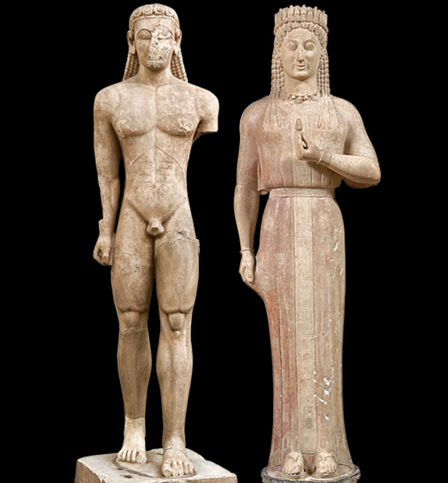

## 一句话定义
古希腊古风时期标准化的青年男子裸体立像类型，常作为献给神庙的祭品或墓葬纪念物。

## 详细解释
- 男像 = 库罗斯（裸体），与穿衣女像 [[科莱 Kore]] 配对
- 造型继承 [[埃及人体程式 (21 等份) Egyptian canon]]：正面像、双脚并立、左脚略前、双臂垂体侧
- 风格千篇一律、不强调个性 → "神难以分辨这是谁送的雕像"
- 公元前 6 世纪起，希腊人开始尝试个性化（如 [[荷犊者 Moschophoros]] 通过添加叙事元素让赞助人可辨识）
- 公元前 480 年前后的 [[克雷提奥斯少年 Kritios Boy]] 已突破 Kouros 严格程式，进入 [[古希腊古典时期 Greek Classical Period]]

## 相关概念 / 流派 / 人物 / 技法
- 流派：[[古希腊古风时期 Greek Archaic Period]]
- 类型对：[[科莱 Kore]]
- 后续发展：[[克雷提奥斯少年 Kritios Boy]] 为过渡形态

## 图片清单

| 编号 | 出自 | 描述 |
|---|---|---|
| 01 | [[002｜古希腊雕塑：为什么做得这么逼真？]] | 库罗斯与科莱类型样本对照图，公元前 7–5 世纪 |

<!-- src: https://piccdn3.umiwi.com/img/202103/11/202103111241075957966492.jpg -->

## 出现在
- [[002｜古希腊雕塑：为什么做得这么逼真？]]
